# Arrays


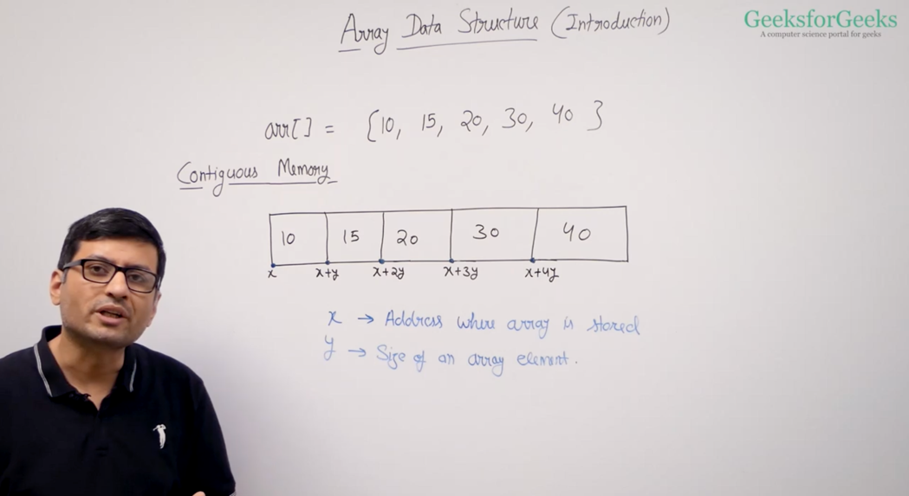

### Advantages of Arrays:
1. **Efficient Random Access** – Arrays allow O(1) time complexity for accessing elements using an index.
2. **Cache Friendliness** – Stored in contiguous memory, making access faster due to CPU caching.
3. **Fixed Size** – Memory is preallocated, reducing overhead.
4. **Easy Iteration** – Can be traversed efficiently using loops.
5. **Reduced Overhead** – Unlike linked lists, arrays do not require extra memory for pointers.
6. **Sorting & Searching** – Works well with efficient algorithms like binary search (O(log n)) and quicksort/mergesort (O(n log n)).
7. **Multidimensional Support** – Can be used to represent matrices, grids, and other data structures.


In Java arrays are always allocated on Heap

Types : fixed size arrays, dynamic arrays

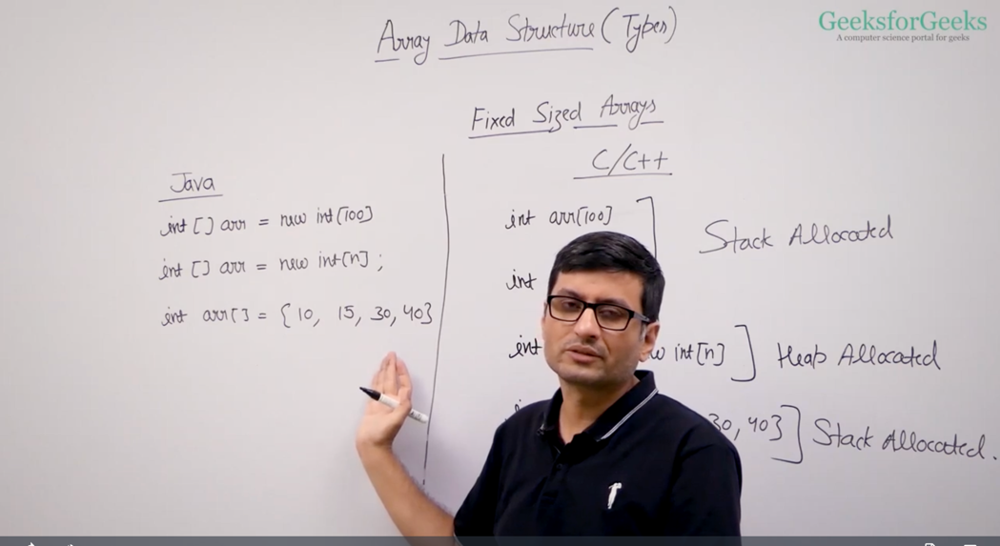


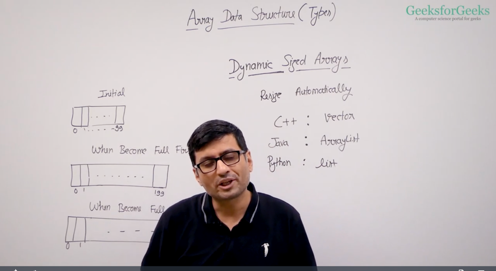

### Types of Arrays:

1. **One-Dimensional Array (1D Array)**
    - A linear collection of elements accessed by a single index.
    - Example: `int arr[] = {1, 2, 3, 4, 5};`

2. **Two-Dimensional Array (2D Array)**
    - A table-like structure (matrix) accessed using two indices (row, column).
    - Example: `int arr[3][3] = {{1,2,3}, {4,5,6}, {7,8,9}};`

3. **Multi-Dimensional Array**
    - Extends beyond 2D arrays, used for complex data representation.
    - Example: `int arr[2][2][2] = {{{1,2}, {3,4}}, {{5,6}, {7,8}}};`

4. **Jagged Array**
    - An array of arrays where each sub-array can have different lengths.
    - Example (Java): `int[][] arr = new int[3][]; arr[0] = new int[2]; arr[1] = new int[4];`

5. **Dynamic Array**
    - Resizable array, used in languages like Python (`list`) and Java (`ArrayList`).
    - Example: `ArrayList<Integer> arr = new ArrayList<>();`

6. **Sparse Array**
    - Contains mostly `0` values, optimized for memory usage using special storage techniques.
    - Example: Used in graphs, game development, and scientific computing.

7. **Associative Array (Hash Array)**
    - Uses key-value pairs instead of index-based access (e.g., Python `dict`, Java `HashMap`).
    - Example: `dict = {"name": "John", "age": 25}`


## **ArrayList**


### **ArrayList in Java**

#### **What is an ArrayList?**
- `ArrayList` is a **resizable** array-based implementation of the `List` interface in Java.
- Unlike arrays, `ArrayList` **can grow and shrink dynamically**.
- It is part of the `java.util` package.

#### **Syntax & Declaration**
```java
import java.util.ArrayList;

ArrayList<Integer> list = new ArrayList<>(); // Default constructor
ArrayList<String> names = new ArrayList<>(10); // Initial capacity of 10
```

**arrayList should be created with Non Primitive data types.**

#### **Key Features of ArrayList:**
✅ **Dynamic Resizing** – Automatically expands when needed.  
✅ **Allows Duplicates** – Unlike `Set`, duplicates are allowed.  
✅ **Indexed Access** – Fast `O(1)` retrieval using index.  
✅ **Not Thread-Safe** – Use `Collections.synchronizedList()` for thread safety.

---

### **Common Operations in ArrayList**
#### **1. Adding Elements**
```java
list.add(10);  // Adds element to the end
list.add(1, 20); // Adds 20 at index 1
```

#### **2. Removing Elements**
```java
list.remove(1);  // Removes element at index 1
list.clear();   // Removes all elements
```

#### **3. Accessing Elements**
```java
int num = list.get(0);  // Retrieves the first element
```

#### **4. Modifying Elements**
```java
list.set(1, 30);  // Changes value at index 1 to 30
```

#### **5. Checking Size & Contains**
```java
list.size();  // Returns the number of elements
list.contains(10); // Returns true if 10 exists
```

#### **6. Iterating Through ArrayList**
```java
for (int num : list) {
    System.out.println(num);
}
```

---

### **Performance Analysis**
| Operation  | Time Complexity |
|------------|---------------|
| Add (end)  | **O(1)** (Amortized) |
| Add (middle) | **O(n)** |
| Remove (end) | **O(1)** |
| Remove (middle) | **O(n)** |
| Get | **O(1)** |
| Search | **O(n)** |

---

### **When to Use ArrayList?**
✅ **When you need dynamic resizing**  
✅ **When fast read (`get()`) is required**  
✅ **When insertion/removal at the end is frequent**

---

### **Alternatives to ArrayList**
| Collection Type | Key Difference |
|----------------|---------------|
| `LinkedList` | Better for frequent insertions/removals in the middle |
| `Vector` | Thread-safe alternative to `ArrayList` |
| `HashSet` | No duplicates allowed |
| `Array` | Fixed-size alternative |

---

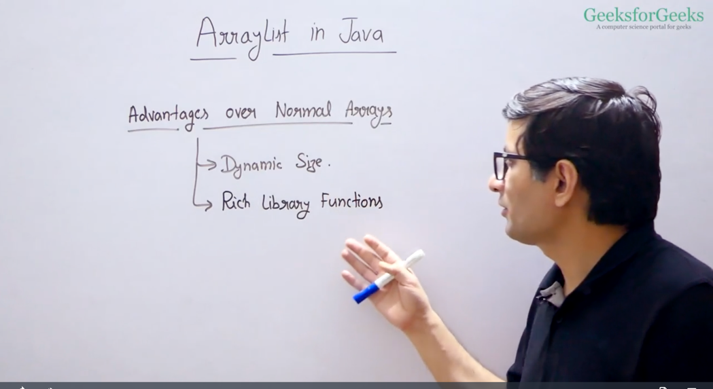


## **Search operation on normal arrays**

Time Complexity : O(n)

if it is a sorted array , time complexity is O(log n)

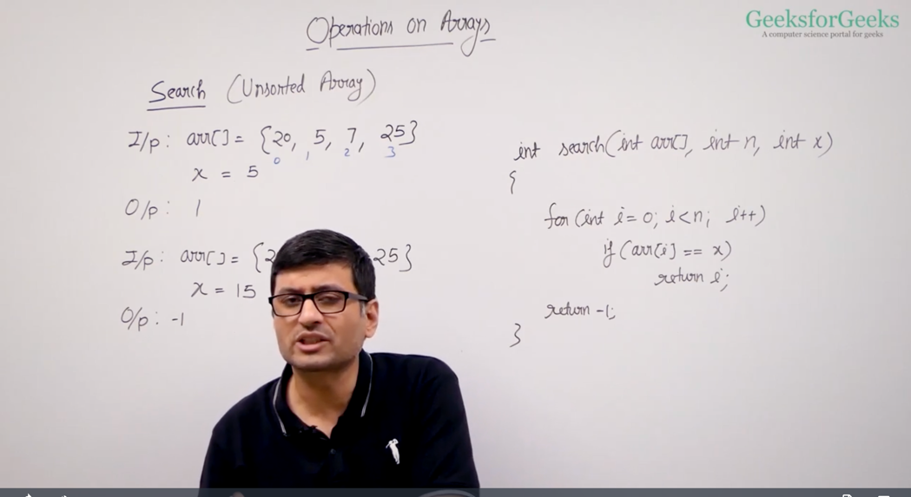


## **Insert Operation** 


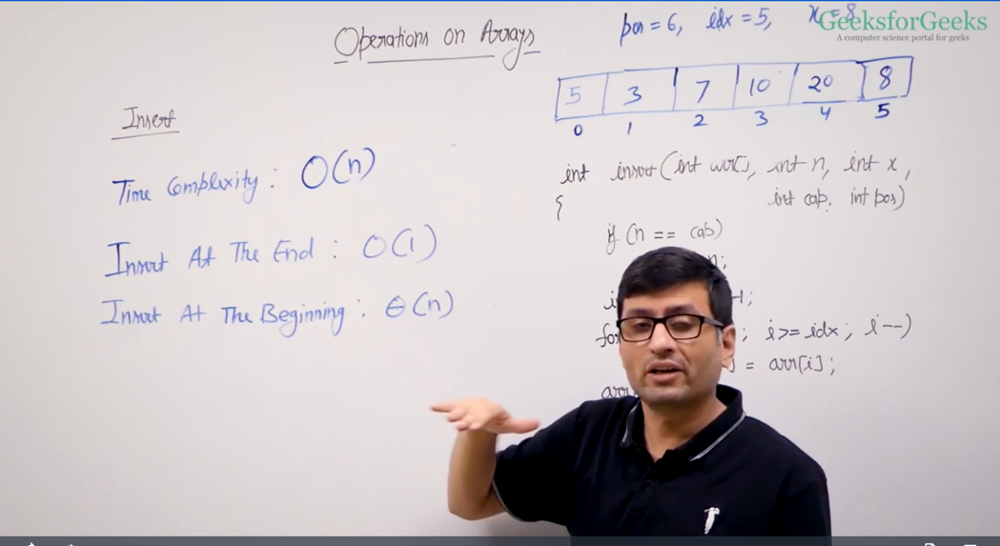

[link to the program](../classes/InsertionInArray.java)

## **Delete Operation**

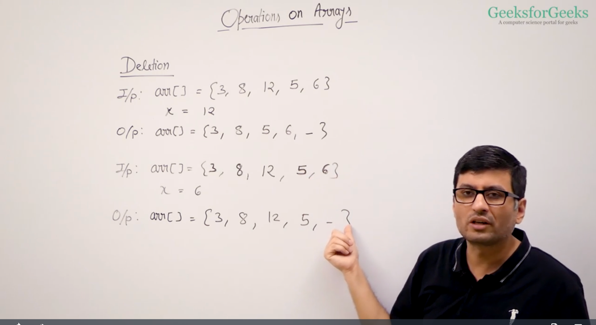

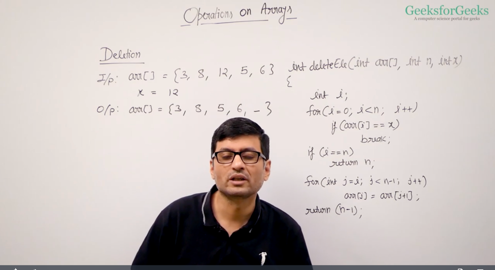

[link to the program](../classes/DeletionInArray.java)


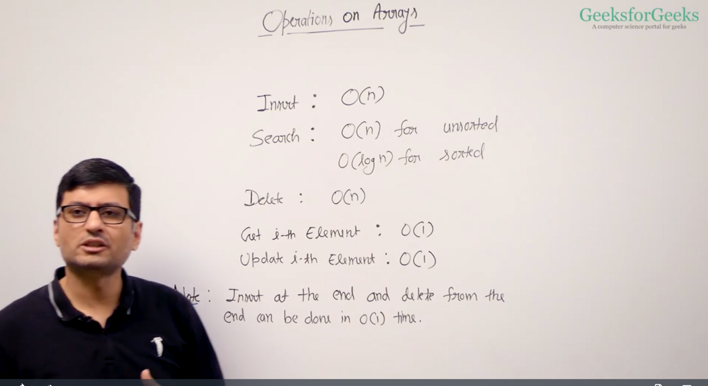


## **Finding the largest element index in array**

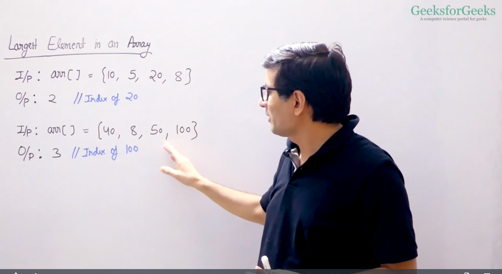

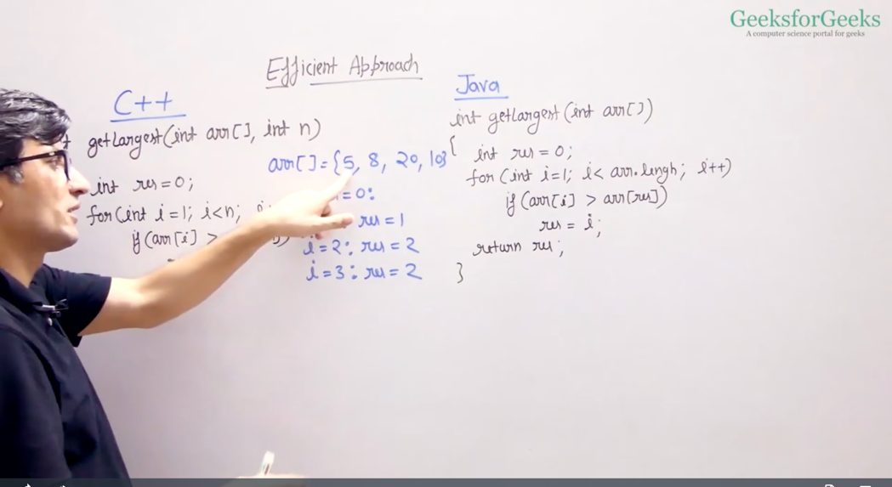

Time Complexity = O(n)

[link to the program](../classes/LargestElementIndex.java)


## **Find Second Largest element index in array**


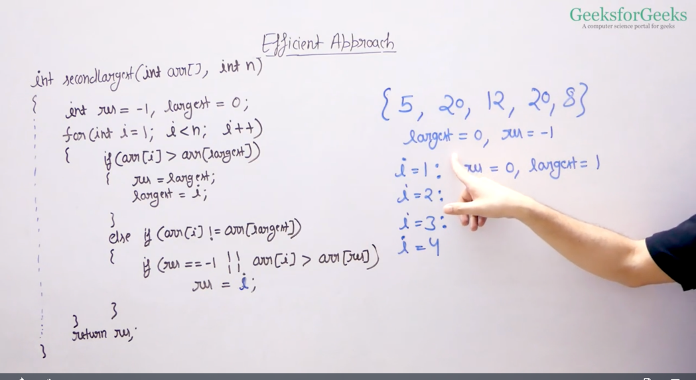

Time Complexity = o(n)
key is to initialize second as -1
[link to the program](../classes/SecondLargestElement.java)


## **Find if array is sorted**

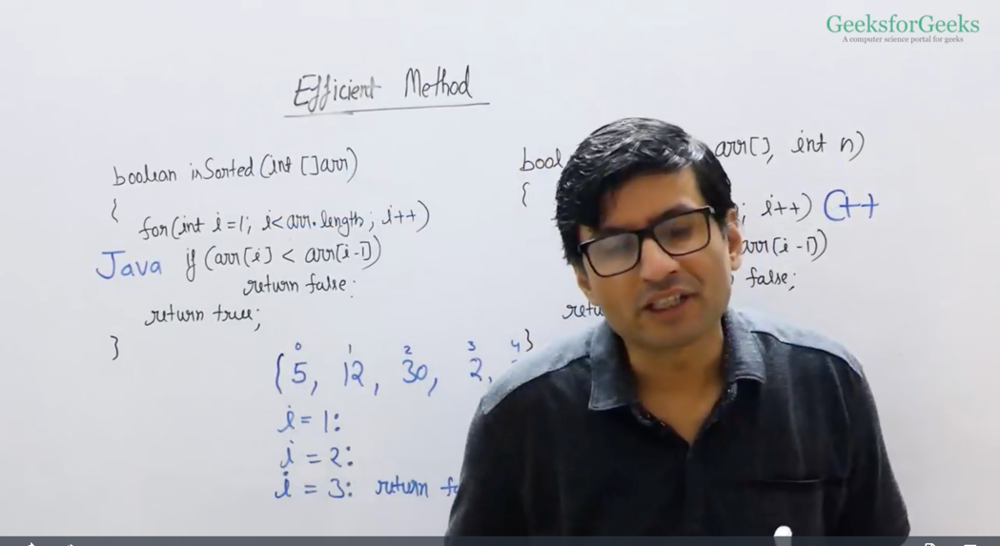

[link to the program](../classes/IsSortedArray.java)


## **Reverse an array** 

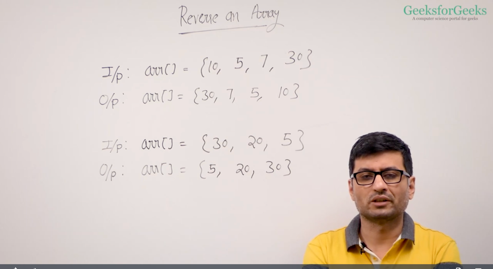

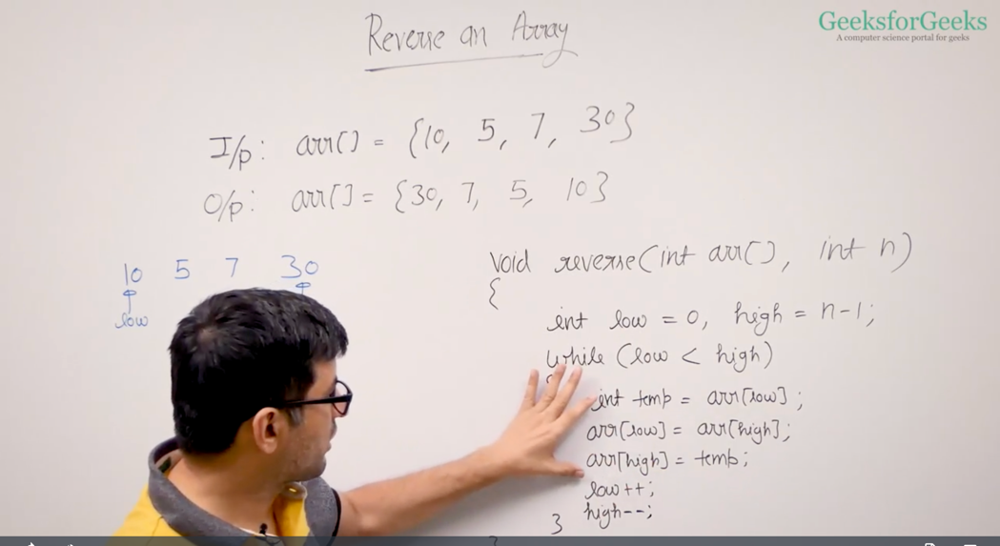

[link to the program](../classes/ReverseAnArray.java)


## **Remove Duplicates from a sorted array**


the thing is to use 2 pointers like i and j , and do a negative comparison (!=) .
if unique element is found then move i and assign the next value to it.
[link to the program](../classes/ReverseAnArray.java)


## **Move Zeros to End**

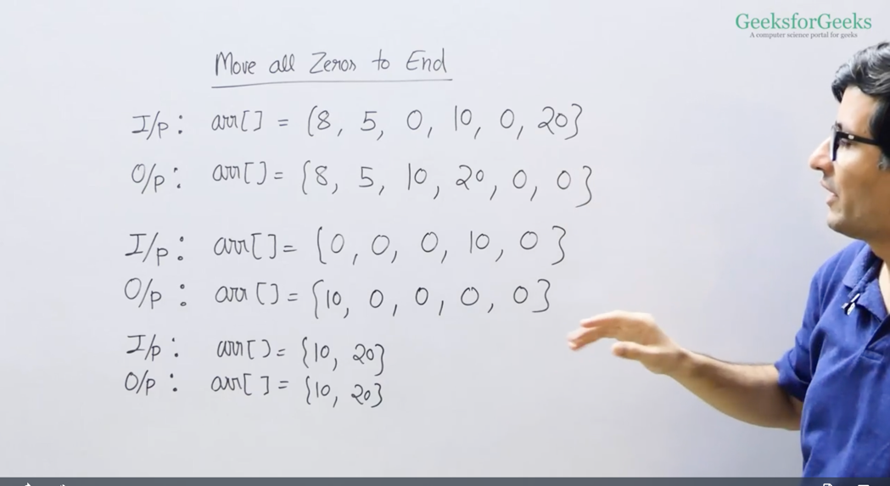

time complexity  O(n)

[link to the program](../classes/MoveAllZerosToEnd.java)


## **Left Rotate Array By 1 :**

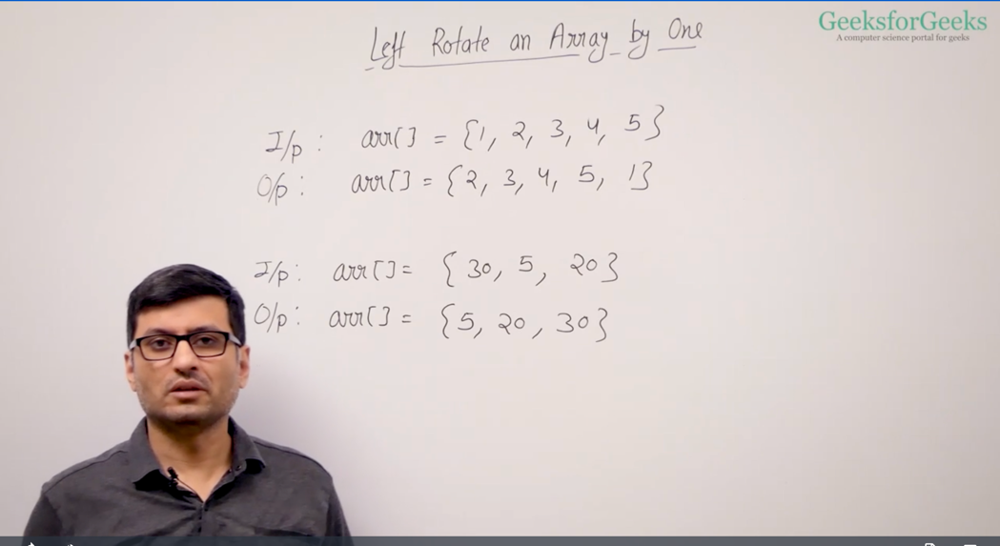

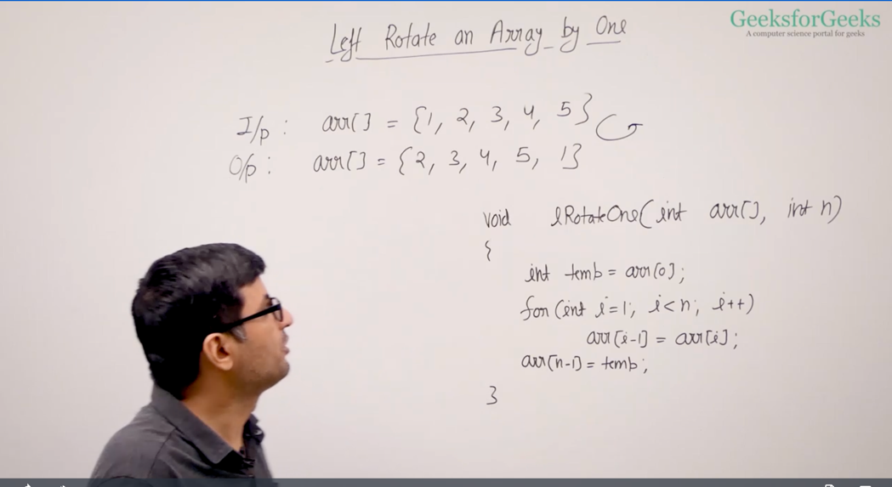

i wrote a little different

[link to the program](../classes/LeftRotate.java)


## **Left Rotate Array by D places**

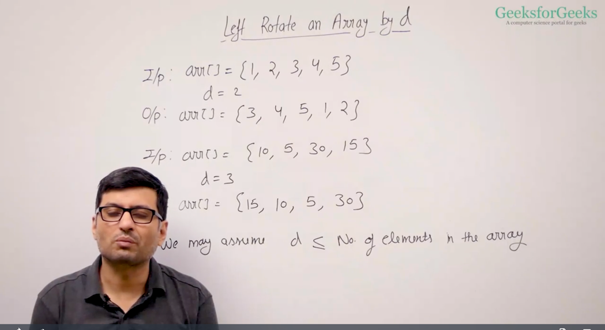

https://leetcode.com/problems/rotate-array/

[link to the program](../classes/LeftRotateByKplaces.java)

**Leaders in an array**

given an array, if there is nothing greater than the right of the element, then its called leader

int a ={ 1, 10, 3, 5, 4, 2}
here 10 , 5 and 2 are leaders. because to the right of it there is nothing greater than them

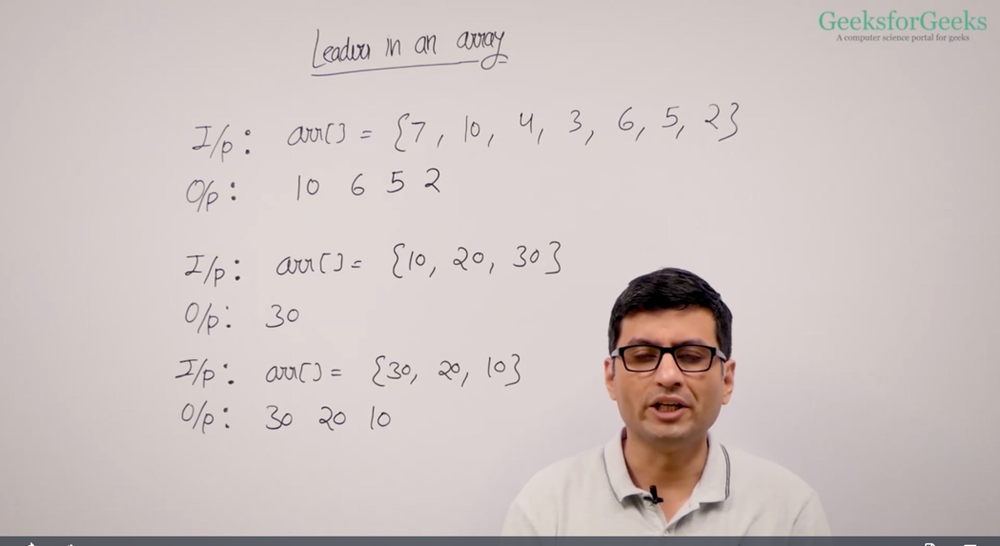

https://www.geeksforgeeks.org/problems/leaders-in-an-array-1587115620/1?itm_source=geeksforgeeks&itm_medium=article&itm_campaign=practice_card

[link to the program](../classes/Leaders.java)

**Maximum difference Problem in ararys**

in a given array find the max difference in such a way that a[j] - a[i] = max where j> i

keep finding the min value
update the max difference
udpate the min value

[link to the program](../classes/MaximumDiff.java)

https://leetcode.com/problems/maximum-difference-between-increasing-elements/

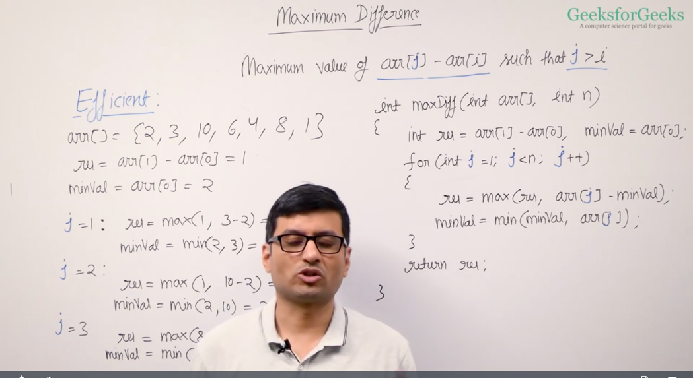

## **Frequency of each element in a sorted array**

## **Stock Buy and Sell**

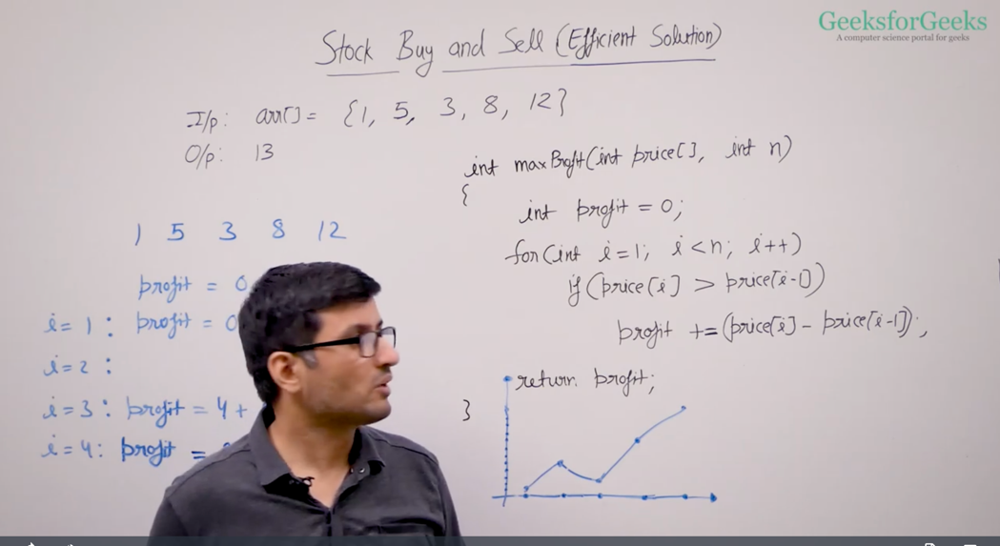

### **Stock Buy and Sell Problem - Java Solution with Pictorial Explanation**

---

### **Problem Statement:**
You are given an array `prices[]`, where `prices[i]` represents the stock price on day `i`. You need to find the maximum profit by choosing a **single buy day and a single sell day** such that the buy day comes before the sell day.

---

## **Java Code (Optimized Approach - O(n))**
```java
class StockProfit {
    public static int maxProfit(int[] prices) {
        int minPrice = Integer.MAX_VALUE;
        int maxProfit = 0;

        for (int price : prices) {
            if (price < minPrice) {
                minPrice = price; // Update min price (buy price)
            } else if (price - minPrice > maxProfit) {
                maxProfit = price - minPrice; // Update max profit
            }
        }
        return maxProfit;
    }

    public static void main(String[] args) {
        int[] prices = {7, 1, 5, 3, 6, 4};
        System.out.println("Maximum Profit: " + maxProfit(prices)); // Output: 5
    }
}
```

---

## **Step-by-Step Pictorial Explanation**
### **Given Prices Array**
```
Index:  0   1   2   3   4   5
Price: [7,  1,  5,  3,  6,  4]
```
🎯 **Goal:** Buy at the lowest price and sell at the highest price afterward.

---

### **Tracking Minimum Price and Maximum Profit**

| Day | Price | Min Price (Buy) | Profit (Sell - Min) | Max Profit |
|-----|-------|----------------|----------------------|------------|
| 0   | 7     | 7              | 0                    | 0          |
| 1   | 1     | 1 (New Min)     | 0                    | 0          |
| 2   | 5     | 1              | 5 - 1 = 4            | 4          |
| 3   | 3     | 1              | 3 - 1 = 2            | 4          |
| 4   | 6     | 1              | 6 - 1 = 5 (New Max)  | 5          |
| 5   | 4     | 1              | 4 - 1 = 3            | 5          |

---

### **Graphical Representation of Prices**
📈 **Stock Price Movement**
```
Price
  7   *  
  6       *   
  5       *   
  4           *       *   
  3           *   *       
  2               
  1       *              
--------------------------------------
Days ->   0   1   2   3   4   5
```
### **Explanation:**
1. **Buy at Day 1 (Price = 1)** ✅
   - We update `minPrice` to `1`, as it's the lowest seen so far.

2. **Sell at Day 4 (Price = 6)** ✅
   - We calculate profit `6 - 1 = 5`, which is the highest possible profit.

💰 **Final Answer: Max Profit = 5**  
( Buy at `1`, Sell at `6` )

---

## **Key Takeaways**
✅ **Time Complexity:** O(n) (Single pass)  
✅ **Space Complexity:** O(1) (No extra space needed)  
✅ **Efficient for large datasets**

https://leetcode.com/problems/best-time-to-buy-and-sell-stock/submissions/1592739332/


[link to the program](../classes/BestTimeToBuySellStock.java)


## **Trapping Rain Water**

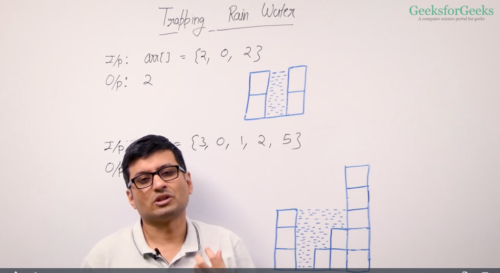

### **Trapping Rain Water - Step-by-Step Explanation**

---

## **Problem Statement**
Given an array `height[]`, where `height[i]` represents the height of a bar at index `i`, calculate how much rainwater can be trapped between the bars after raining.

---

### **Example**
#### **Input:**
```
height = [0,1,0,2,1,0,1,3,2,1,2,1]
```
#### **Output:**
```
Trapped Water = 6 units
```

---

## **Step-by-Step Solution (Two-Pointer Approach - O(n), O(1) Space)**
### **Step 1: Initialize Variables**
- **Two pointers**: `left = 0`, `right = n - 1`
- **Track max height from left and right**: `leftMax = 0`, `rightMax = 0`
- **Total trapped water**: `trappedWater = 0`

### **Step 2: Move the Pointers**
- Compare `height[left]` and `height[right]`
- If `height[left] < height[right]`, process **left pointer**
- Else, process **right pointer**

---

## **Step-by-Step Execution**
#### **Given `height` array:**
```
Index:   0  1  2  3  4  5  6  7  8  9 10 11
Height: [0, 1, 0, 2, 1, 0, 1, 3, 2, 1, 2, 1]
```

### **Step 1: Initialize**
```
left = 0, right = 11
leftMax = 0, rightMax = 0
trappedWater = 0
```

### **Step 2: Processing**
| Step | Left | Right | LeftMax | RightMax | Water Added | Total Water |
|------|------|-------|---------|----------|-------------|-------------|
| 1    | 0    | 11    | 0       | 1        | 0           | 0           |
| 2    | 1    | 11    | 1       | 1        | 0           | 0           |
| 3    | 2    | 11    | 1       | 1        | 1 - 0 = 1   | 1           |
| 4    | 3    | 11    | 2       | 1        | 0           | 1           |
| 5    | 4    | 11    | 2       | 2        | 2 - 1 = 1   | 2           |
| 6    | 5    | 10    | 2       | 2        | 2 - 0 = 2   | 4           |
| 7    | 6    | 9     | 2       | 2        | 2 - 1 = 1   | 5           |
| 8    | 7    | 9     | 3       | 2        | 0           | 5           |
| 9    | 7    | 8     | 3       | 2        | 0           | 5           |
| 10   | 7    | 7     | 3       | 3        | 3 - 2 = 1   | 6           |

### **Step 3: Final Output**
```
Trapped Water = 6 units
```

---

## **Graphical Representation**
```
Elevation Map:

        #
    #   #
    # . # . #
  # . # . # . #   #
--------------------
Index: 0 1 2 3 4 5 6 7 8 9 10 11

Water trapped: (.) = 6 units
```

---

## **Optimized Java Code**
```java
class RainWaterOptimized {
    public static int trap(int[] height) {
        if (height == null || height.length == 0) return 0;

        int left = 0, right = height.length - 1;
        int leftMax = 0, rightMax = 0;
        int trappedWater = 0;

        while (left < right) {
            if (height[left] < height[right]) {
                if (height[left] >= leftMax) {
                    leftMax = height[left];
                } else {
                    trappedWater += leftMax - height[left];
                }
                left++;
            } else {
                if (height[right] >= rightMax) {
                    rightMax = height[right];
                } else {
                    trappedWater += rightMax - height[right];
                }
                right--;
            }
        }

        return trappedWater;
    }

    public static void main(String[] args) {
        int[] height = {0,1,0,2,1,0,1,3,2,1,2,1};
        System.out.println("Trapped Water: " + trap(height)); // Output: 6
    }
}
```

---

## **Key Takeaways**
✅ **Time Complexity:** O(n)  
✅ **Space Complexity:** O(1)  
✅ **Efficient for large inputs**


https://leetcode.com/problems/trapping-rain-water/

[link to the program](../classes/TrappingRainWater.java)


## **Maximum consequent 1s in Binary array**

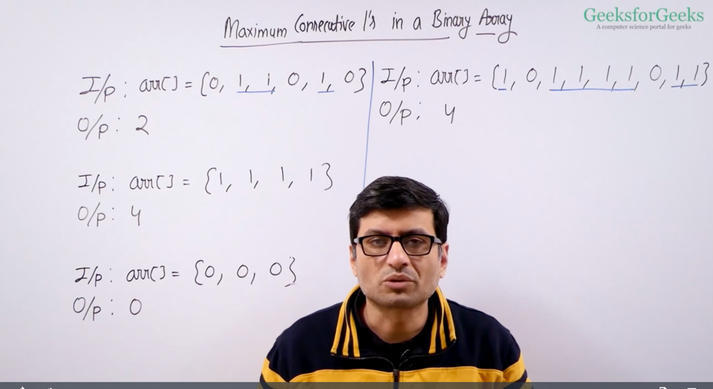

https://leetcode.com/problems/max-consecutive-ones/
[link to the program](../classes/MaxConsequiteOnes.java)


**Maximum sum subarray with negative numbers also in it.**

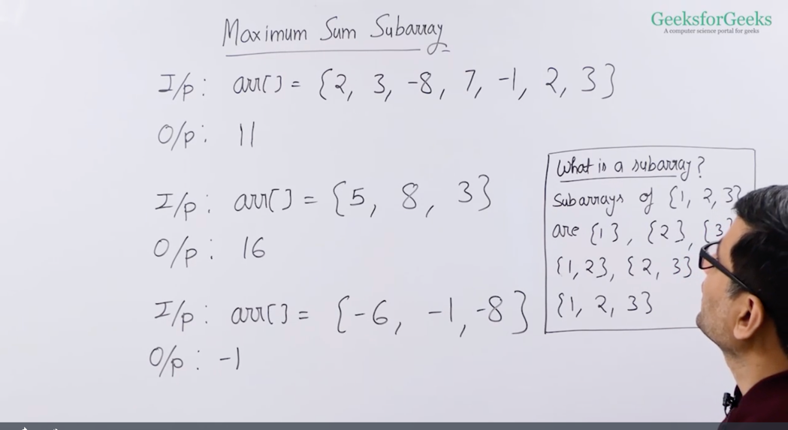

[link to the program](../classes/MaximumSumSubarray.java)

https://leetcode.com/problems/maximum-subarray/description/

[link to the program](../classes/MaximumSumSubarray.java)

# **Max Length even or odd - alternative**

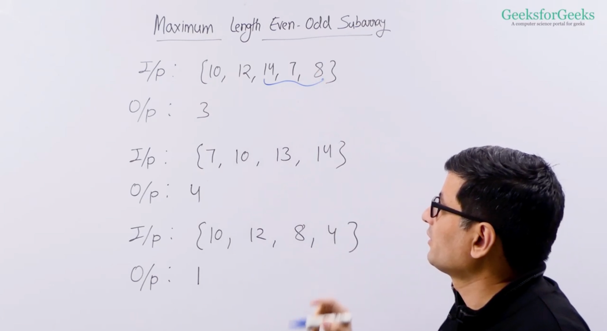

[link to the program](../classes/MaxEvenOddSubarray.java)

## **Maximum circular subarray sum**

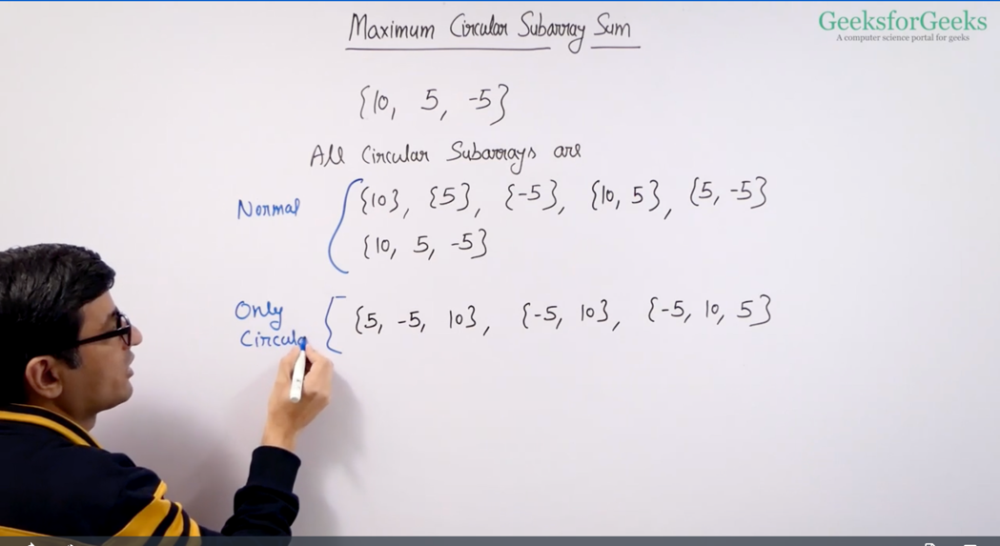

watch for full explanation
https://www.geeksforgeeks.org/batch/dsa-4/track/DSASP-Arrays/video/MTQ2NDU%3D

first find the normal maximum sum subarray
see if sum is less than 0 then return that.
if not
find the total sum
and
next find minimum sum subarray 
and the result is max of maxSum , totalSum-minSum


## **Majority Element in an Array**

In a given array, if an element appears more than half of the size of array, then its majority element.
i.e if n =6 , then an element should appear more than n/2 = 3 times
eg : {8,3,4,8,8} => 8 appears more than 5/2 times
{3,7,4,7,7,5} => 7 appears exactly 3 times its not majority
This works on algorithm called

#### **Moore's Voting Algorithm**

which states that we assume it is first element which repeats and store its index in result variable.
we begin with 2nd element, we check if result element and 2nd element are equal.
if so , we increment the count and if not , we decrement the count
when count reaches 0 then we make the result element as current element, and reset the count to 1.

in the next phase, we just simply traverse through the list and confirm if the result element is the actual majority element

if no majority element, then we return -1;

its not always mandatory for this algorithm to return the 1st found index of majority element. it can return the middle one as well.

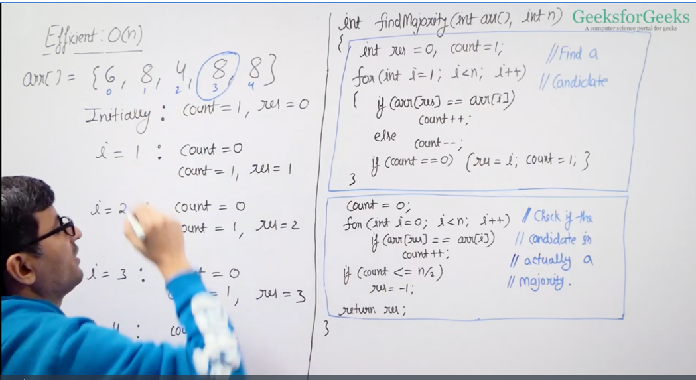

[link to the program](../classes/MajorityElement.java)

https://leetcode.com/problems/majority-element/description/


### **Minimum Consecutive Flips in a binary array**


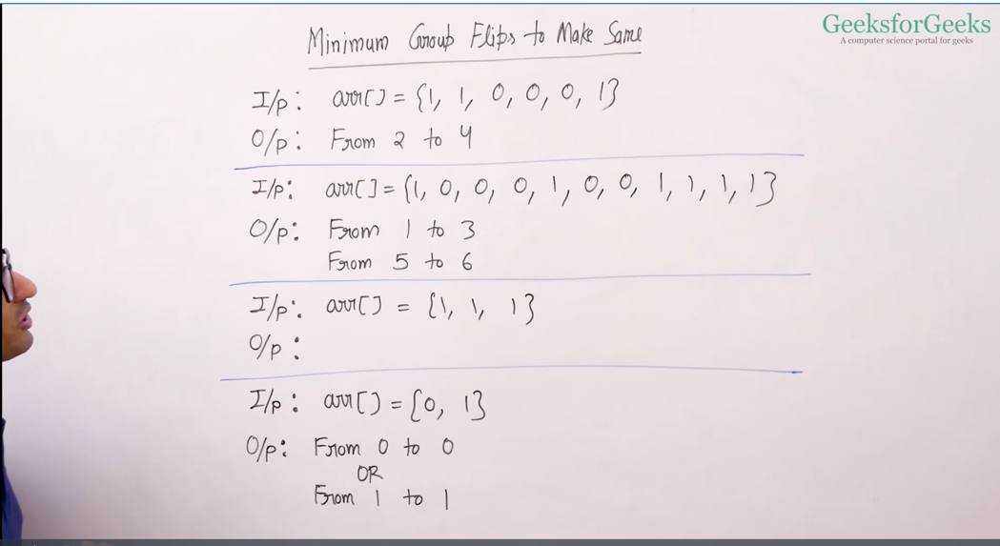

https://www.geeksforgeeks.org/batch/dsa-4/track/DSASP-Arrays/video/MTU4Ng%3D%3D

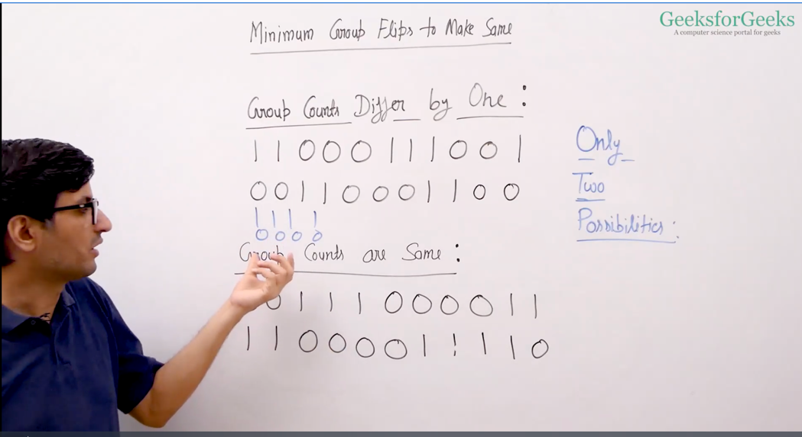

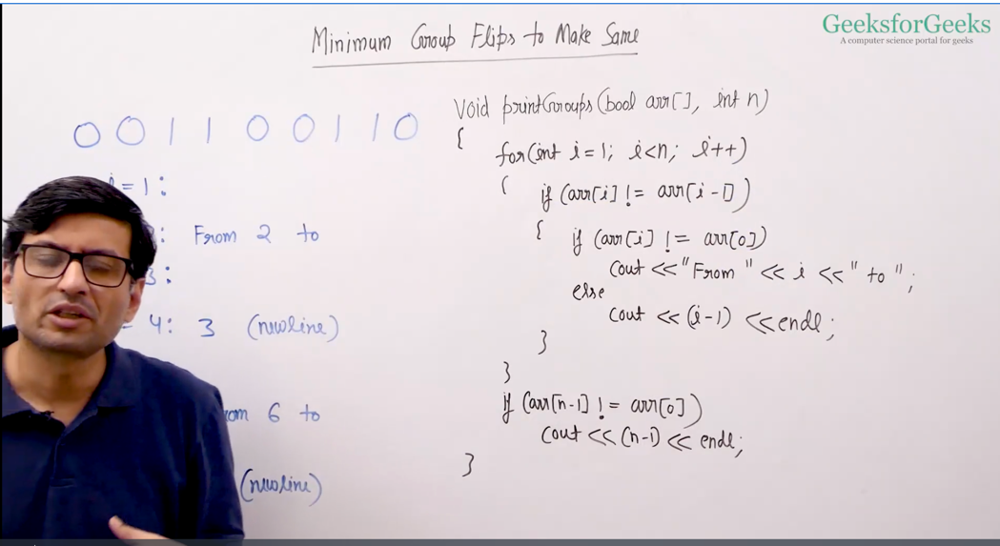

**Explanation :** 

the concept is that since its a binary array, the difference between no.of 0 group flips and 1 group flips are either same or 1.

eg : {1,1,0,1,1,0} 
here 1 group flips = 2
0 group flips = 2
so difference is 0 which is same.

eg : {1,1,1,0,0,1,1,1,1}
0 group flips = 1
1 group flips = 2
difference is 1.

also there are only 2 cases,  first element and last element are same or its different(different as 2nd group)
in above example, 110110 - last element is same as 2nd group

logic : 

we keep checking where the elements does not match. we never flip the 1st group. we always find the starting point and 
ending point of 2nd group.

eg : {1,1,0,1,1,0} 

we check the point where a[i] and a[i-1] are not same. and check if that group is not same as first group. because we never flip the first group.
if its a different group then thats the starting point.

next we a[i] and a[i-1] are not same but a[i] is same as first group element, thats the ending point

there could be an edge case, where last group needs a closure, so at the end we check if a[n-1] != a[0] then we just close it

[link to the program](../classes/MinimumConsFlip.java)

## **Sliding Window Approach**

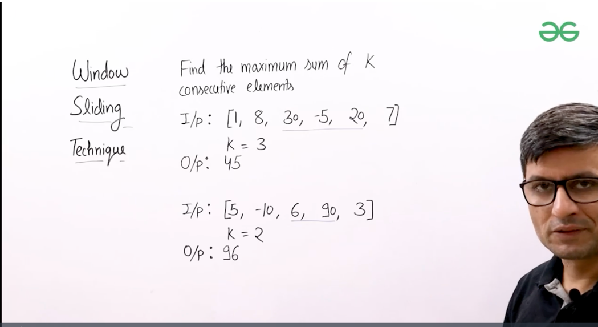

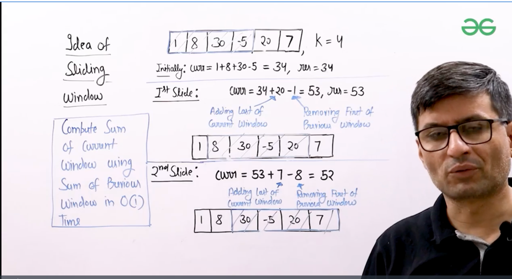

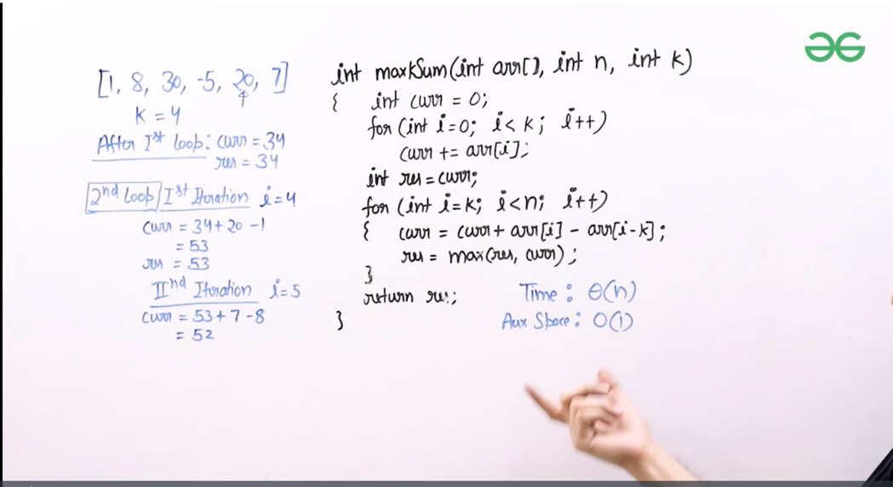

just slide the window as needed.

[link to the program](../classes/SlidingWindow.java)

## **SubArray with given Sum**

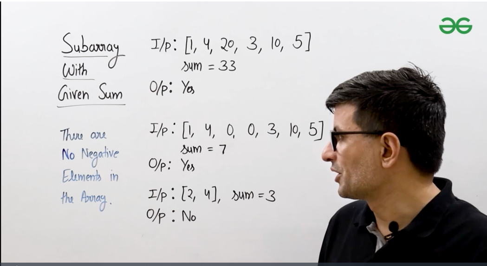

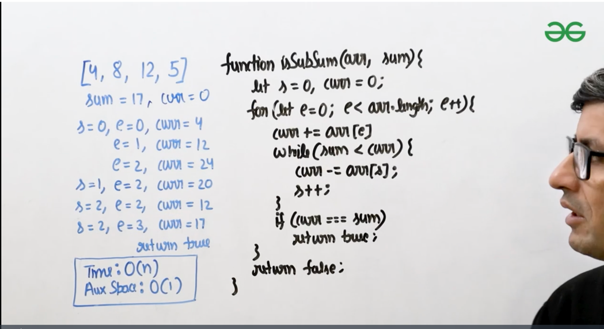

[link to the program](../classes/SubArrayWithGivenSum.java)

## **Prefix Sum**

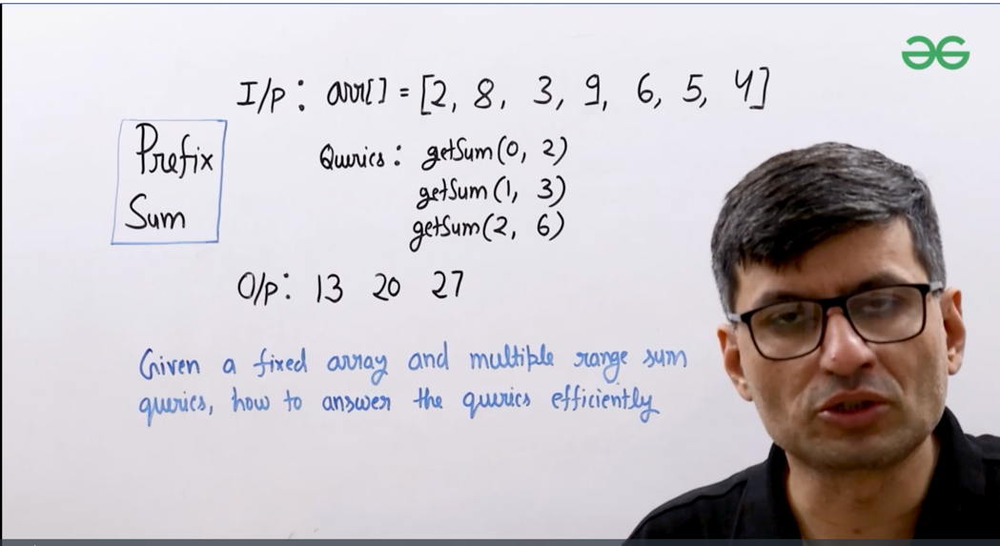

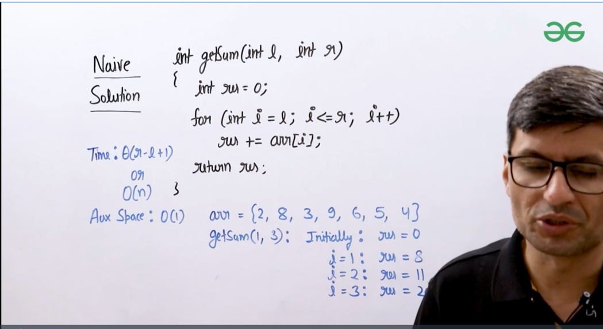

We will be pre-processing the array inorder to achieve the time complexity as O(1)

a = [2,8,3,9,6,5,4]
in pre-processing we find the sum of subarray from  0 to k , where k is incremental index

i.e pSum = [2, 10,13,22,33,37]
i.e from 1st element to the current element what is the sum
if we know this, then getSum(1,2)
will be 
pSum[2] - pSum[1-1] => 13 - 2 = 11 which is true.
in case getSum(0,2) -> then it is just pSum[2] => 13

thats the logic for O(1) time complexity

[link to the program](../classes/PrefixSum.java)

## **Equilibrium Point**

A point in array where left and right sum of that point are same.
eg : {3,4,8,-9,9,7} . equilibrium point is 8, because 3+4 = 7 and -9+9+7 = 7

naive solution is to have multiple loops to find the left sum and right sum.

next best solution is to compute prefixSum and SuffixSum.
But the efficient solution is: 
1. find the total sum
2. for every element, calculate the right sum ( total - current element)
3. compare left and right sum - if same then return true
4. if not, add the current element to left sum. i.e update the left sum

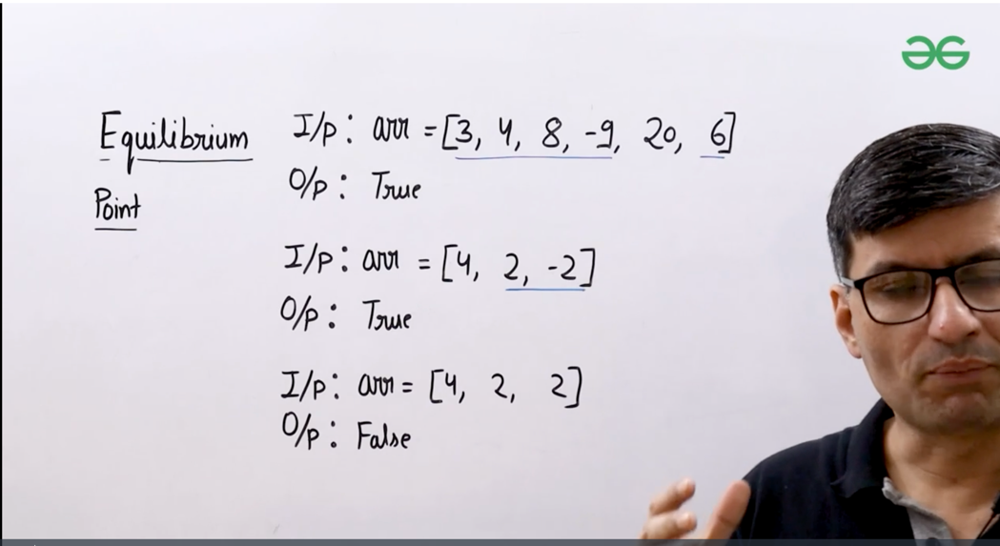

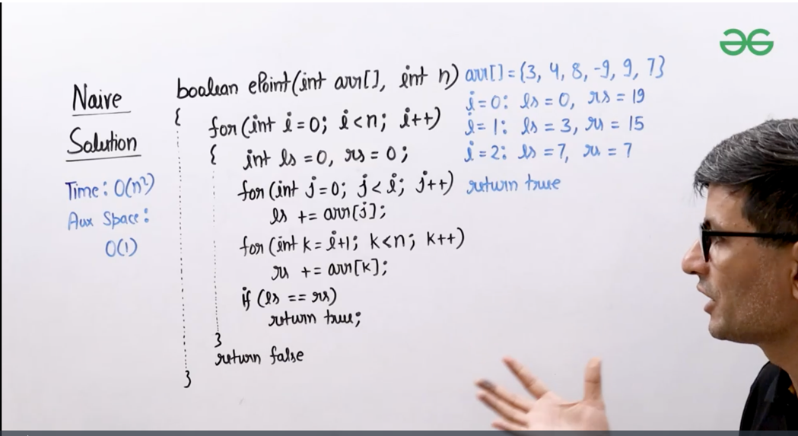

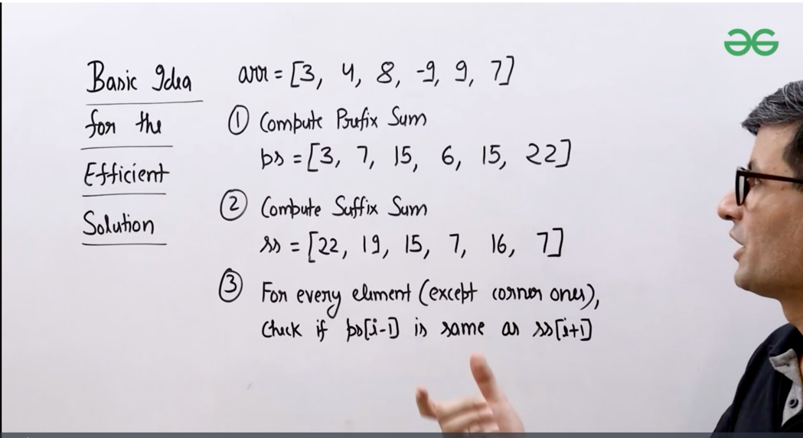

[link to the program](../classes/EquilibriumPoint.java)

https://leetcode.com/problems/find-pivot-index/

## **Maximum Appearing element in given arrays**

given an array a = {1,2,3,4,5}; and b = {2,3,4,5,6,7,8}; find the most appearing element
array elements are < 100 and >= 0

[link to the program](../classes/MaxAppearingInGivenArray.java)

## **Maximum Appearing element in the ranges of arrays.**

Given left (starting ) and right (ending) values in of an array , we need to calculate which element appears most in the formed ranges
left = [1,2,5,3] right = [5,8,7,6] left <= right and numbers are < 100 and >= 0

here ranges are  [1,2,3,4,5] , [2,3,4,5,6,7,8] , [5,6,7] , [3,4,5,6]
here most appearing element is 5

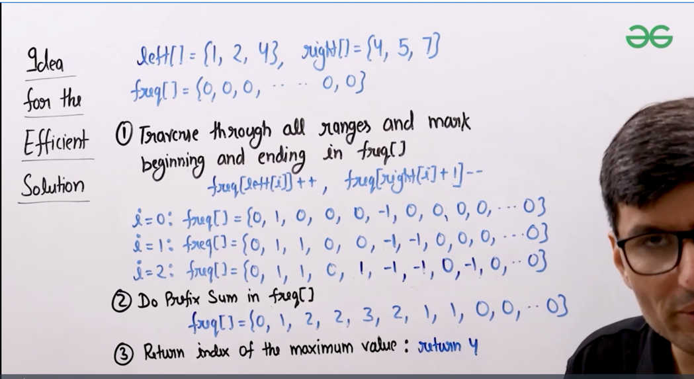

we first mark the starting and ending of the range to 1 and -1 respectively.
once that is done, 
then we find out the prefix sum
and in that which ever is the highest thats the max sum

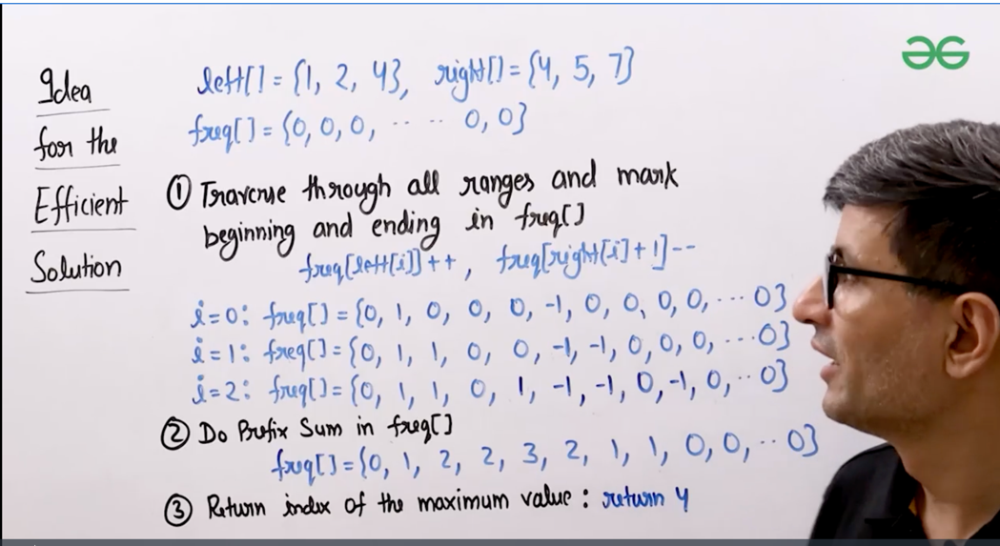


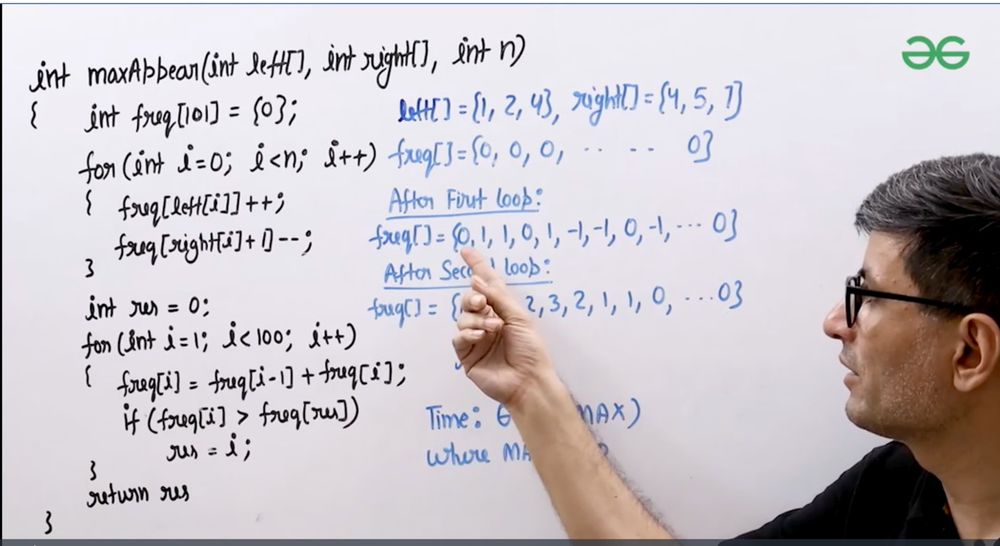

[link to the program](../classes/MaxAppearingInRange.java)


   


