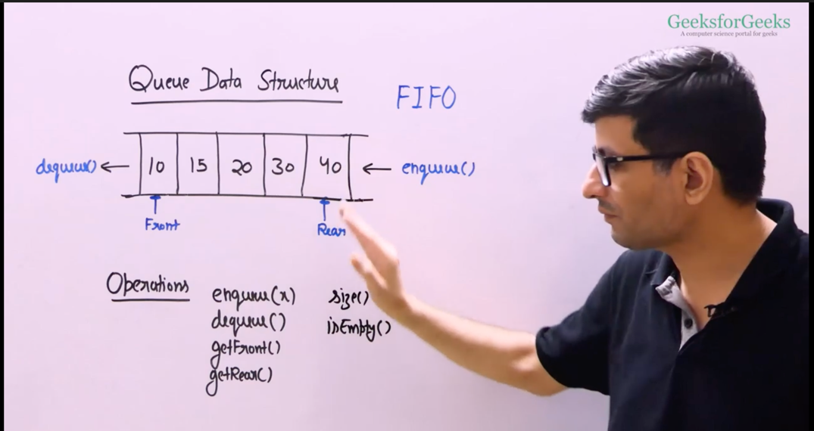
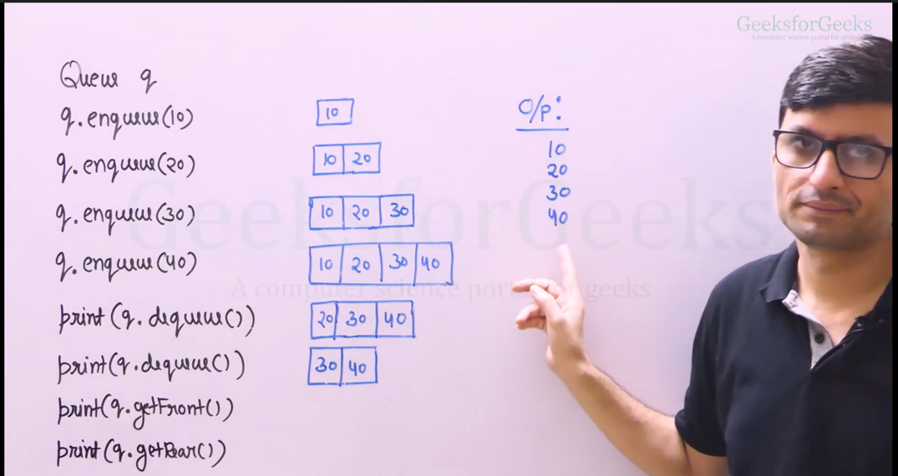
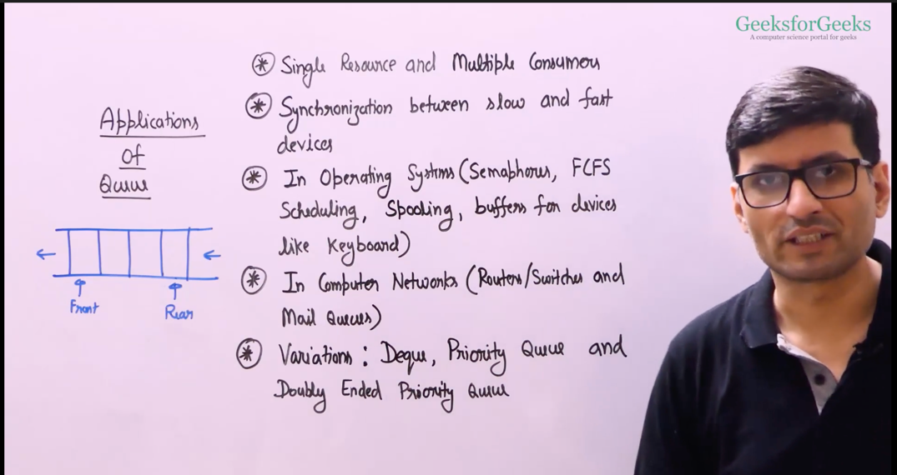
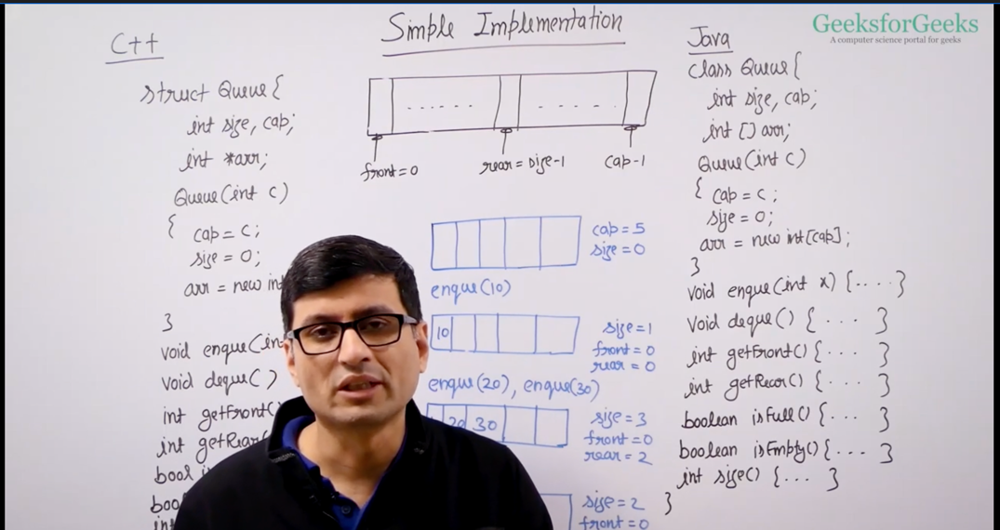
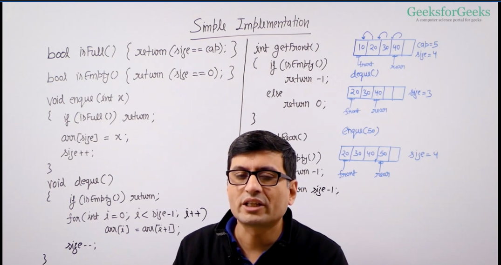
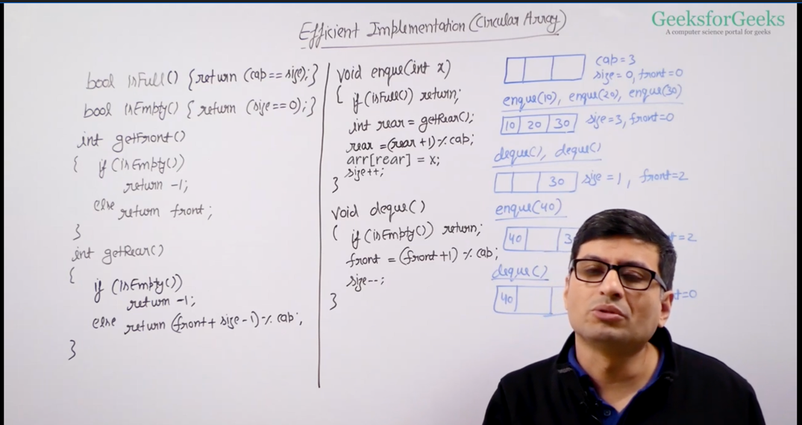
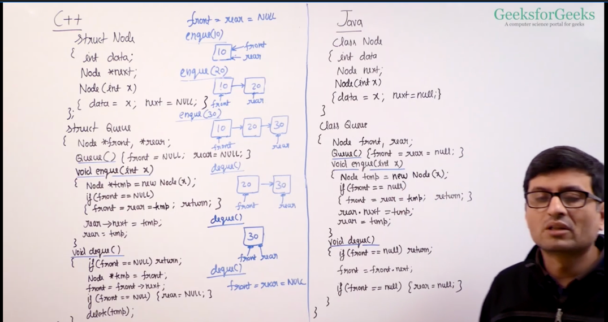

# Queue : 

the end from which we remove(dequeue()) is called front, and the end from which we insert(enqueue()) is called rear.

## **Implementation of Queue using Array :** 

but in above approach, dequeue() takes moving all the elements from right to left n-1 times

Efficient is when we use circular array :

## **Implementation of Queue using Linked List :** 

