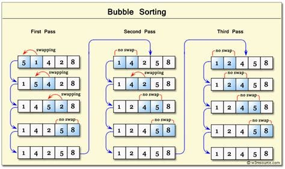
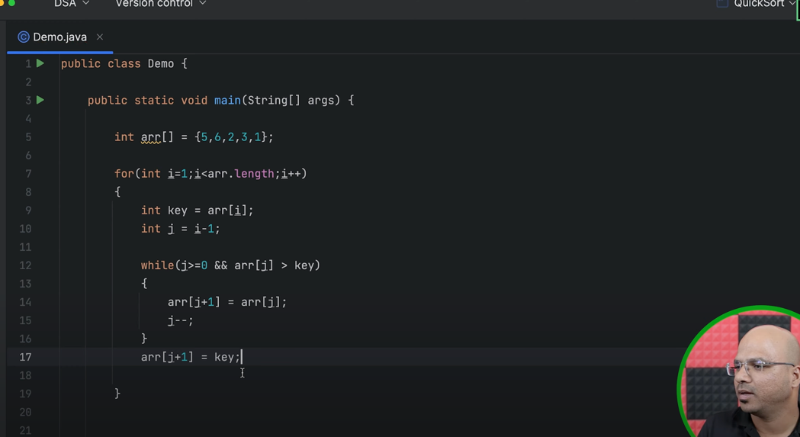
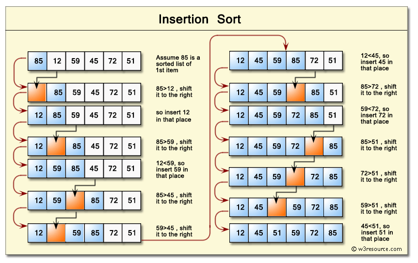
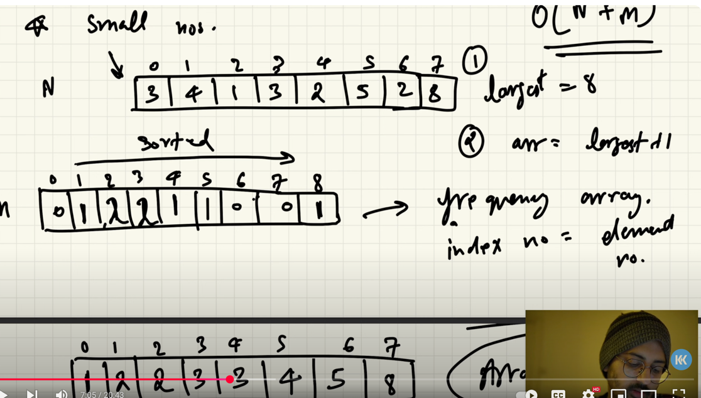
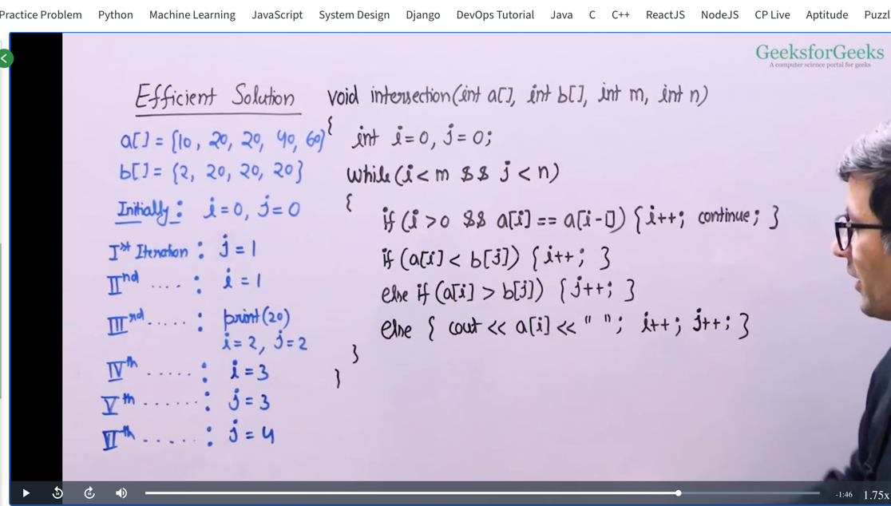

## **Overview of Sorting Algorithm**

binary array - partition of algorithm of **quick sort** (Lomuto, Hoare and Naive) . Naive requires extra space. 
but other two algorithms are faster.

Arrays with 3 possible values (0,1,2) - **Quick sort** partition algorithms

Array of size N. but range of this array is only till 200 . like elements in that array are below 200 - **Counting sort**

But if range is more like. 1 lakh or more, then we can use **Radix Sort**  - O(n) time complexity

Array with uniformly distributed data over the range. - **bucket sort**

when memory writes are costly. - **selection sort or cycle sort** - but takes O(n^2) but space complexity is good

when in a spl situation you are allowed to swap only adjacent elements. - **bubble sort** . Optimized version of bubble sort is **cocktail sort**

when array is small - **selection sort and insertion sort** - inserstion sort works best.

when the available extra memory is small - Shall sort . O(n * log(n)^2)


General purpose sorting algorithms - like random data, we dont know anything about data. - Merge sort, quick sort, heap sort

Hybrid sorting algorithms - most of the libraries use these . in python its **timsort** - mix of insertion sort and merge sort.
it uses merge sort usually and when input becomes small, it switches to insertion sort.

Introsort - mix of quick sort, heap sort and insertion sort. it generally uses quick sort, and when unfair amount of 
partitions are done, then it switches to heap sort and when input becomes small, it switches to insertion sort.


### **Sorting in Java**


## **Bubble Sort :**

https://youtube.com/shorts/-kXznl7NEGk?feature=shared



Sure! Let’s break down **Bubble Sort** with a clear and simple explanation.

---

### 🔁 **What is Bubble Sort?**
Bubble Sort is a simple sorting algorithm that repeatedly steps through the list, compares adjacent elements, and swaps them if they are in the wrong order. This process continues until the array is sorted.

---

### ✅ **Key Idea**
The largest element "bubbles up" to the end of the list in each pass.

---

### 📘 **Step-by-step Example**
Let’s sort this array:  
`[5, 3, 8, 4, 2]`

**Pass 1**:
- Compare 5 and 3 → Swap → `[3, 5, 8, 4, 2]`
- Compare 5 and 8 → No Swap
- Compare 8 and 4 → Swap → `[3, 5, 4, 8, 2]`
- Compare 8 and 2 → Swap → `[3, 5, 4, 2, 8]`

➡️ Largest element `8` is now at the end.

**Pass 2**:
- Compare 3 and 5 → No Swap
- Compare 5 and 4 → Swap → `[3, 4, 5, 2, 8]`
- Compare 5 and 2 → Swap → `[3, 4, 2, 5, 8]`

➡️ `5` is in its place.

**Pass 3**:
- Compare 3 and 4 → No Swap
- Compare 4 and 2 → Swap → `[3, 2, 4, 5, 8]`

**Pass 4**:
- Compare 3 and 2 → Swap → `[2, 3, 4, 5, 8]`

✅ Array is now sorted!

---

### 💡 **Algorithm (Pseudocode)**

```java
for (int i = 0; i < n-1; i++) {
    for (int j = 0; j < n-i-1; j++) {
        if (arr[j] > arr[j+1]) {
            // Swap arr[j] and arr[j+1]
        }
    }
}
```

---

### ⏱️ Time Complexity
- Worst & Average: `O(n^2)`
- Best Case (already sorted): `O(n)` if optimized with a **no-swap flag**

---

### ✅ Suitable When:
- List is small
- Simplicity matters more than performance

---

[link to the program](../classes/BubbleSort.java)

https://leetcode.com/problems/sort-an-array/


Absolutely! Let’s look at the **best-case scenario for Bubble Sort** and see how it achieves **O(n)** time complexity.

---

### ✅ **Best Case Condition**
The array is **already sorted**.

Example:
```java
int[] arr = {1, 2, 3, 4, 5};
```

---

### 🔁 Optimized Bubble Sort Code

We use a **flag** to detect if any swaps were made. If no swaps occur during a pass, the array is already sorted, and we break early.

```java
public class BubbleSortOptimized {
    public static void bubbleSort(int[] arr) {
        int n = arr.length;
        boolean swapped;

        for (int i = 0; i < n - 1; i++) {
            swapped = false;  // Reset for each pass

            for (int j = 0; j < n - i - 1; j++) {
                if (arr[j] > arr[j + 1]) {
                    // Swap
                    int temp = arr[j];
                    arr[j] = arr[j + 1];
                    arr[j + 1] = temp;

                    swapped = true;
                }
            }

            // No swaps = array already sorted
            if (!swapped) {
                break;
            }
        }
    }

    public static void main(String[] args) {
        int[] arr = {1, 2, 3, 4, 5};
        bubbleSort(arr);

        for (int i : arr) {
            System.out.print(i + " ");
        }
    }
}
```

---

### ⏱️ Time Complexity in Best Case

- **Only 1 pass** is made.
- No swaps occur → breaks early.
- So the complexity is **O(n)**.

---


## **Selection Sort:**

https://youtube.com/shorts/nadI4BM0Bvw?feature=shared


---

## 🔁 What is Selection Sort?

Selection Sort is a simple comparison-based sorting algorithm.  
It works by **repeatedly finding the minimum element** from the **unsorted part** and putting it at the beginning.

---

## 📌 How It Works (Step-by-Step)

### Suppose the array is:
```text
[29, 10, 14, 37, 14]
```

### Steps:

1. **First Pass**:
    - Find the **minimum** from index `0 to 4`: → `10`
    - Swap it with the first element → Swap `29` and `10`
    - Array becomes: `[10, 29, 14, 37, 14]`

2. **Second Pass**:
    - Find the **minimum** from index `1 to 4`: → `14`
    - Swap with `29` → `[10, 14, 29, 37, 14]`

3. **Third Pass**:
    - Find the **minimum** from index `2 to 4`: → `14`
    - Swap with `29` → `[10, 14, 14, 37, 29]`

4. **Fourth Pass**:
    - Find the **minimum** from index `3 to 4`: → `29`
    - Swap with `37` → `[10, 14, 14, 29, 37]`

Now the array is sorted!

---

## ✅ Final Sorted Array
```text
[10, 14, 14, 29, 37]
```

---

## 📦 Java Code
```java
public class SelectionSort {
    public static void selectionSort(int[] arr) {
        int n = arr.length;

        for (int i = 0; i < n - 1; i++) {
            int minIndex = i;

            // Find the minimum in the unsorted part
            for (int j = i + 1; j < n; j++) {
                if (arr[j] < arr[minIndex]) {
                    minIndex = j;
                }
            }

            // Swap with the first unsorted element
            int temp = arr[minIndex];
            arr[minIndex] = arr[i];
            arr[i] = temp;
        }
    }
}
```

---

## ⏱️ Time Complexity
| Case        | Time Complexity |
|-------------|-----------------|
| Best Case   | O(n²)           |
| Average     | O(n²)           |
| Worst Case  | O(n²)           |

Selection Sort **does not depend** on the initial arrangement of data.

---

[link to the program](../classes/selectionSort.java)

## **Insertion Sort**

https://youtube.com/shorts/A6dwiFWO5bA?feature=shared

we take the 2nd element as key and starts comparing with the first element .
just like cards... while playing we insert the card at the right position.

https://www.youtube.com/watch?v=rrfRRllt4c4





[link to the program](../classes/InsertionSort.java)


## **Quick sort :** 
### **(Lomuto partition algorithm)**

Absolutely! Let's walk through **Quick Sort** — one of the most efficient and widely used sorting algorithms, especially for large datasets.

---

### 🔥 Quick Sort – The Idea

Quick Sort is a **divide-and-conquer** algorithm that:
1. Picks a **pivot** element.
2. **Partitions** the array into two parts:
   - Elements **less than pivot**
   - Elements **greater than pivot**
3. Recursively applies the same logic to both sub-arrays.

---

### ✅ Steps in Quick Sort

Given an array `arr = [4, 2, 7, 1, 3]`

1. **Choose Pivot** → Let's say pivot is `3`.
2. **Partition**: Rearrange so that:
   - Left of pivot: values < 3
   - Right of pivot: values > 3  
     → `[2, 1, 3, 7, 4]`
3. **Pivot is now at correct position**.
4. **Recursively** apply Quick Sort to `[2, 1]` and `[7, 4]`.

---

### 🔁 Visualization

```
[4, 2, 7, 1, 3]  
Pivot = 3  
Step 1: Partition  
→ [2, 1, 3, 7, 4]  

Now Quick Sort [2, 1] and [7, 4]  
→ [1, 2, 3, 4, 7] ✅
```

---

### 🔢 Time Complexity

| Case        | Time       |
|-------------|------------|
| Best Case   | `O(n log n)` |
| Average     | `O(n log n)` |
| Worst Case  | `O(n²)`     | (e.g., already sorted + bad pivot)

---

### 🧠 Space Complexity

- In-place sort (no extra array): `O(log n)` auxiliary space for recursion stack.

---

### ✅ When to Use Quick Sort?

- When average-case performance matters
- When space is tight (in-place)
- When random input is expected

---

Let me know if you'd like to see **Java code**, a **step-by-step trace**, or a **pictorial animation**!


[link to the program](../classes/QuickSort.java)


QUICK Sort (Hoare partition)

Great! Here's a version of **Quick Sort using Hoare's partition** where the partition logic avoids `while (true)` and also avoids `do-while`. Instead, we simulate everything using a clean `while (i < j)` structure — no infinite loops, no confusion.

---

### ✅ **Quick Sort (with Hoare’s Partition, no `while(true)`, no `do-while`)**

```java
class Solution {
    public int[] sortArray(int[] nums) {
        quickSort(nums, 0, nums.length - 1);
        return nums;
    }

    void quickSort(int[] arr, int low, int high) {
        if (low < high) {
            int p = hoarePartition(arr, low, high);
            quickSort(arr, low, p);
            quickSort(arr, p + 1, high);
        }
    }

    int hoarePartition(int[] arr, int low, int high) {
        int pivot = arr[low];
        int i = low;
        int j = high;

        while (i < j) {
            // Move i until we find an element >= pivot
            while (i <= high && arr[i] < pivot) i++;

            // Move j until we find an element <= pivot
            while (j >= low && arr[j] > pivot) j--;

            if (i < j) {
                // Swap arr[i] and arr[j]
                int temp = arr[i];
                arr[i] = arr[j];
                arr[j] = temp;
                i++;
                j--;
            }
        }

        return j;
    }
}
```

---

### ✅ Example Dry Run:

Given: `arr = [5, 3, 8, 4, 2]`, pivot = `5`

1. i = 0 → `arr[i] == 5` → stop  
   j = 4 → `arr[j] == 2` → stop  
   Swap `arr[0]` and `arr[4]` → `[2, 3, 8, 4, 5]`

2. i = 1, j = 3  
   i = 1 → `arr[i] == 3` → keep moving  
   i = 2 → `arr[i] == 8` → stop  
   j = 3 → `arr[j] == 4` → keep moving  
   j = 2 → `arr[j] == 8` → stop  
   Swap `arr[2]` and `arr[2]` (no effect)

3. i = 3, j = 1 → i > j → stop

Partition index is `j = 1`.

---
Great question! Let's understand **why we return `j`** in **Hoare’s partition scheme** — it’s a subtle but very important detail in quicksort.

---

### 🔄 Hoare Partition Recap

In Hoare's partition:

- We **choose a pivot** (usually `arr[low]`)
- We use two pointers `i` and `j`:
   - `i` starts from `low - 1` or `low`
   - `j` starts from `high + 1` or `high`
- We move `i` forward until we find an element **greater than or equal to the pivot**
- We move `j` backward until we find an element **less than or equal to the pivot**
- If `i < j`, we **swap** `arr[i]` and `arr[j]`
- When `i >= j`, we **stop**, and we **return `j`**

---

### ❓ Why return `j`?

Returning `j` gives us the **final position of the partition boundary**, where:

- All elements **to the left of `j`** are **less than or equal to pivot**
- All elements **to the right of `j`** are **greater than or equal to pivot**

⚠️ But **note**: **the pivot itself might not be at `j`**. Unlike Lomuto partitioning, **Hoare’s does not guarantee pivot ends up in the middle** — but the array is still partitioned correctly.

---

### 🧠 In Quick Sort:

```java
int p = hoarePartition(arr, low, high);
quickSort(arr, low, p);
quickSort(arr, p + 1, high);
```

We do **not** use `p - 1` and `p + 1` like Lomuto. We recurse on:

- `low` to `p` → because the pivot could still be somewhere inside this range
- `p + 1` to `high`

---

### ✅ Summary:

| Partitioning Scheme | Returns | Why |
|---------------------|---------|-----|
| **Hoare**           | `j`     | Final index where left half ≤ pivot, right half ≥ pivot |
| **Lomuto**          | `i`     | Final index of pivot (pivot is placed there)            |

Let me know if you'd like to see a dry-run demo comparing both styles!


## **Merge Sort**

https://www.youtube.com/watch?v=SHqvb69Qy70

https://leetcode.com/problems/sort-an-array/submissions/1602672079/

Sure Shilpa! Let’s walk through **Merge Sort** — one of the most popular **divide-and-conquer** sorting algorithms.

---

### 🔍 What is Merge Sort?

**Merge Sort** recursively divides the array into halves until you reach subarrays of size 1, and then **merges** those subarrays in a **sorted manner**.

---

### ✅ Key Characteristics

- **Time Complexity**:
   - Best: O(n log n)
   - Average: O(n log n)
   - Worst: O(n log n)
- **Space Complexity**: O(n)
- **Stable Sort**: Yes
- **Divide and Conquer** approach

---

### 🧠 How Merge Sort Works

Let’s say you have this array:

```java
[6, 3, 8, 5, 2, 7, 4, 1]
```

#### 🔸 Step 1: Divide
Split it into two halves recursively:

```
[6, 3, 8, 5]       [2, 7, 4, 1]
[6, 3] [8, 5]      [2, 7] [4, 1]
[6][3] [8][5]      [2][7] [4][1]
```

#### 🔸 Step 2: Merge sorted subarrays

Start merging while sorting:

```
[3,6] [5,8]        [2,7] [1,4]
[3,5,6,8]          [1,2,4,7]
[1,2,3,4,5,6,7,8]  ✅ Sorted
```

---

### 🧑‍💻 Java Code Example

```java
class MergeSort {

    public void mergeSort(int[] arr, int left, int right) {
        if (left < right) {
            int mid = (left + right) / 2;

            // Sort left half
            mergeSort(arr, left, mid);

            // Sort right half
            mergeSort(arr, mid + 1, right);

            // Merge the two sorted halves
            merge(arr, left, mid, right);
        }
    }

    public void merge(int[] arr, int left, int mid, int right) {
        int n1 = mid - left + 1;
        int n2 = right - mid;

        int[] L = new int[n1];
        int[] R = new int[n2];

        for (int i = 0; i < n1; i++)
            L[i] = arr[left + i];

        for (int j = 0; j < n2; j++)
            R[j] = arr[mid + 1 + j];

        int i = 0, j = 0, k = left;

        // Merge back into arr
        while (i < n1 && j < n2) {
            if (L[i] <= R[j]) {
                arr[k++] = L[i++];
            } else {
                arr[k++] = R[j++];
            }
        }

        // Copy remaining elements
        while (i < n1) arr[k++] = L[i++];
        while (j < n2) arr[k++] = R[j++];
    }
}
```

---

### 📌 When to Use Merge Sort?

- When **stability matters**
- When sorting **linked lists** (since merge sort can be done in O(1) space for lists)
- When worst-case performance matters (merge sort always performs in O(n log n))

---

[link to the program](../classes/MergeSort.java)


## **Cycle Sort :**

[link to the program](../classes/CycleSort.java)

watch video for full details.

when given array has 0 to n elements. then blindly use cycle sort. like n = 5 and a = {0,1,2,3,4} then use cycle sort

https://www.youtube.com/watch?v=JfinxytTYFQ

Missing number : https://leetcode.com/problems/missing-number/solutions/127673/missing-number/


## Heap Sort :

## **Counting Sort :** 



we build a frequency array and store the no.of times the element is repeating. 
we can substitute with hash map as well.

but this algorithm not good for large numbers and decimals

steps : 
first find the largest element in the array.

then create an auxillary array of size largest element + 1 ,for storing frequencies

now fill the frequency array.

now traverse the frequency array and add all the non-zero numbers in order in main array.

https://www.youtube.com/watch?v=FOo820lJV1Y - go through this for full explanation

[link to the program](../classes/CountingSort.java)


## Radix Sort :

## **Bucket Sort :** 

# Problems :

## **Merge two Sorted Arrays :**

[link to the program](../classes/MergeTwoSortedArrays.java)

https://leetcode.com/problems/merge-sorted-array/


## **Intersection of Two Sorted Arrays :**


[link to the program](../classes/IntersectionSortedArrray.java)


## **Intersection of two unsorted arrays :** 

https://leetcode.com/problems/intersection-of-two-arrays/

[link to the program](../classes/FindIntersectionOfUnsorted.java)


