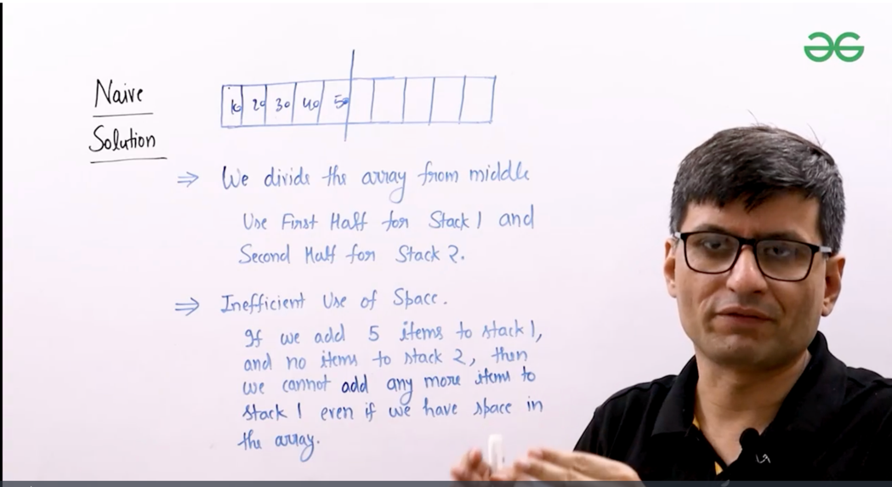
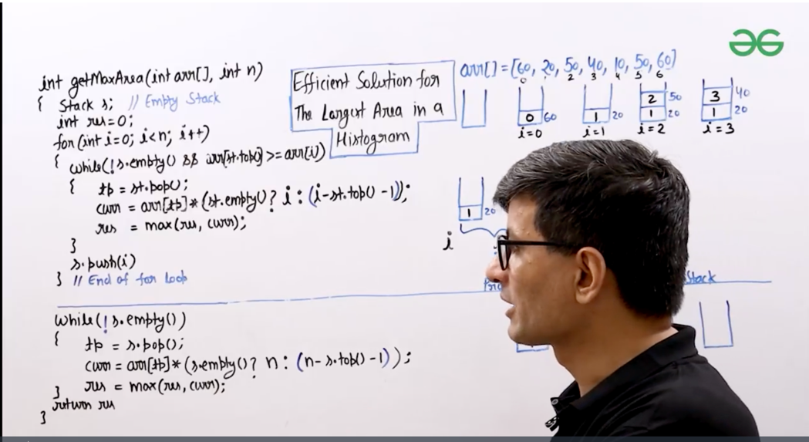

# **Stack**


push and pop

functions of Stack


## **ArrayList implementation :**


Handling edge cases


simple array implementation : [link to program ](../classes/MyStackArrayImp.java)
To solve above problems, we can use ArrayList instead of Array for dynamic allocation to avoid overflow and underflow issues.


Time Complexity of all operations is O(1) both for array and arraylIST implementation. but due to dynamic sizing
arraylist might be a bit costly.

# **linkedList implementation**


[link to program ](../classes/MyStackLLImp.java)


# **Applications of Stack :**

where ever we need Last in First out, then we use stack.

Sure, Shilpa! Here are the **real-world applications of a Stack** — a key data structure based on **LIFO (Last-In-First-Out)** principle:

---

### 🧠 **Core Applications of Stack**

| # | Application Area                  | Description                                                                 |
|---|----------------------------------|-----------------------------------------------------------------------------|
| 1 | **Function Call Management**      | Stores return addresses and local variables in program execution (Call Stack). |
| 2 | **Undo/Redo Functionality**       | In editors like MS Word or IDEs, each action is pushed onto a stack.       |
| 3 | **Expression Evaluation**         | Used to evaluate and convert expressions (Infix to Postfix/Prefix).        |
| 4 | **Syntax Parsing**                | Compilers use stacks to match braces `{}`, `()`, and `[]`.                 |
| 5 | **Backtracking Algorithms**       | Solving mazes, puzzles, or games by exploring and undoing moves.           |
| 6 | **Browser History**               | Forward and backward navigation is managed using two stacks.               |
| 7 | **Reversing Strings/Data**        | Push characters onto a stack and pop to reverse a string or data structure.|
| 8 | **Memory Management**             | Stack memory is used for function calls and variable allocation.           |
| 9 | **DFS in Graph Traversal**        | Depth First Search (DFS) uses stack (explicitly or via recursion).         |
|10 | **Parentheses Matching**          | Checks if a string of brackets is balanced using a stack.                  |

---

### ✅ Example Scenarios

#### 1. **Undo Feature in Text Editor**
Every operation (type, delete, format) is pushed to a stack. Undo pops the last operation.

#### 2. **Backtracking in Sudoku Solver**
Push choices onto a stack. If a move fails, backtrack by popping.

#### 3. **Expression Evaluation**
```java
Postfix: "2 3 1 * + 9 -"  
Stack helps evaluate left to right → result = -4
```

---


# **Stack in Java Collections**


**Balanced Parenthesis :**


all open brackets are put in stock . when closing bracket is found and matches with the top, then we pop. if not return false
by the end if the stack is empty then its true. else false. 


util function to check the paranthesis are matching or not.


[link to program ](../classes/BalancedParanthesis.java)

time complexity is O(n)

**Implement 2 stacks in an array**




begin stack 1 from left and stack 2 from right.


[link to program ](../classes/TwoStacksInArray.java)

The **Stock Span Problem** is a classic example of using a **stack** to solve problems involving **previous greater elements** efficiently.

---

## 🧠 Stock Span Problem

You are given an array of daily stock prices. For each day, you need to calculate the **span** — the number of consecutive days (including today) the stock price was **less than or equal** to today's price.

---

### 🔍 Example:

**Input:**
```java
prices = [100, 80, 60, 70, 60, 75, 85]
```

**Output:**
```java
[1, 1, 1, 2, 1, 4, 6]
```

### 🔎 Explanation:

- Day 1 → 100 → no previous day → span = 1
- Day 2 → 80 < 100 → span = 1
- Day 3 → 60 < 80 → span = 1
- Day 4 → 70 > 60 → span = 2
- Day 5 → 60 < 70 → span = 1
- Day 6 → 75 > 60,70,60 → span = 4
- Day 7 → 85 > all previous → span = 6

---

## 🚀 Efficient Solution using Stack

We use a stack to store **indices** of previous days.  
We process each price from **left to right**, popping from the stack until we find a **greater price**.

### ✅ Java Code:
```java
import java.util.*;

public class StockSpan {
    public static int[] calculateSpan(int[] prices) {
        int n = prices.length;
        int[] span = new int[n];
        Stack<Integer> stack = new Stack<>(); // stores indices

        for (int i = 0; i < n; i++) {
            // Pop elements from stack while stack top is less than or equal to current price
            while (!stack.isEmpty() && prices[stack.peek()] <= prices[i]) {
                stack.pop();
            }

            // If stack is empty, all previous prices are smaller
            span[i] = stack.isEmpty() ? i + 1 : i - stack.peek();

            // Push current index to stack
            stack.push(i);
        }

        return span;
    }

    public static void main(String[] args) {
        int[] prices = {100, 80, 60, 70, 60, 75, 85};
        int[] span = calculateSpan(prices);
        System.out.println(Arrays.toString(span));  // Output: [1, 1, 1, 2, 1, 4, 6]
    }
}
```

---

## 🧮 Time & Space Complexity

- **Time Complexity:** O(n)  
  Each index is pushed and popped from the stack **only once**.
- **Space Complexity:** O(n) (for the stack and output array)

---

Let me know if you want the same logic using Java Streams (functional-style) or want to solve other problems like **Next Greater Element** using stack!

https://www.geeksforgeeks.org/batch/competitive-programming/track/cp-stack-hyb/video/OTAx - video link

[link to program ](../classes/StockSpanProblem.java)

see leetcode problem
https://leetcode.com/problems/online-stock-span/description/
very different.
instead of pushing the indexes, they push the array int[] {price,span}
and span is calculated for each item as span + top[1] -> span inside the while statement.


## **Previous Greater Element**

Same like above find the previous greater element.


[link to program ](../classes/PrevGreatElement.java)


## **Next Greater Element**


[link to program ](../classes/NextGreatElement.java)


## **Largest Rectangular Area in Histogram**

https://leetcode.com/problems/largest-rectangle-in-histogram/description/

The **Stock Span Problem** is a classic example of using a **stack** to solve problems involving **previous greater elements** efficiently.

---

## 🧠 Problem Statement

You are given an array of daily stock prices. For each day, you need to calculate the **span** — the number of consecutive days (including today) the stock price was **less than or equal** to today's price.

---

### 🔍 Example:

**Input:**
```java
prices = [100, 80, 60, 70, 60, 75, 85]
```

**Output:**
```java
[1, 1, 1, 2, 1, 4, 6]
```

### 🔎 Explanation:

- Day 1 → 100 → no previous day → span = 1
- Day 2 → 80 < 100 → span = 1
- Day 3 → 60 < 80 → span = 1
- Day 4 → 70 > 60 → span = 2
- Day 5 → 60 < 70 → span = 1
- Day 6 → 75 > 60,70,60 → span = 4
- Day 7 → 85 > all previous → span = 6

---

## 🚀 Efficient Solution using Stack

We use a stack to store **indices** of previous days.  
We process each price from **left to right**, popping from the stack until we find a **greater price**.

### ✅ Java Code:
```java
import java.util.*;

public class StockSpan {
    public static int[] calculateSpan(int[] prices) {
        int n = prices.length;
        int[] span = new int[n];
        Stack<Integer> stack = new Stack<>(); // stores indices

        for (int i = 0; i < n; i++) {
            // Pop elements from stack while stack top is less than or equal to current price
            while (!stack.isEmpty() && prices[stack.peek()] <= prices[i]) {
                stack.pop();
            }

            // If stack is empty, all previous prices are smaller
            span[i] = stack.isEmpty() ? i + 1 : i - stack.peek();

            // Push current index to stack
            stack.push(i);
        }

        return span;
    }

    public static void main(String[] args) {
        int[] prices = {100, 80, 60, 70, 60, 75, 85};
        int[] span = calculateSpan(prices);
        System.out.println(Arrays.toString(span));  // Output: [1, 1, 1, 2, 1, 4, 6]
    }
}
```

---

## 🧮 Time & Space Complexity

- **Time Complexity:** O(n)  
  Each index is pushed and popped from the stack **only once**.
- **Space Complexity:** O(n) (for the stack and output array)

---

Let me know if you want the same logic using Java Streams (functional-style) or want to solve other problems like **Next Greater Element** using stack!


https://www.geeksforgeeks.org/batch/dsa-4/track/DSASP-Stack/video/MTMyNA%3D%3D



[link to program ](../classes/LargestRectangleArea.java)


## **Largest Rectangle with all 1's**
in a binary 2 dimentional array (matrix)


using rectangle problem we consider each row as a histogram

first find the histogram largest rectangle for 1st row,
then from next row on wards, where ever ones are then add those with the above element in the previous row.
then find the largest of the remaining rows. max is the max of them.


[link to program ](../classes/LargestRectangleOnes.java)

https://leetcode.com/problems/maximal-rectangle/description/


## Design a stack that supports getMin() function using Auxiliary space :

we use extra stack MinStack and we store only minimum values in that.


To design a stack that supports the following operations **in O(1) time**:

- `push(x)`
- `pop()`
- `top()`
- `getMinimum()`

We use **two stacks**:

---

### ✅ **Design Strategy**:

| Stack | Purpose |
|-------|---------|
| `mainStack` | Stores all elements |
| `minStack`  | Stores current minimums |

At each `push(x)`, we push into `minStack` **only if** `x` is less than or equal to the current minimum.

---

### ✅ Java Code:

```java
import java.util.Stack;

class MinStack {
    private Stack<Integer> mainStack;
    private Stack<Integer> minStack;

    public MinStack() {
        mainStack = new Stack<>();
        minStack = new Stack<>();
    }

    public void push(int x) {
        mainStack.push(x);

        // Push to minStack if it's empty or x is new min
        if (minStack.isEmpty() || x <= minStack.peek()) {
            minStack.push(x);
        }
    }

    public void pop() {
        if (mainStack.isEmpty()) return;

        int removed = mainStack.pop();

        // Pop from minStack only if it's the min being removed
        if (!minStack.isEmpty() && removed == minStack.peek()) {
            minStack.pop();
        }
    }

    public int top() {
        return mainStack.peek();
    }

    public int getMinimum() {
        return minStack.peek(); // O(1) min access
    }
}
```

---

### ✅ Example:

```java
MinStack s = new MinStack();
s.push(3);
s.push(5);
System.out.println(s.getMinimum()); // 3
s.push(2);
s.push(2);
System.out.println(s.getMinimum()); // 2
s.pop();
System.out.println(s.getMinimum()); // 2
s.pop();
System.out.println(s.getMinimum()); // 3
```

---

### 💡 Why this works:

- `minStack` keeps track of **all minimums in sync** with `mainStack`.
- When a minimum is removed from `mainStack`, we also remove it from `minStack`.
- So the top of `minStack` is always the current minimum.

---

//different variant : 
https://leetcode.com/problems/min-stack/

check the leetcode one its very easy. we use int[] array to store in a single stack.

``` java
import java.util.*; 
class MinStack {
    private Deque<int[]> stack = new ArrayDeque<>();

    public MinStack() {}

    public void push(int x) {
        /* If the stack is empty, then the min value
         * must just be the first value we add. */
        if (stack.isEmpty()) {
            stack.push(new int[] { x, x });
            return;
        }

        int currentMin = stack.peek()[1];
        stack.push(new int[] { x, Math.min(x, currentMin) });
    }

    public void pop() {
        stack.pop();
    }

    public int top() {
        return stack.peek()[0];
    }

    public int getMin() {
        return stack.peek()[1];
    }
}
```

[link to program ](../classes/StackWithGetMin.java)


