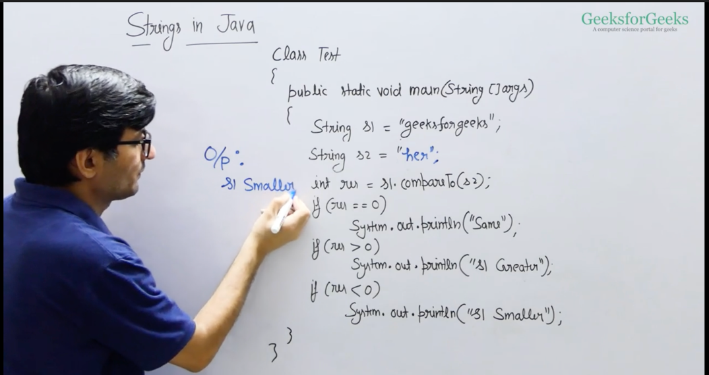
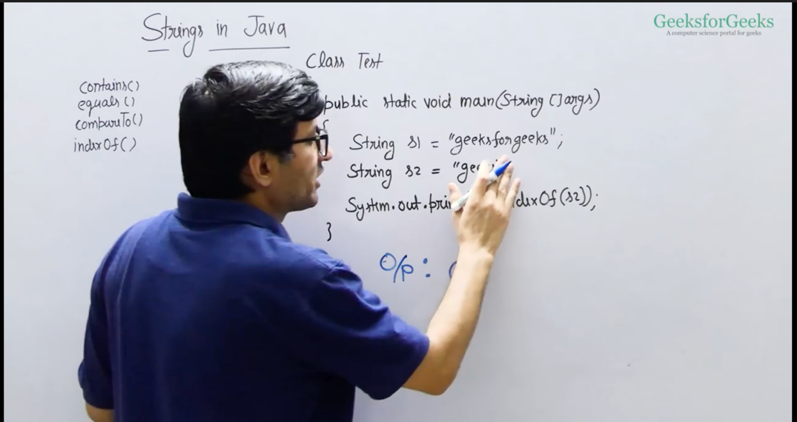

# **Strings :** 

Character of Arrays
Small set of characters.


In ASCII there are only english characters.
UTF-15 has all other language symbols

```java
char x = 'a';
System.out.println((int) x); --> ascii value of a : 97
```

### **Print Frequencies of a character in sorted order in a lower case alphabets **
in most of the string problems, if they say only lower case or upper case elements will be there, 
appudu cheyyalsindi okkate. oka alphabets char array teeskovali of length 26.
and ichina string ni loop cheydam start chesaka, each character ni alphabet array lo mark cheyali
ante "geeksforgeeks" anukondi. first character g. g ni dani place lo mark cheyali.
dani index ela telustundi ante , ivanni contigeous locations lo untay kabatti, g-a cheste g place telsipotundi

ee problem lo frequencies kanukovali kabatti, each element ni dani place lo mark cheskuntu potham. like ippudu e appeared 4 times.
we mark e index lo 4 ani. last lo anni mark cheskunnaka,
alphabet array iterate chesi no.of occurances in sorted order print chestam. ante ekkada aithe index lo > 0 untundo adantha print chestam


[link to program ](../classes/FiindFrequenciesInLowerCaseString.java)

like this we can achieve time complexity as O(n). 
not just for this problem, we can sort the string also in O(n)

looping 26 times is considered as constant work.

[link to program ](../classes/SortTheString.java)


CompareTo()



checks lexographic comparision. checks each letter of both the strings at the same index and compares which one is greater.


indexOf()



if the substring is not present, then it returns -1

or we can also use as
s1.indexOf(s2,1) - means it starts to search from 1st index of s1 and not the 0th index


here contat actually does not modify the exisiting string. but creates a new string. so even though initially s1 and s2 are pointing to same reference
after contactination they point to different reference


## **Palindrome check**

Naive method to find if the string is palindrome or not is to use as StringBuilder class, which has reverse method and find the reverse and store in another string.
compare both strings if they are equal.


here we are using a copy of string. O(n) of auxillary space and O(n) of time complexity.

#### Efficient solution :

takes constant time in best case, and O(n) in worst case.

we begin with 2 indexes, 1 start on the left, 2nd start on the right.
compare those characters if same or not. if not same then end, if same then move to next comparision.

[link to program ](../classes/PalindromeCheck.java)

### **check if string is subsequence of other :** 


not substring. its subsequence
total no. of subsequences in a string will always be 2^n

Naive solution to this problem is to generate all subsequences of S1 and finally check if s2 is there are not.
time complexity of this will be O(2^n * n)


we use 2 pointers . 1 in s1 and other in s2 comparing each character.

[link to program ](../classes/CheckSubsequence.java)


## **Check for Anagram :** 


[link to program ](../classes/isAnagram.java)

time complexity = O(n)
space complexity = O(n)

## **Find the Left Most Repeating Character :** 


the string will contain repeatations and we need to find out which is the first occurance which is repeated and return its index.

[link to program ](../classes/LeftMostRepeating.java)

## **Find the left most non-repeating character :** 

the idea is to first fill the alpha array with -1 and then 
on first occurance, make it the index of the current character. 
on next occurance of it, make it -2.

so finally we iterate through alpha to find out the min of the indexes (left most index) which is non-repeating

[link to program ](../classes/LeftMostNonRepeating.java)

## **Reverse words in a String :** 


first reverse words and then reverse string.
or first reverse string and then reverse words.
[link to program ](../classes/ReverseWords.java)

## **Pattern Searching Problem :**


find all the occurances of pattern


## **Naive method :**

Per each element of the pattern , we search with each element of the string.

[link to program ](../classes/NaivePatternMatching.java)

## **Improvised Naive Method only for Distinct pattern:**

There are no repeatitions in pattern


the idea is that since the pattern is distinct , if ABC in the pattern matches and D does not match, then we can just slide to that position of D

this only works for Distinct patterns .

[link to program ](../classes/NaivePatternMatchingDistinct.java)


## **Check if Strings are Rotations :** 

Given two strings s and goal, return true if and only if s can become goal after some number of shifts on s.

A shift on s consists of moving the leftmost character of s to the rightmost position.

For example, if s = "abcde", then it will be "bcdea" after one shift.

Example 1:

Input: s = "abcde", goal = "cdeab"
Output: true
Example 2:

Input: s = "abcde", goal = "abced"
Output: false


Constraints:

1 <= s.length, goal.length <= 100
s and goal consist of lowercase English letters.

solution : concatinate s+s and use indexOf() to find if it has goal or not. 
if yes then it can be rotated.
if not then it cannot be.

[link to program ](../classes/CheckIfStringsAreRotations.java)


## Anagram Search : 

Given two strings s and p, return an array of all the start indices of p's anagrams in s. You may return the answer in any order.


Example 1:

Input: s = "cbaebabacd", p = "abc"
Output: [0,6]
Explanation:
The substring with start index = 0 is "cba", which is an anagram of "abc".
The substring with start index = 6 is "bac", which is an anagram of "abc".
Example 2:

Input: s = "abab", p = "ab"
Output: [0,1,2]
Explanation:
The substring with start index = 0 is "ab", which is an anagram of "ab".
The substring with start index = 1 is "ba", which is an anagram of "ab".
The substring with start index = 2 is "ab", which is an anagram of "ab".


### Sliding Window Technique and Frequency Array

the idea is that usually anagrams ela kanukkuntam , alphabets array use chestam
same alane alphatets array use chestam. One for main string and another for pattern.
But in the main string, instead of storing all the characters, manam only oka window varaki matram add chestam
aa window length pattern length same ayyi undali.
and ala first window kanukunnam. 
next manam sliding window technique use chesi okko item add cheskuntu, patha item remove cheskuntu, rendu arrays (patterns) same ga unnaya leda ani chustam.
ekkada same avtundo akkada aa index note cheskuntam.
last lo window migilipotundi checking ki. danni kuda check chesi return chestam

[link to program ](../classes/AnagramSearch.java)


## **Group Anagrams**

Given an array of strings strs, group all anagrams together into sublists. You may return the output in any order.

An anagram is a string that contains the exact same characters as another string, but the order of the characters can be different.

Example 1:

Input: strs = ["act","pots","tops","cat","stop","hat"]

Output: [["hat"],["act", "cat"],["stop", "pots", "tops"]]
Example 2:

Input: strs = ["x"]

Output: [["x"]]
Example 3:

Input: strs = [""]

Output: [[""]]
Constraints:

1 <= strs.length <= 1000.
0 <= strs[i].length <= 100
strs[i] is made up of lowercase English letters.

http://neetcode.io/problems/anagram-groups

[link to program ](../classes/GroupAnagrams.java)


