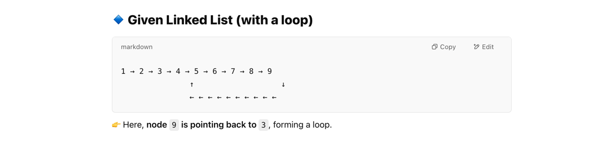

## Types of Declarations of an Array:

Vector and ArrayList are dynamic size arrays . They grow automatically.

Problems of Arrays :
Either size is fixed and pre-allocated or worst case insertion at the end is tita(n)
insertion in the middle of beginning is costly

deletion from middle or beginning is also very costly
implementation of data structures like queue and dequeue is complex with arrays
because in queue - insertion happens from one end, and deletion happens from other end

with arrays implementing round robin scheduling is very difficult

this is another problem where its very complex to implement via arrays

we will alwways need an auxillary space to solve this. Using arrays its very difficult. if we use linked list, 
we do not need extra space

# **Linked List**

also a linear data structure
stores item in sequential manner one after the other
the idea is to drop contiguous memory allocation so that insertions and deletions can efficiently happen at the middle
or beginning also and no need to preallocate the space - so no extra space is consumed

👉 Linked List అనేది nodes ద్వారా కలిపిన డేటా స్ట్రక్చర్.

👉 ప్రతి Node దగ్గర data మరియు next pointer ఉంటుంది.

👉 Array కన్నా ఇది డైనమిక్ గాను, మెమరీని సమర్థవంతంగా ఉపయోగించుకునేలా ఉంటుంది.

Single linked list implementation in Java

memory allocation can be random . Does not have to be side by side

✔ ప్రతి Node దగ్గర data మరియు next pointer ఉంటుంది.

✔ Nodes లింక్ చేయాలి → first.next = second;

✔ Linked List ను ప్రింట్ చేయాలి → while(temp != null) {}

👉 ఇది పూర్తిగా చేతితో (manually) Nodes ను లింక్ చేసే implementation.

Basic Node [Creation](../SinglyLinkedList/SLLNode.java)

[link to program](../SinglyLinkedList/BasicImplementation.java)

int data - here we assume that data is integer, it can be string or any class student etc.
Node next - self reference structure. it has reference to self type
then we have constructor - data is x - passed parameter and next is null

first node will be called head, and it stores the reference of temp1 which is 2nd node.
so first all the nodes are created, then they are linked here
but not an idle way. just a static example.

## **Traversing a singly Linked List**

we will keep printing the current data and keep moving to the next of current

time complexity : O(n)
we will go through the whole Linked List

same problem recursively

time complexity : O(n)
requires auxillary space of n+1 because its recursive . it needs to store the previous function stack to return back.
thats why iterative is better than recursive here.

[Link to program](../SinglyLinkedList/SLLTraversal.java)

## **Insertion at the beginning of Singly Linked List**

[Link to program](../SinglyLinkedList/SLLInsertAtTheBeginning.java)

First we allocate memory to the new node
point the next reference to head and return

## **Insertion at the end of singly linked list** 

[link to program](../SinglyLinkedList/SLLInsertAtTheEnd.java)

first allocate memory to the last node

**Insert at given position in single linked list**

[Link to Program](../SinglyLinkedList/SLLInsertAtPosition.java)

## **Delete First or head node of SLL**

[link to the program ](../SinglyLinkedList/SLLDeleteHead.java)

## **Delete Last Node of SLL**

[Link to the program](../SinglyLinkedList/SLLDeleteTail.java)

## **Search the position of the given key in SLL**

**iterative approach :**

**recursive approach :**

[ link to program  ](../SinglyLinkedList/SLLSearch.java) 

## **Doubly Linked list**

**Doubly linked list vs singly linked list**

## **Insert at the Beginning of Doubly Linked List**

[Link to program:](../DoublyLinkedList/DLLInsertAtTheBeggining.java)

## **Insert at the end of Doubly Linked List**

[link to the program](../DoublyLinkedList/DLLInsertAtEnd.java)

**Reverse a doubly linked list**

we have to swap the prev and next thats all

[link to program](../DoublyLinkedList/DLLReverse.java)

## **Delete Head of a DLL**

[link to program](../DoublyLinkedList/DLLDeleteHead.java)

## **Delete Last of DLL**

[link to program](../DoublyLinkedList/DLLDeleteLast.java)

## **Singly Circular Linked List :**

the next of the last node is not null .but head

[normal node class](../CircularLinkedList/singly/SCLLNode.java)

## **Singly Circular Linked List Traversal**

[link to program](../CircularLinkedList/singly/SCLLTraversal.java)

## **Insert at the Beginning of the Circular Linked List:**

[link to program](../CircularLinkedList/singly/SCLLInsertBeginning.java)

## **Insert at the end of Singly Circular Linked list**

[link to program](../CircularLinkedList/singly/SCLLInsertAtEnd.java)

## **Delete Head of Circular Linked List**

[link to program](../CircularLinkedList/singly/SCLLDeleteHead.java)

## **Delete Kth node in Singly Circular Linked List**

[link to program](../CircularLinkedList/singly/SCLLDeleteKthNode.java)

## **Circular Doubly Linked List**

## **Insert at Head**

[link to program](../CircularLinkedList/doubly/DCLLInsertAtHead.java)

## **Insert at the End:**

similar to above but does not have to change the head.

[link to program](../CircularLinkedList/doubly/DCLLInsertAtEnd.java)

## **Sorted Insert in a Singly Linked List**

we will be given a number and we need to insert in a linked list in such a way that ll is always sorted

[link to program](../ZAdditionalProblems/InsertSortedLinkedList.java)

## **Middle of Singly Linked list**

we are given a singly linked list, and we need to find the middle of it.

in case of odd numbers then we can get exact middle.
but in case of even number of nodes, then we need to take the second middle

if ll is null, then return null, in case of single node, print single node

apart from the normal naive method, here we introduce slow and fast pointer approach.
where slow moves 1 pointer at a time and fast moves 2 pointers at a time. so its 1:2 ratio
so when fast is at the end, slow is still at the middle. so thats how u find the mid pointer

[link to program ](../ZAdditionalProblems/FindMiddle.java)

## **Find Nth node from the end of sll**

from the end, print the nth node

if n is given 3 and ll has only 2 nodes, then return null
 n = 1 means its last node

[link to program ](../ZAdditionalProblems/FindNthNodeFromEnd.java)

we can also easily do using a **two pointer approach**.
where we will have 2 pointers, first pointer's starting point will be n (given position)
and second pointer's starting point will be head
by the time first pointer reaches end null, then the second pointer would have reached the desired node
so we just print the second pointer node

[link to program ](../ZAdditionalProblems/FindNthNodeFromEnd.java)

## **Reverse a Linked list**

idea is to change the links instead of having an auxillary space and time complexity

we use 2 pointers here again, prev and curr and idea is to reverse the links. and return the head

[link to program ](../ZAdditionalProblems/ReverseLinkedList.java)

## **Remove duplicates from a sorted singly linked list**

[link to program ](../ZAdditionalProblems/RemoveDuplicatesFromSortedLL.java)

## **Detect Loop**

normally we can loop twice from every node to check if the address is same or not .
but time complexity will be O(n^2)
for achieving O(n) we can modify the node class and add new field visited to mark which all nodes are visited
this allows us to find out which node has visited twice . if any node visited twice then it means there is a loop

there is a 3rd approach , where we use a dummy node .
all nodes next will be pointed to dummy node as we traverse. and when we find out if any node is already pointing its next
to dummy node , it means there is a loop

[link to program ](../ZAdditionalProblems/DetectLoop.java)

## **Floyd’s Cycle Detection Algorithm (Tortoise and Hare)**

Floyd’s Cycle Detection Algorithm is an efficient way to detect a loop in a linked list using two pointers (slow and fast). 
It is also called the Tortoise and Hare Algorithm because one pointer moves slowly (tortoise), and the other moves faster (hare).

**Algorithm Explanation**
Initialize Two Pointers

slow pointer moves one step at a time.

fast pointer moves two steps at a time.

Traverse the Linked List

If the linked list has no loop, fast will eventually reach null, and we return FALSE.

If there is a loop, slow and fast will meet at some point inside the loop, proving the presence of a cycle.

Return the Result

If slow == fast, return TRUE (loop exists).

If fast reaches null, return FALSE (no loop).

[link to program ](../ZAdditionalProblems/FloydsCycleDetection.java)

## **Detect and Remove the Loop in linked list**

the above step is very important. u need to navigate fast to find the last node of the loop .
meaning before node of slow

[link to program ](../ZAdditionalProblems/RemoveLoop.java)

## **Delete the node with only pointer given and not head**

this ensures that even if u dont give head, still we will able to delete the node with the pointer given
pointer.data = pointer.next.data;
pointer.next = pointer.next.next;

## **Segregate Even and Odd nodes in LL**

all even nodes should come first in the same order and then odd nodes should come next

