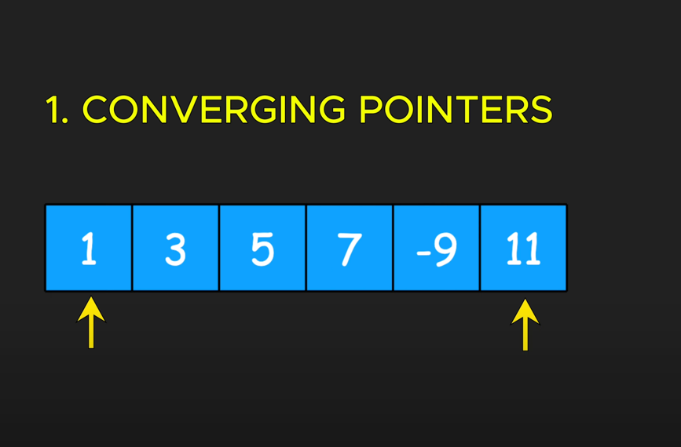
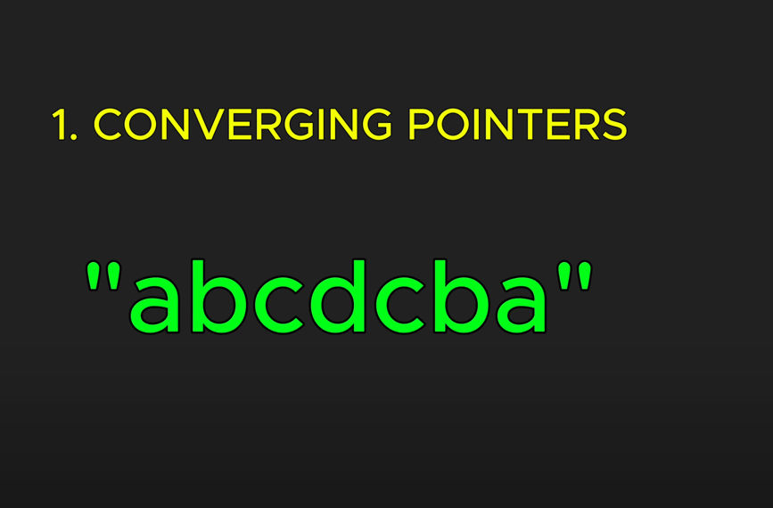
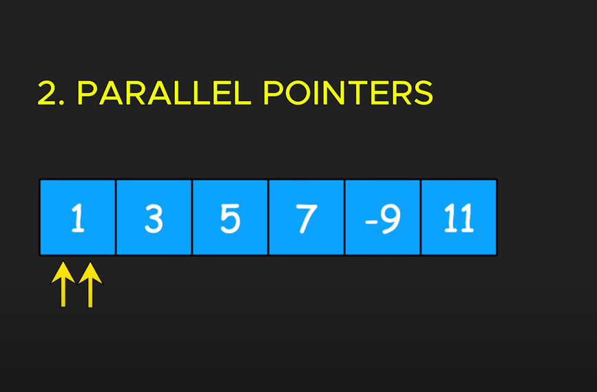
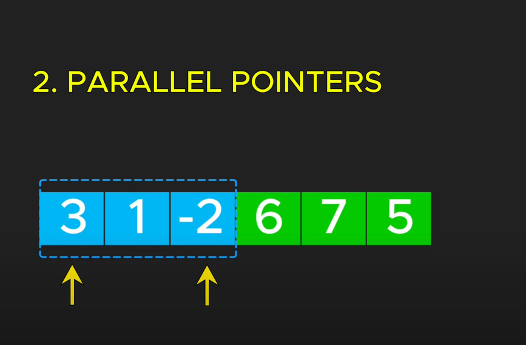
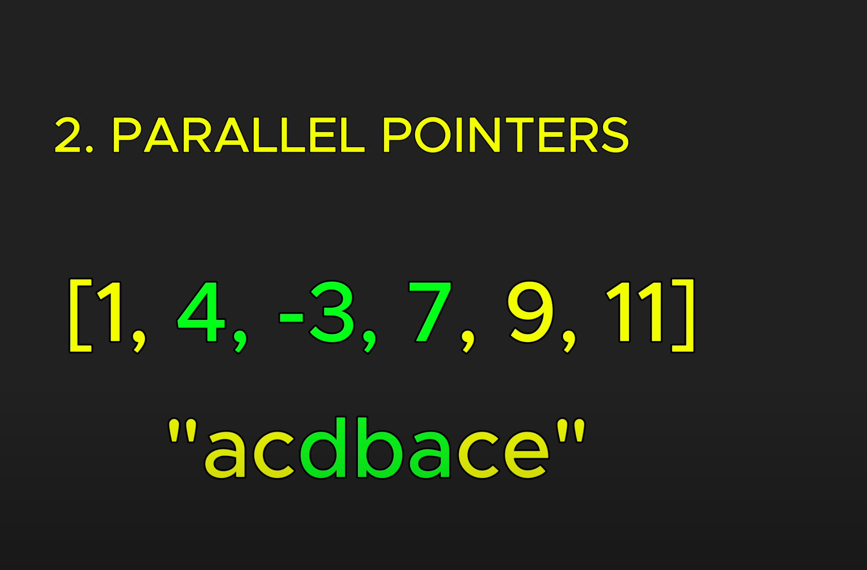
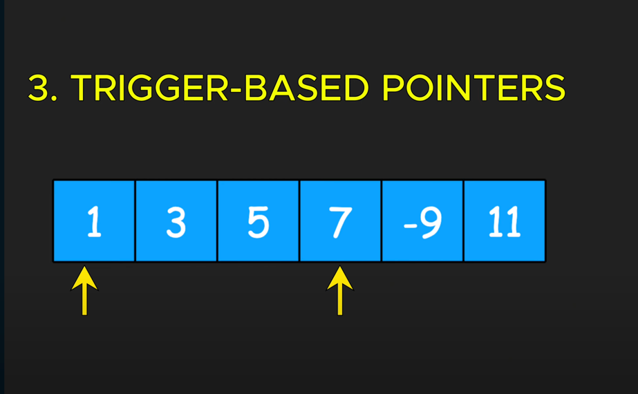
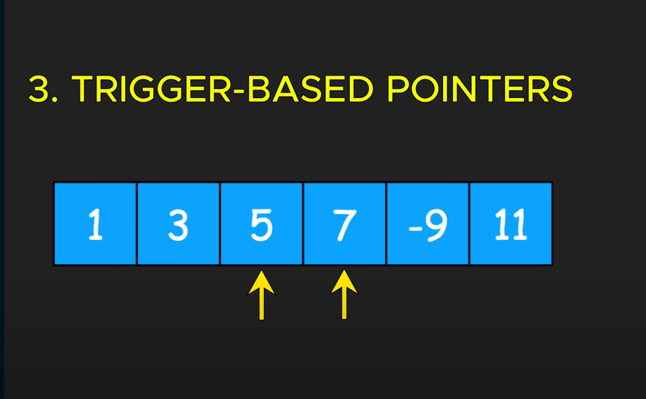
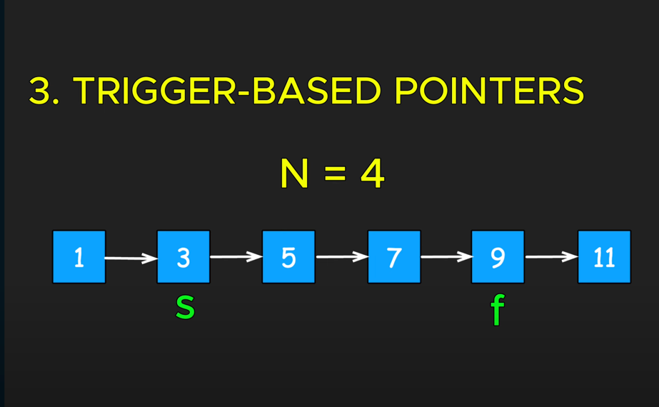
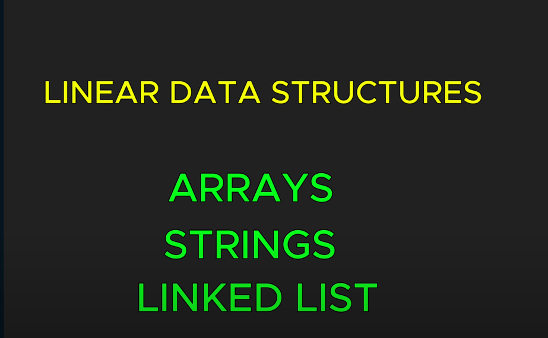
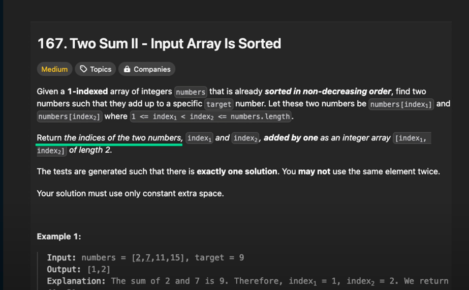

# **Two Pointer :**

eg : check if a word is a palindrome

in this : right pointer is used to explore or find new information
left pointer is used to track progress

sliding window technique is popular variation of this approach

commonly used to find subarray or substring that meet specific criteria

in this approach, we move the right pointer independently until it finds an element that meets the condition.
after this we start traversing the 2nd pointer along with 1st pointer, and both move at the same time till end

best example is find nth node of linked list from the end.
first we move the 1st pointer till nth node from the start.
then we initialize 2nd pointer and slide the window till end. by end, 2nd pointer will be at the nth node from last

# **When to Use Two Pointer Pattern ? :** 
generally applied to linear data structures .

when explicitly asked for a pair of values that satisfy a condition. or a result that can be generated from 2 values.

| Problem                             | Class Link | LeetCode/NeedCode link                                                  |
|-------------------------------------|------------|-------------------------------------------------------------------------|
| Move Zeros                          |[link to program ](../classes/MoveZeros.java)       | [link](https://leetcode.com/problems/move-zeroes/description/)          |
| Container with Most Water           |[link to program ](../classes/ContainerWithMostWater.java)     | [link](https://leetcode.com/problems/container-with-most-water/)        |
| Three pointer Merge 2 sorted arrays |[link to program ](../classes/MergeSortedArrays.java)     | [link](https://leetcode.com/problems/merge-sorted-array/)               |
| Two Sum II - Input Array Is Sorted  |[link to program ](../classes/TwoSumWithoutAuxillarySpace.java)        | [link](https://leetcode.com/problems/two-sum-ii-input-array-is-sorted/) |
| Three sum                           |[link to program ](../classes/ThreeSum.java)            | [link](https://leetcode.com/problems/3sum/description/)                 |
|                                     |            |                                                                         |
|                                     |            |                                                                         |
|                                     |            |                                                                         |
|                                     |            |                                                                         |

