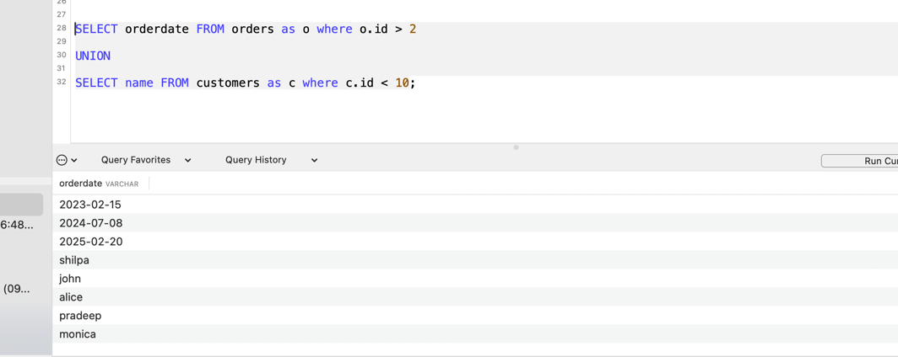

## SELECT : 

```sql
SELECT * FROM Employees; - prints all employees
SELECT id, name FROM employee;
SELECT DISTINCT name FROM employee;  - prints only unique names
SELECT * FROM employee WHERE name = "shilpa";
SELECT * FROM employee ORDER BY age; - sorts in ascending order
SELECT * FROM employee ORDER BY age DESC; - sorts in descending order
SELECT * FROM employee WHERE name = "krishna" AND age = 33; - select with and
SELECT * FROM employee WHERE name = "krishna" OR name = "pandu";
SELECT * FROM employee WHERE name != "pandu";
```

## INSERT : 

```SQL
INSERT INTO employee VALUES (9,"harika",28,50000); //single value
INSERT INTO employee VALUES (10,"swarna",40,10000), (11,"raja",50,15000); //multiple values
INSERT INTO employee (name) VALUES ("amara"); //insert into only specific columns and leave rest as null

```

## IS NULL and IS NOT NULL

```SQL

SELECT * FROM employee WHERE age IS NOT NULL;
SELECT * FROM employee WHERE age IS NULL;

```

## **UPDATE :**

```
UPDATE employee SET age = 51 WHERE name = "amara";
SELECT * FROM employee;
UPDATE employee SET salary = 5000 WHERE name = "amara" AND age = 51;
UPDATE orders SET shipid = 3 where customerid = 5;

```

## **DELETE :**

```dtd
DELETE FROM employee where id = 8 AND name = "pandu";
```

## **TOP, LIMIT, FETCH FIRST , ROWNUM** 

```SQL
TOP , fetch first not working

SELECT id FROM employee LIMIT 4;

```

## **AGGREGATE Functions : MIN(), MAX(), COUNT(), SUM(), AVG() , MOD()**

```SQL

SELECT MAX(age) FROM employee;

SELECT COUNT(*) FROM employee;
SELECT COUNT(age) FROM employee;
SELECT COUNT(age) FROM employee WHERE id > 2;
SELECT COUNT(DISTINCT salary)  AS uniquesalaries FROM employee;
SELECT COUNT(DISTINCT salary) ,age FROM employee GROUP BY age ORDER BY age;//counts distinct salary per each age group and displays in order of small to big age
SELECT salary, COUNT(age) FROM employee GROUP BY salary; //count how many ages are there per salary group

SELECT AVG(age) FROM employee;
SELECT AVG(age) FROM employee where name != "shilpa";
SELECT * FROM employee WHERE age > (SELECT AVG(age) FROM employee); //selects everything which is above avg age. //subquery

SELECT SUM(age) FROM employee;
SELECT SUM(age) FROM employee WHERE salary > 10000;
SELECT SUM(age*10) multipliedAge FROM employee WHERE salary > 20000; //in combination with Expression * 10 . can be any expression
SELECT SUM(age *salary) FROM employee WHERE salary = 25000;


SELECT MIN(age) FROM employee;
SELECT MIN(age) AS min FROM employee WHERE salary >=20000; //alias
SELECT MIN(age) AS minAgePerGroup FROM employee GROUP BY age; //Grouping by age
SELECT age ,MIN(salary) AS perAgeMinSal FROM employee GROUP BY age;

select * from cinema where MOD(id,2) = 1 and description != 'boring' order by rating desc; //if odd then only print the non-boring cinemas


```

## **SQL LIKE**

The LIKE operator is used in a WHERE clause to search for a specified pattern in a column.

There are two wildcards often used in conjunction with the LIKE operator:

The percent sign % represents zero, one, or multiple characters
The underscore sign _ represents one, single character

```sql

SELECT * FROM employee where name LIKE 's%'; //selects the names that starts with s
SELECT * FROM employee where name LIKE '%a'; //select the names that ends with a
SELECT * FROM employee where name LIKE 'K_ISH%' // _ defines missing single character
SELECT * FROM employee where name LIKE 'k_ishna'; // r is missing
SELECT * FROM employee where name LIKE '%sh%';

```

## **SQL IN and NOT IN OPERATORS**

```sql
SELECT * FROM employee where age IN ('10','20' ,'25' ,'28' ,'31' ,'35' ,'40' , '51') ORDER BY age;
SELECT * FROM employee where age NOT IN ('10','51') ORDER BY age;
SELECT * FROM employee where age IN (SELECT AGE FROM employee where age > 28); // IN (SELECT)

```

## **BETWEEN & NOT BETWEEN**

```SQL
SELECT * FROM employee where age BETWEEN 25 AND 35;
SELECT * FROM employee where age NOT BETWEEN 25 AND 35;
SELECT * FROM employee WHERE age BETWEEN 25 AND 35 AND AGE IN (28,31); //BETWEEN AND IN combination
SELECT * FROM employee WHERE name BETWEEN "amara" AND "shilpa"; //gives all names between amara and shilpa
SELECT * FROM employee WHERE name BETWEEN "amara" AND "shilpa" ORDER BY name; //prints in ascending order
SELECT * FROM employee WHERE name BETWEEN "amara" AND "shilpa" ORDER BY name DESC; //prints in descending order
SELECT * FROM Orders WHERE OrderDate BETWEEN '1996-07-01' AND '1996-07-31';//between dates  

```


## **SQL JOIN :**

A JOIN clause is used to combine rows from two or more tables, based on a related column between them.


```sql

SELECT * FROM orders as o INNER JOIN customers as c WHERE o.customerid = c.id; //given common elements between both
SELECT o.id, c.country FROM orders as o JOIN customers as c WHERE o.customerid = c.id; //join and inner join both give same result

SELECT Orders.OrderID, Customers.CustomerName, Shippers.ShipperName
FROM ((Orders
INNER JOIN Customers ON Orders.CustomerID = Customers.CustomerID)
INNER JOIN Shippers ON Orders.ShipperID = Shippers.ShipperID);


```

Three join : 
```
SELECT * FROM ((orders as o
INNER JOIN customers as c ON o.customerid = c.id)
INNER JOIN shipment as s ON o.shipid = s.id);
```

### LEFT JOIN

gives all left data with common on right
```
SELECT * FROM orders as o LEFT JOIN customers as c ON o.`customerid` = c.id;
```

### RIGHT JOIN

gives all right data + common data in left one
```dtd

select * FROM orders as o RIGHT JOIN customers as c ON o.customerid = c.id;
```


### FULL OUTER JOIN
MySQL does NOT support FULL OUTER JOIN directly.

```dtd

SELECT *
        FROM customers AS c
        LEFT JOIN orders AS o ON c.id = o.customerid

        UNION

        SELECT *
        FROM customers AS c
        RIGHT JOIN orders AS o ON c.id = o.customerid

        ORDER BY c.name;
```


## UNION AND UNION ALL

UNION gives all elements of both the tables. without duplicates

UNION ALL gives with duplicates

```dtd

SELECT id FROM orders as o where o.id > 2

UNION

SELECT id FROM customers as c where c.id < 10
ORDER BY id;

```



gives in the same row.


## GROUP BY

The GROUP BY statement groups rows that have the same values into summary rows, like "find the number of customers in each country".

The GROUP BY statement is often used with aggregate functions (COUNT(), MAX(), MIN(), SUM(), AVG()) to group the result-set by one or more columns.

```SQL

SELECT COUNT(CustomerID), Country
        FROM Customers
        GROUP BY Country;

SELECT COUNT(CustomerID), Country
        FROM Customers
        GROUP BY Country
        ORDER BY COUNT(CustomerID) DESC;


SELECT Shippers.ShipperName, COUNT(Orders.OrderID) AS NumberOfOrders FROM Orders
LEFT JOIN Shippers ON Orders.ShipperID = Shippers.ShipperID
GROUP BY ShipperName;


```

## The SQL HAVING Clause

```
SELECT COUNT(c.name),c.country FROM customers as c GROUP BY c.country HAVING c.country = "india";

SELECT COUNT(c.name),c.country FROM customers as c GROUP BY c.country HAVING COUNT(c.name) > 1;


```

## SQL WHERE EXISTS :

The EXISTS operator is used to test for the existence of any record in a subquery.

The EXISTS operator returns TRUE if the subquery returns one or more records.

```dtd

SELECT o.orderdate from orders as o WHERE EXISTS (select c.name from customers as c where o.customerid = c.id and c.country = 'india');

```


## ANY AND ALL

```SQL
SELECT o.orderdate from orders as o WHERE o.customerid 
= ANY(select c.id from customers as c where c.country = 'india'); //returns even if 1 value found matched from the select query

SELECT o.orderdate from orders as o WHERE o.customerid
        = ALL (SELECT c.id FROM customers as c where c.id = 3); //definitely all values from subquery should match then it will return output
```


## COPY all columns into a new table;

```sql

INSERT INTO customers_copy SELECT * FROM customers;

```

## The SQL CASE Expression

like if-else-then

if there is no else block , then it returns null

```sql

SELECT o.id, o.customerid,
CASE 
	WHEN o.orderdate < '2024-01-01' THEN "LEGACY ORDER"
	WHEN o.orderdate BETWEEN '2024-01-01' AND '2024-12-31' THEN "FOLLOW UP ORDER"
	ELSE "NEW ORDER"
END AS orderstatus
FROM orders as o;
```

## views

```sql
CREATE VIEW [Brazil Customers] AS
SELECT CustomerName, ContactName
FROM Customers
WHERE Country = 'Brazil';
```


## **Alter Table :** 

### ALter Table add foreign key : 

```dtd

ALTER TABLE orders
ADD CONSTRAINT fk_customer
FOREIGN KEY (customerid) REFERENCES customers(id);


```

alter table add column :

```dtd
ALTER TABLE orders
ADD shipid INT;
```

## Char length

```sql
select tweet_id from tweets where char_length(content) > 15;
```

## Find Highest salary and 2nd highest salary

```sql

select name,salary from employee where salary ;
select name, salary from employee where salary = (select MAX(salary) from employee);

select MAX(salary) from employee where salary < (select MAX(salary) from employee); //only salary

select name,salary from employee where salary = (select MAX(salary) from employee where salary < (select MAX(salary) from employee));

```


