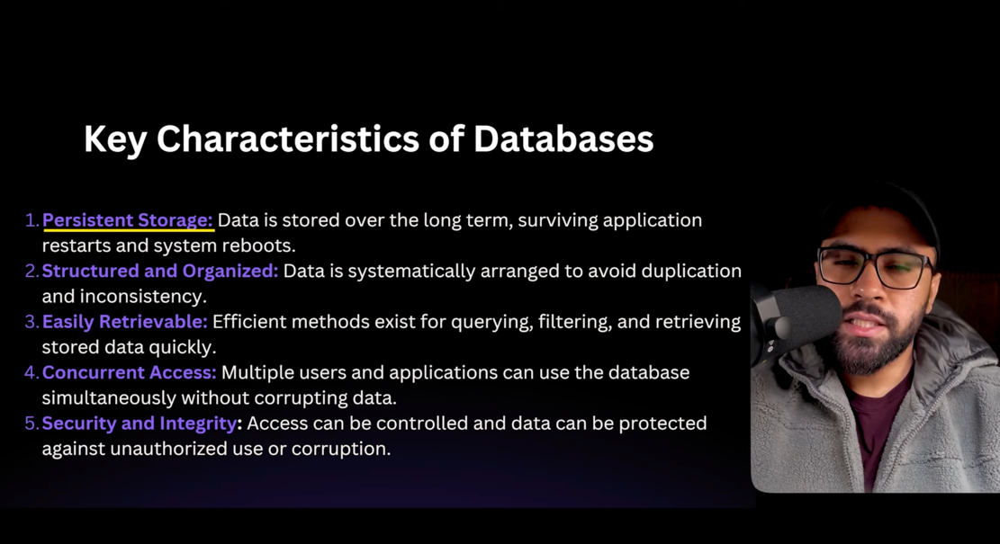

## **What is database ?**

RDBMS - Relational Data Management System

Stores in Table - rows and columns

## **SQL and its Role :**

Structural Query Language .

Programming language to manage relational db.

