# **System Design**

SDLC - system design life cycle - step by step guide to build any project or system. breaks the 
development into multiple phases
people involved - developers, designers, business team, product team , stakeholders etc

## **Phases of SDLC :** 

### **1. Requirement Gathering and Analysis**

   a. gather requirements

   b. analyze if that can be done and how it can be done.

   c. in how much budget can we build ?

   d . do we have resources / team to develop it. do they have skills?  

   e . document everything / route map

### **2. Sytem Design**

   a. HLD - high level design - eg : sketching the basic house design, how many rooms ? how many floors ? how many staircases etc.

   b. LLD - low level design - eg : dimensions of the room, what decor ? where the furniture goes etc . 

   c. scalability - we cannot assume how many users will be there. always system should be scalable

   d. security - protect the user data 

### **3. implementation** 

### **4. Testing**

   a. unit testing - test specific parts of the system

   b. Integration testing - all units together works fine or not

   c. load testing - increase with heavy load and see if system handles

   d . User Acceptance Testing - users test this to make sure it works for them on multiple devices etc

### **5. Deployment**

### **6. Maintenance** - adding features of it etc

   a. corrective maintenance - fixing bugs

   b. adaptive maintenance - upgrading or changing system to adapt to different technology. 

   c. perfective maintenance - adding new features
   

### **Iterative Nature of SDLC**

during testing , you find something wrong. go back to design and repeat the steps

### Common pitfalls of SDLC

1. Skipping requirement and analysis phase
2. over engineering
3. inadequate testing

## **Requirements**

### **Functional vs Non-Functional Requirements**

| Feature              | Functional Requirements (FR) | Non-Functional Requirements (NFR)                                                                                           |
|----------------------|----------------------------|-----------------------------------------------------------------------------------------------------------------------------|
| **Definition**       | Describes *what* the system should do. | Describes *how well* the system should perform.                                                                             |
| **Focus**           | System behavior, features, and operations. | System qualities, performance, scalability and constraints.                                                                 |
| **Examples**        | - User login functionality.   - Payment processing.   - Search feature. | - System should handle 1000 users at a time.   - Response time should be <2 seconds.   - High security for user data. |
| **Measurable?**     | Yes, based on expected outputs. | Yes, based on performance benchmarks.                                                                                       |
| **Change Frequency** | Changes frequently based on business needs. | Changes less frequently but evolves with technology.                                                                        |
| **Testing**         | Functional testing (Unit, Integration, System). | Performance, Load, Security, and Usability testing.                                                                         |

### **Example in a Banking Application**
- **Functional Requirement**: (FR) Users should be able to transfer money between accounts.
- **Non-Functional Requirement**: (NFR) The transaction should be completed within 2 seconds.

Both are crucial: FR ensures the system *works*, and NFR ensures it *works well*. 🚀

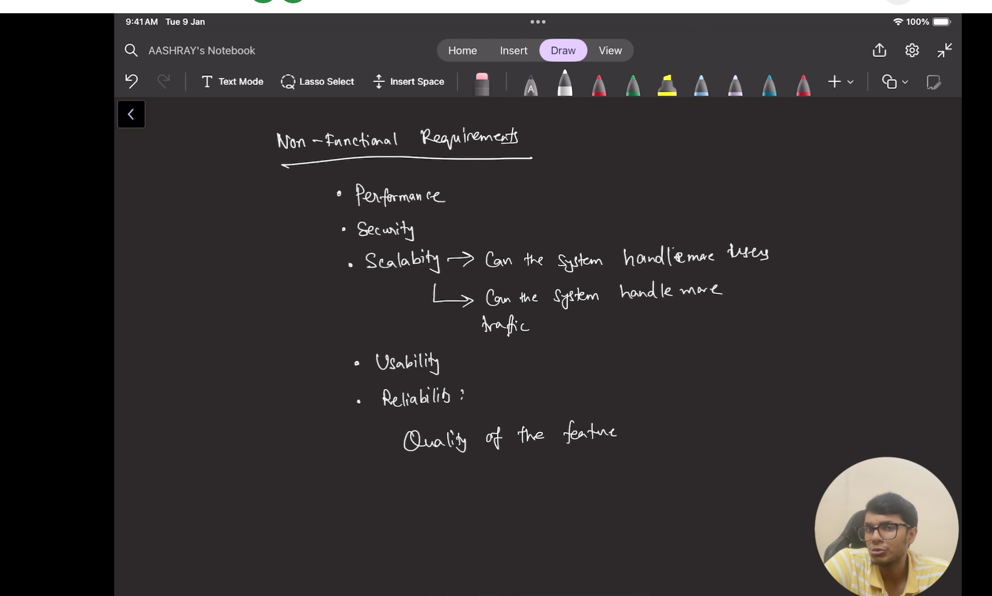

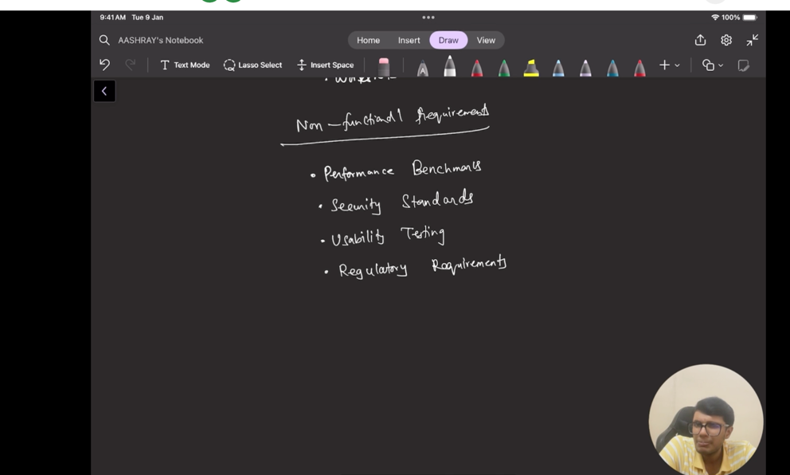

    

### **Techniques for Gathering and Analyzing System Requirements**

#### **1. Requirement Gathering Techniques**
These methods help collect functional and non-functional requirements:

🔹 **Interviews** – Directly talk to stakeholders to understand their needs.  
🔹 **Surveys & Questionnaires** – Collect feedback from a large audience quickly.  
🔹 **Workshops** – Group discussions to brainstorm and refine requirements.  
🔹 **Observation** – Analyze how users currently perform tasks.  
🔹 **Document Analysis** – Review existing system documentation for insights.  
🔹 **Prototyping** – Develop mock-ups to clarify requirements visually.  
🔹 **Use Cases & User Stories** – Define step-by-step user interactions with the system.

#### **2. Requirement Analysis Techniques**
These help in validating and refining requirements:

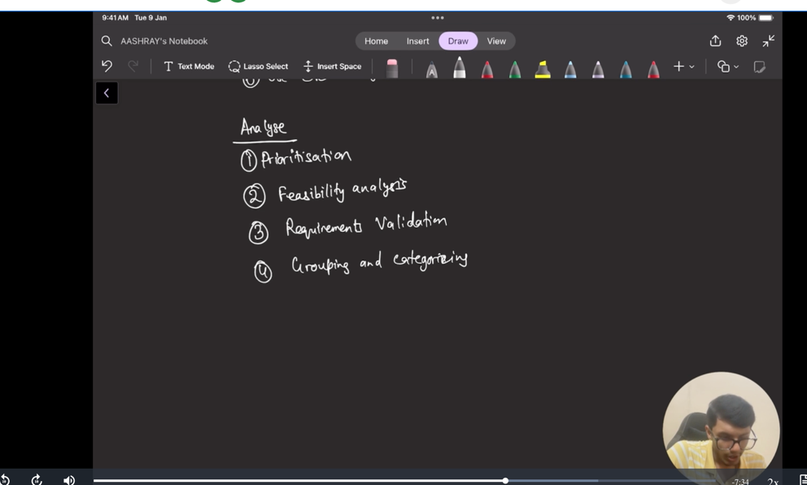

🔸 **MoSCoW Prioritization** – Categorize into Must-have, Should-have, Could-have, Won't-have.  
🔸 **Gap Analysis** – Identify differences between current and desired systems.  
🔸 **SWOT Analysis** – Evaluate Strengths, Weaknesses, Opportunities, and Threats.  
🔸 **Data Flow Diagrams (DFD)** – Visualize how data moves within the system.  
🔸 **Entity-Relationship Diagrams (ERD)** – Define relationships between data entities.  
🔸 **Prototyping & Wireframing** – Validate UI/UX with stakeholders.  
🔸 **Requirement Traceability Matrix (RTM)** – Ensure all requirements are mapped to test cases.

These techniques ensure clear, complete, and well-prioritized requirements for a successful system. 🚀

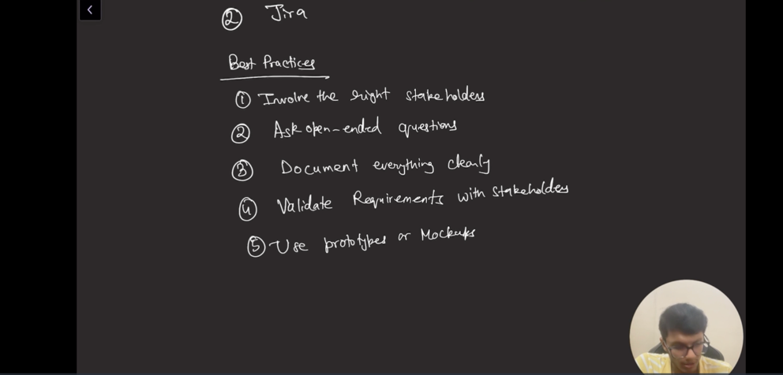

### **Capacity Estimation in System Design**
Capacity estimation helps in designing scalable systems by estimating resource requirements (CPU, memory, storage, bandwidth) based on expected traffic and data growth.

#### **Key Steps in Capacity Estimation**
1. **Estimate Traffic Volume**
    - **Daily Active Users (DAU)**: How many users will use the system daily?
    - **Queries Per Second (QPS)**: Expected number of requests per second.
    - **Read vs. Write Ratio**: Helps in database scaling.

2. **Estimate Storage Requirements**
    - **Data per Request**: How much data is stored per user action?
    - **Total Data Storage**: `(Avg. Data per User) × (Total Users) × (Retention Period)`.
    - **Replication Overhead**: Consider 2x or 3x replication in distributed storage.

To scale:

Use distributed databases (e.g., Cassandra, DynamoDB)

Use LSM-tree based storage to optimize writes.

3. **Estimate Bandwidth Requirements**
    - **Request Size × QPS** = Incoming Bandwidth
    - **Response Size × QPS** = Outgoing Bandwidth
   
To optimize:

Use caching (Redis, CDN) for popular URLs

Optimize database queries to reduce bandwidth usage.
4. **Estimate Server Needs**
    - If each server handles **X QPS**, then **Total Servers = Total QPS / X**
    - Consider redundancy for high availability (e.g., active-active, active-passive).

---

### **Capacity Estimation in SDLC (Software Development Life Cycle)**
Capacity estimation plays a role in multiple phases of SDLC:

| **SDLC Phase**    | **Capacity Estimation Involvement** |
|------------------|--------------------------------|
| **Requirement Analysis** | Identify expected traffic, data growth, and scalability needs. |
| **Design** | Plan architecture, storage, and compute resources for scalability. |
| **Implementation** | Implement efficient data models, caching, and load balancing. |
| **Testing** | Perform load testing to validate system capacity. |
| **Deployment** | Monitor system metrics, auto-scale if needed. |
| **Maintenance** | Adjust capacity based on real-time usage data. |

Final Architecture Design

✔ Web Servers (6x Nginx + Application Servers)

✔ Caching Layer (Redis, 3 nodes)

✔ Database (Cassandra, 3 nodes, sharded)

✔ Load Balancer (AWS ALB / Nginx / HAProxy)

✔ CDN for faster URL redirections

## **Characteristic of Distributed Systems**

multiple systems collaborating to work as a single system

### **Characteristics of Distributed Systems**

A **Distributed System** is a collection of independent computers that appear to users as a **single system** and work together to achieve a common goal. Below are its key characteristics:

---

### **1. Scalability**
✔ The system can **handle increased workload** by adding more machines (horizontal scaling).  
✔ Example: Cloud platforms like **AWS, Google Cloud** scale automatically based on demand.

---

### **2. Concurrency**
✔ Multiple processes execute **simultaneously** across different nodes.  
✔ Example: In a **banking system**, thousands of transactions are processed at the same time.

---

### **3. Fault Tolerance & Reliability**
✔ The system **continues functioning** even if some components fail.  
✔ Redundancy and replication ensure **no single point of failure**.  
✔ Example: **Google Search** remains available even if some servers fail.

---

### **4. Transparency**
✔ Users should not be aware of the **underlying complexity** of multiple systems.  
✔ **Types of Transparency:**
- **Location Transparency:** Users don't need to know where the data is stored.
- **Access Transparency:** Users interact with a uniform API, regardless of the backend.
- **Replication Transparency:** Users don’t need to know if data is copied across multiple locations.  
  ✔ Example: **Google Drive** stores files across multiple data centers but appears as a single storage unit to users.

---

### **5. Heterogeneity**
✔ The system can consist of **different hardware, operating systems, and programming languages**.  
✔ Example: A **microservices-based** architecture where different services use Java, Python, or Node.js.

---

### **6. No Global Clock (Synchronization Challenges)**
✔ No single clock exists to synchronize all nodes.  
✔ **Logical Clocks** (e.g., **Lamport timestamps**) are used to maintain order.  
✔ Example: In **stock trading**, event ordering must be handled carefully.

---

### **7. Security & Trust**
✔ Communication happens over **open networks**, making security a critical concern.  
✔ **Encryption, authentication, and access control** are required.  
✔ Example: **Blockchain** ensures secure transactions in a decentralized environment.

---

### **8. Resource Sharing**
✔ Nodes in a distributed system share **data, files, computing power, and network resources**.  
✔ Example: **Cloud Computing** allows multiple users to share virtual machines and databases.

---

### **9. High Latency & Network Dependency**
✔ Performance depends on **network speed** and **latency**.  
✔ **Caching and load balancing** are used to optimize performance.  
✔ Example: **CDNs (Content Delivery Networks)** cache static content closer to users to reduce latency.

---

### **10. Eventual Consistency (CAP Theorem)**
✔ Distributed databases follow the **CAP theorem**, which states that a system can achieve only **two out of three**:
- **Consistency (C)**: Every node has the latest data.
- **Availability (A)**: System is always operational.
- **Partition Tolerance (P)**: System continues functioning despite network failures.  
  ✔ Example: **Amazon DynamoDB** prioritizes **availability** over strict consistency.

---

### **Conclusion**
Distributed systems provide **scalability, fault tolerance, and resource sharing**, but they also introduce **challenges like latency, synchronization, and security**. Understanding these characteristics is crucial for designing robust, efficient systems.

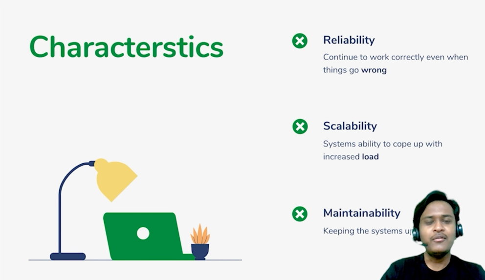

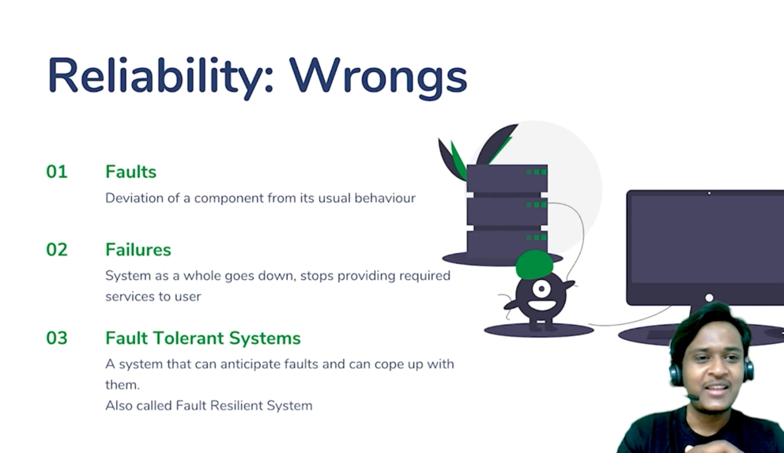

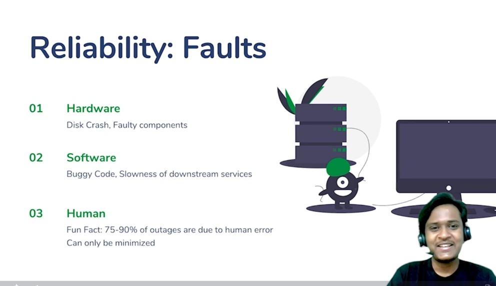

### **Scalability in System Design** 🚀

**Scalability** is the ability of a system to **handle increased load** without performance degradation. A **scalable system** can efficiently manage growth in **users, data, and requests** by adding resources.

---

## **Types of Scalability**

### **1. Vertical Scalability (Scaling Up) ⬆️**
✔ Adding **more power** (CPU, RAM, storage) to an existing server.  
✔ **Example:** Upgrading a database server with **more RAM** to handle large queries.  
✔ **Limitations:** Expensive, hardware limitations (can only scale so much).  
✔ **Use case:** Relational databases (e.g., **MySQL, PostgreSQL**).

### **2. Horizontal Scalability (Scaling Out) ⬅️➡️**
✔ Adding **more machines (servers)** to distribute the load.  
✔ **Example:** Adding more application servers behind a **load balancer** in a web application.  
✔ **Advantages:** Cost-effective, highly available, no single point of failure.  
✔ **Use case:** NoSQL databases (e.g., **Cassandra, MongoDB**) and microservices.

### **3. Diagonal Scalability 🔀**
✔ Combination of **vertical & horizontal scaling**.  
✔ **Example:** Scale up a server **until max capacity** and then scale out by adding more servers.

---

## **Techniques for Scalability**

### **1. Load Balancing**
✔ Distributes traffic across multiple servers to **prevent overload**.  
✔ **Example:** AWS **Elastic Load Balancer (ELB)** routes requests to healthy instances.

### **2. Caching**
✔ Stores frequently accessed data in memory (Redis, Memcached) to reduce database load.  
✔ **Example:** A social media app caches user profiles to reduce repeated database queries.

### **3. Database Sharding**
✔ Splitting a database into **smaller partitions (shards)** to distribute load.  
✔ **Example:** Large-scale applications like **Instagram** use sharding for user data.

### **4. Asynchronous Processing (Message Queues)**
✔ Offloads heavy tasks using **Kafka, RabbitMQ, or AWS SQS**.  
✔ **Example:** A food delivery app queues **order notifications** for background processing.

### **5. Microservices Architecture**
✔ Breaks a **monolithic system** into **small, independent services**.  
✔ **Example:** Amazon uses **microservices** for order management, payments, and recommendations.

---

## **Scalability Challenges & Considerations**

🔴 **Data Consistency vs Availability:** CAP theorem forces a tradeoff (e.g., eventual consistency in distributed databases).  
🔴 **Latency Issues:** Network calls between distributed components can slow down performance.  
🔴 **Cost Management:** Cloud scaling can be expensive if not optimized properly.

---

## **Example: How Netflix Scales** 🎬

1️⃣ Uses **AWS Auto Scaling** to handle traffic spikes.  
2️⃣ Caches movies using **CDN (Content Delivery Networks)** like **Akamai & CloudFront**.  
3️⃣ Stores billions of logs using **Cassandra (NoSQL, horizontally scalable)**.  
4️⃣ Uses **Kafka for asynchronous event streaming**.

---

## **Conclusion**
Scalability is essential for modern applications to **handle growing traffic and data** efficiently. The best approach depends on the **use case**—**vertical scaling** is simpler but limited, while **horizontal scaling** is more robust but complex.

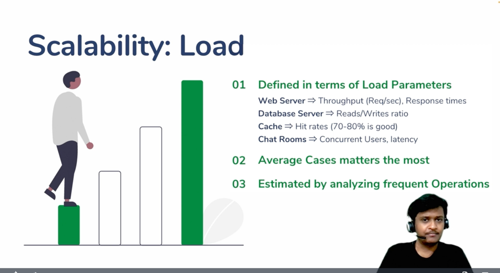

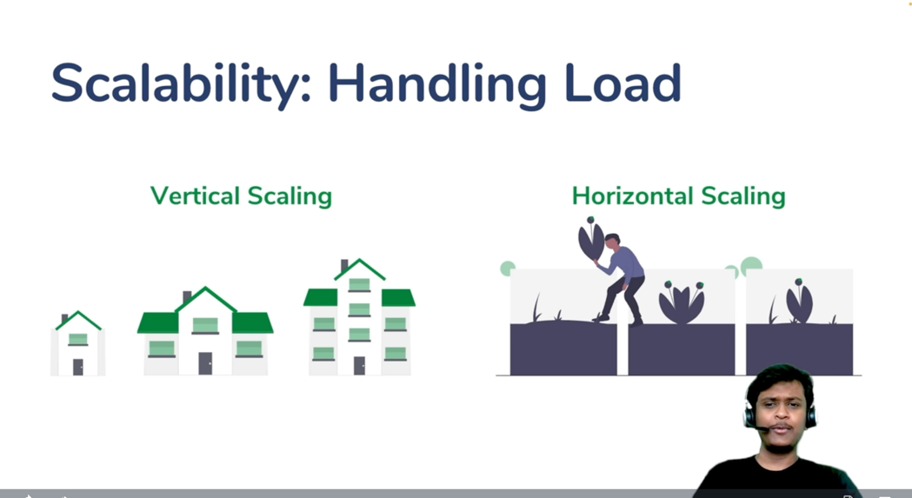

vertical - add multiple resources to the system
horizontal - create identical copies of a specific system, load will be distributed among the service which handles higher load

## **Maintainability**

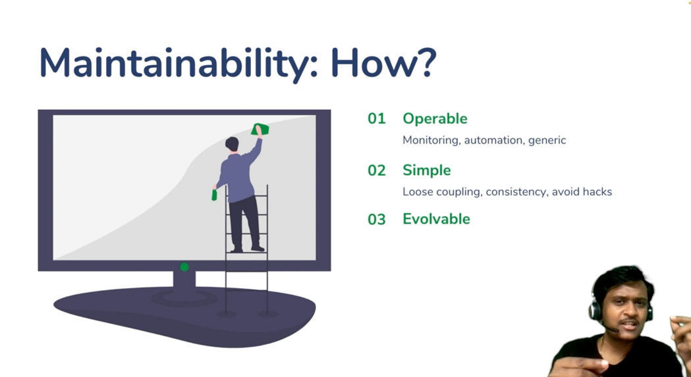

### **Maintainability in System Design** 🛠️🔧

**Maintainability** is the ability of a system to be **easily modified, updated, and debugged** with minimal effort. A highly maintainable system ensures that future changes, bug fixes, and enhancements can be done efficiently without introducing new problems.

---

## **Why is Maintainability Important?**
✔ **Reduces downtime** – Faster bug fixes and updates.  
✔ **Lowers technical debt** – Prevents messy, unmanageable code.  
✔ **Improves developer productivity** – Easy to understand and extend.  
✔ **Enhances system longevity** – Adapts to new requirements over time.

---

## **Key Aspects of Maintainability**

### **1. Modularity** 🏗️
✔ **Break down** the system into smaller, independent components (e.g., microservices).  
✔ Example: In an e-commerce system, separate services for **payments, orders, and users** make updates easier.

### **2. Readable & Well-Documented Code** 📖
✔ Use **clear variable & function names** (e.g., `calculateDiscount()` instead of `cd()`).  
✔ Follow **consistent coding style** (use linters & formatters).  
✔ Example: Google’s **style guides** ensure uniform code across teams.

### **3. Loose Coupling & High Cohesion** 🔄
✔ **Loose coupling**: Minimize dependencies between components.  
✔ **High cohesion**: Keep related logic together in a module.  
✔ Example: A **microservices architecture** where each service operates independently.

### **4. Automated Testing (Unit & Integration Tests)** ✅
✔ Helps **detect bugs early** and prevent regressions.  
✔ Use frameworks like **JUnit (Java), PyTest (Python), Jest (JS)**.  
✔ Example: CI/CD pipelines **run automated tests before deployment**.

### **5. Version Control & CI/CD** 🔄
✔ Use **Git, GitHub/GitLab/Bitbucket** to track changes.  
✔ Implement **Continuous Integration & Deployment (CI/CD)** for smooth updates.  
✔ Example: **Netflix deploys hundreds of updates daily** with automated pipelines.

### **6. Scalable & Flexible Architecture** 🏗️
✔ Design systems that can evolve without major rewrites.  
✔ Example: Use **feature flags** to roll out new features safely.

### **7. Logging & Monitoring** 📊
✔ Helps in debugging and identifying issues **before they cause failures**.  
✔ Tools: **ELK Stack (Elasticsearch, Logstash, Kibana), Prometheus, Grafana**.  
✔ Example: **Uber monitors real-time logs** to detect system failures instantly.

---

## **Example: How Maintainability Helps in Real Life** 🎯
**Scenario:** Your team needs to update the payment system in an e-commerce app.  
👎 **Without Maintainability**: Payments are tightly coupled with orders, requiring changes in multiple files.  
👍 **With Maintainability**: Payments are a separate **microservice**, so the update is isolated and quick.

---

## **Conclusion**
A well-maintained system **reduces complexity, speeds up development, and ensures long-term stability**. Prioritizing **modularity, testing, CI/CD, and monitoring** makes it easy to maintain and scale as business needs grow.

**Database Sharding**

### **Database Sharding** 🗂️⚡

**Database sharding** is a technique of **splitting a large database into smaller, faster, and more manageable parts** called **shards**. Each shard is an **independent database** that contains a subset of the overall data.

---

## **Why Use Sharding?**

✔ **Improves Performance** – Queries run faster because they search through smaller datasets.  
✔ **Enhances Scalability** – Supports handling a massive number of users and transactions.  
✔ **Increases Availability** – If one shard fails, others remain unaffected.  
✔ **Reduces Load** – Distributes read and write operations across multiple servers.

---

## **How Sharding Works?**

Instead of storing **all data in a single database**, we split it into multiple databases based on a **sharding key**.

### **Example** 🎯
Imagine a user database for a global social media app. Instead of storing **100 million users in one database**, we can **split them by region**:

✅ **Shard 1:** Users from **North America**  
✅ **Shard 2:** Users from **Europe**  
✅ **Shard 3:** Users from **Asia**  
✅ **Shard 4:** Users from **Africa**

Each shard operates as a **separate database**, reducing the load on any single server.

---

## **Types of Sharding**

### **1. Horizontal Sharding (Row-Based)** 📊
- Data is **split by rows** across different databases.
- Example: Users with **ID 1-10M in Shard A, ID 10M-20M in Shard B**.
- ✅ **Most common method** for scaling transactional databases.

### **2. Vertical Sharding (Column-Based)** 📑
- Data is **split by columns**, storing different attributes in different databases.
- Example:
   - **Shard A:** Usernames, Emails
   - **Shard B:** Passwords, Preferences
- ✅ Useful when some columns are accessed more frequently than others.

### **3. Directory-Based Sharding** 📂
- A lookup table decides which shard contains which data.
- Example: A **metadata table** maps users to specific shards.
- ✅ Flexible but **adds an extra lookup step**.

---

## **Challenges of Sharding** ⚠️

❌ **Complex Queries** – Joins across shards can be difficult.  
❌ **Rebalancing Issues** – Moving data when a shard gets too full.  
❌ **Increased Operational Overhead** – Requires careful monitoring and maintenance.

---

## **When to Use Sharding?**

🔹 When **database performance slows down** due to too much data.  
🔹 When **a single database server can’t handle growing traffic**.  
🔹 When **data can be easily split using a clear sharding key** (e.g., user ID, region).

---

## **Real-World Examples** 🌍

📌 **Facebook & Instagram** – User data is **sharded by user ID**.  
📌 **Netflix** – Splits databases based on **content categories**.  
📌 **Amazon** – Shards orders by **region and user ID**.

### **Client Server Architecture**

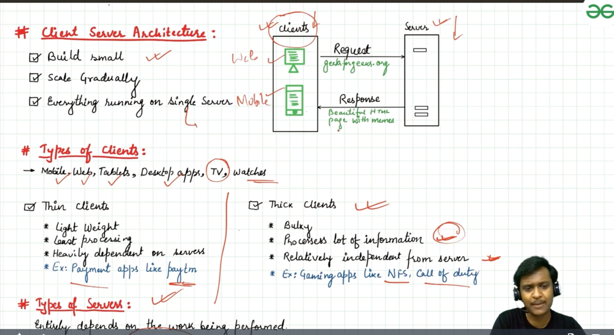

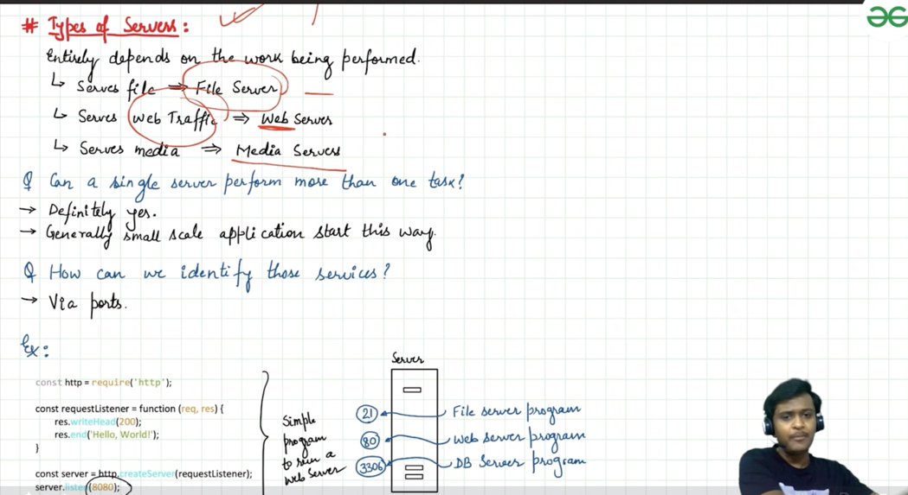

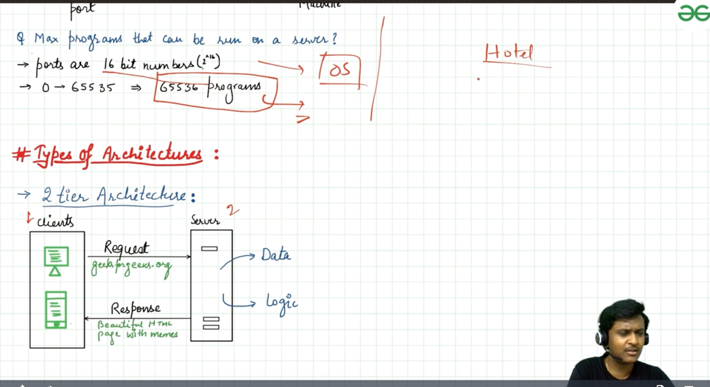

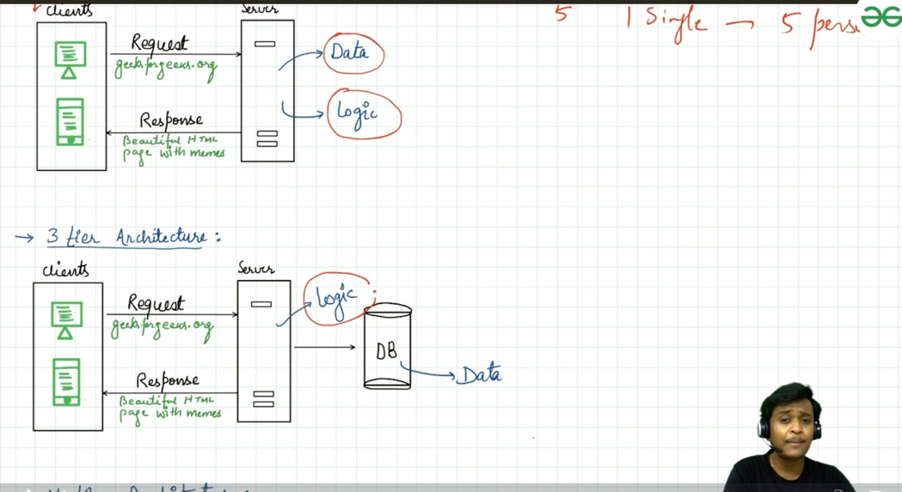

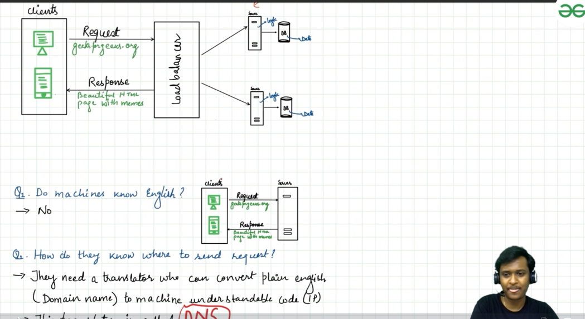

## **Network Protocols and Proxies**

### **1️⃣ Network Protocols** 🌐

A **network protocol** is a set of rules that define how data is transmitted and received across a network. These protocols ensure reliable and efficient communication between devices.

### **Types of Network Protocols:**

1. **Communication Protocols**
    - **HTTP/HTTPS** – Used for web communication.
    - **FTP** – Transfers files over a network.
    - **SMTP/IMAP/POP3** – Email communication.
    - **WebSockets** – Enables real-time communication.

2. **Transport Protocols**
    - **TCP (Transmission Control Protocol)** – Reliable, connection-based communication.
    - **UDP (User Datagram Protocol)** – Faster but less reliable, used in gaming and video streaming.

3. **Routing Protocols**
    - **BGP (Border Gateway Protocol)** – Determines the best path for data across the internet.
    - **OSPF (Open Shortest Path First)** – Used in internal networking for routing.

4. **Security Protocols**
    - **TLS/SSL** – Encrypts data for secure communication.
    - **IPSec** – Secures VPNs and network connections.

---

### **2️⃣ Proxies** 🛡️

A **proxy server** is an intermediary between a client (user) and a server. It helps with **security, caching, load balancing, and anonymity**.

### **Types of Proxies:**

1. **Forward Proxy** 🔄
    - Sits between **client and internet**.
    - Hides client identity.
    - Used for **content filtering and access control**.
    - Example: **Corporate proxies that restrict social media access.**

2. **Reverse Proxy** 🔁
    - Sits between **client and backend servers**.
    - Hides backend servers from clients.
    - Used for **load balancing, caching, and security**.
    - Example: **NGINX or Apache used as a reverse proxy.**

3. **Transparent Proxy** 🔍
    - Works without user configuration.
    - Used in **network monitoring and content filtering**.

4. **Anonymous Proxy** 🕶️
    - Hides user identity while browsing.
    - Example: **TOR, VPN services.**

5. **Caching Proxy** 🚀
    - Stores frequently accessed data to reduce load time.
    - Example: **CDN (Content Delivery Network) caches web content for faster access.**

**🔹 Proxies are widely used for security, performance optimization, and network control in distributed systems and cloud architectures.**

## **Challenges and Best Practices of Proxies**

### **1️⃣ Challenges of Using Proxies**

1. **Latency Issues ⏳**
    - Proxies add an extra hop, which can slow down requests if not optimized.
    - High latency can degrade user experience.

2. **Single Point of Failure (SPOF) ❌**
    - If the proxy server goes down, all traffic relying on it may be disrupted.
    - This can lead to downtime and service outages.

3. **Security Risks 🔓**
    - If a proxy is not secured properly, it can be exploited for **man-in-the-middle (MITM) attacks**.
    - Malicious proxies can log sensitive user data.

4. **Scalability Challenges 📈**
    - Handling large amounts of traffic requires efficient **load balancing** and **distributed proxies**.
    - A single proxy may become a **bottleneck** if not scaled properly.

5. **Data Privacy and Compliance ⚖️**
    - Some proxies **log user activities**, raising privacy concerns.
    - Must comply with **GDPR, CCPA, and other data protection regulations**.

6. **Compatibility Issues 🔄**
    - Some applications may **not work well** with proxies due to authentication, session handling, or protocol restrictions.
    - Example: Some **streaming services block proxy/VPN users**.

---

### **2️⃣ Best Practices for Using Proxies**

1. **Implement High Availability (HA) and Load Balancing 🔄**
    - Use **multiple proxy servers** and a **load balancer** (e.g., HAProxy, NGINX) to prevent SPOF.
    - Example: **Round-robin or Least Connection load balancing.**

2. **Optimize Caching for Performance 🚀**
    - Use **caching proxies** like **Varnish or Squid** to reduce latency and bandwidth usage.
    - Example: CDNs cache static content for faster delivery.

3. **Ensure Security and Encryption 🔐**
    - Use **TLS/SSL encryption** to prevent MITM attacks.
    - Restrict access with **firewalls, ACLs (Access Control Lists), and authentication**.

4. **Monitor and Log Traffic 📊**
    - Use monitoring tools (**Prometheus, Grafana, ELK Stack**) to analyze proxy traffic.
    - Detect **anomalies, high response times, or security threats**.

5. **Enforce Access Control and Authentication 🔑**
    - Implement **IP whitelisting, authentication (OAuth, JWT), or VPN-based access** for security.
    - Restrict proxy access to **authorized users only**.

6. **Use Reverse Proxies for Scalability 🏗️**
    - Reverse proxies **protect backend servers**, improve performance, and distribute traffic.
    - Example: **NGINX, Apache, Envoy, HAProxy** as reverse proxies.

7. **Regularly Update and Patch Proxy Servers 🔄**
    - Keep proxies updated to **fix vulnerabilities** and **enhance performance**.
    - Example: **Outdated Squid or NGINX versions may have security loopholes.**

8. **Minimize Data Logging for Privacy ⚖️**
    - Avoid logging sensitive user data **unless necessary**.
    - Comply with **privacy laws like GDPR and CCPA**.

---

### **💡 Summary**
✅ Proxies improve **security, caching, anonymity, and scalability**.  
⚠️ But they **introduce latency, security risks, and SPOF issues**.  
💡 Following **best practices** like **HA setup, caching, encryption, and monitoring** ensures smooth and secure operation.

## **High Level Design Diagram**

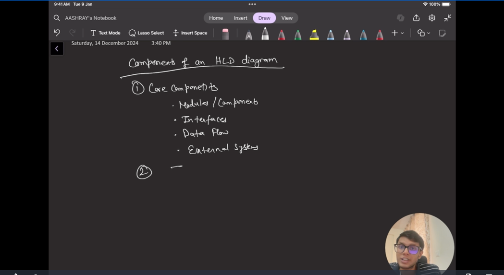

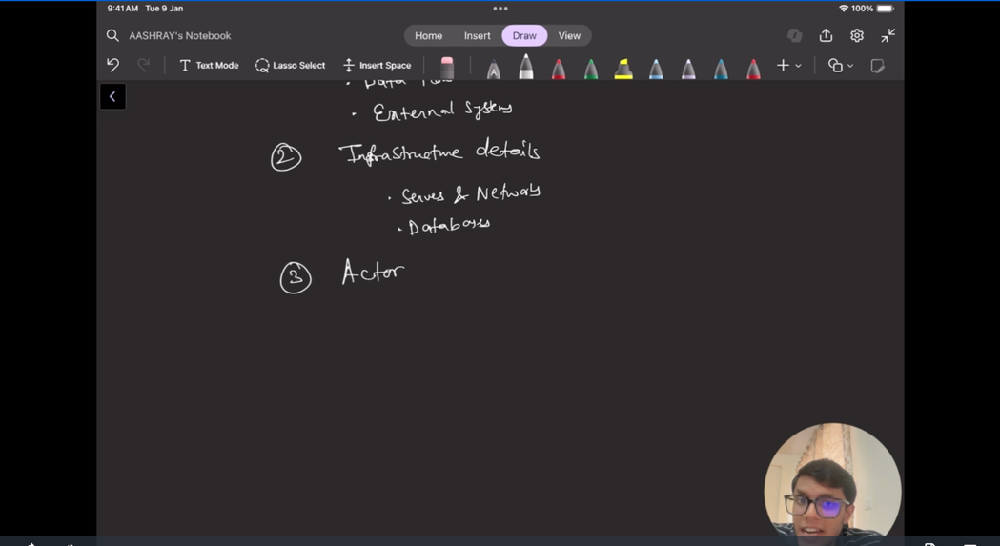

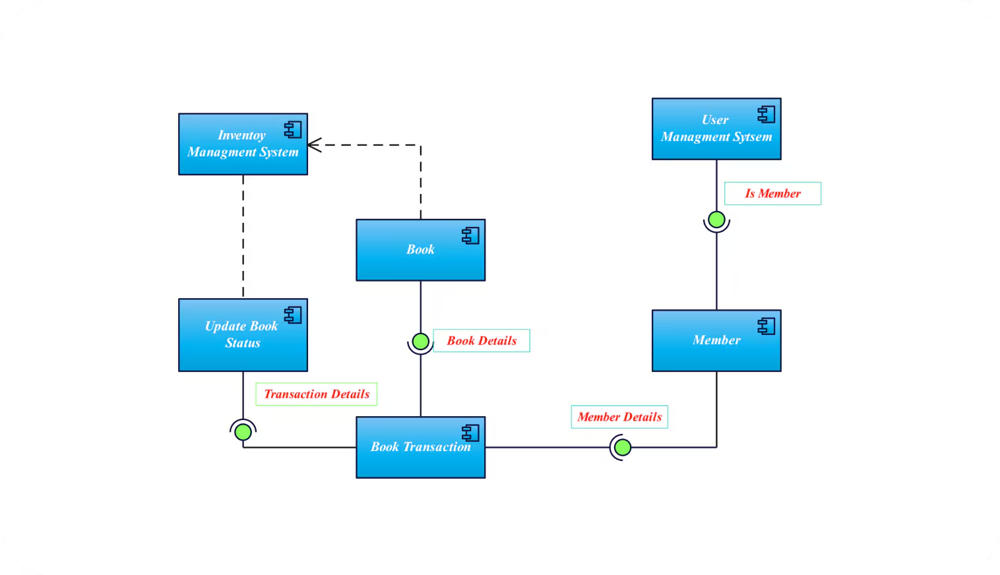

more about component diagram

https://www.geeksforgeeks.org/component-based-diagram/

Sequence diagrams :
https://www.geeksforgeeks.org/unified-modeling-language-uml-sequence-diagrams/?ref=lbp

Deployment diagrams :
https://www.geeksforgeeks.org/deployment-diagram-unified-modeling-languageuml/

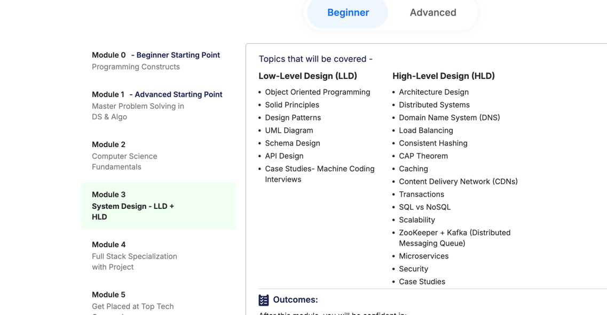

