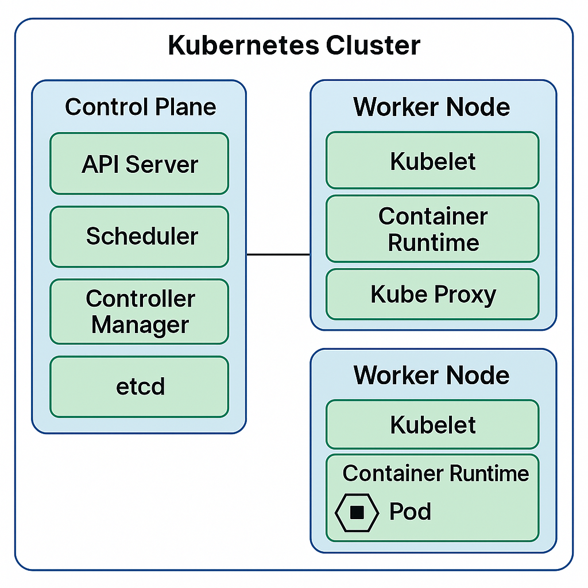

### **🔹 What is Docker?**

Docker is a **containerization platform** that allows developers to package applications **with all dependencies** into **lightweight, portable containers**. These containers can run **consistently** across different environments (development, testing, production).

---

## **1️⃣ Why Use Docker?**

| **Feature**         | **Benefit** |
|---------------------|------------|
| **Portability** | Runs on any system (Windows, Linux, Mac) without changes. |
| **Isolation** | Each container has its own dependencies, avoiding conflicts. |
| **Scalability** | Easily scale applications using Docker Swarm or Kubernetes. |
| **Faster Deployment** | Containers start **within seconds**, unlike VMs. |
| **Efficient Resource Usage** | Containers share the host OS, making them lightweight. |

---

## **2️⃣ Key Concepts in Docker**

| **Term** | **Definition** |
|----------|--------------|
| **Image** | A lightweight, standalone package containing code, runtime, libraries, etc. |
| **Container** | A running instance of a Docker **image**. |
| **Dockerfile** | A script defining how to build a Docker **image**. |
| **Docker Hub** | A public/private repository for storing Docker images. |
| **Volume** | Persistent storage for containers. |
| **Network** | Communication between containers using virtual networks. |

---

## **3️⃣ How Docker Works?**

1️⃣ **You create a Dockerfile (recipe for your image).**  
2️⃣ **You build an image from the Dockerfile.**  
3️⃣ **You run a container from the image.**  
4️⃣ **Containers run your app in an isolated environment.**

---

## **4️⃣ Example: Running a Spring Boot App in Docker**

### **Step 1: Create a `Dockerfile`**
```dockerfile
# Use official Java runtime
FROM openjdk:17

# Set working directory inside container
WORKDIR /app

# Copy the JAR file to container
COPY target/myapp.jar myapp.jar

# Command to run the JAR
CMD ["java", "-jar", "myapp.jar"]
```

---

### **Step 2: Build the Docker Image**
```sh
docker build -t myapp .
```

---

### **Step 3: Run the Container**
```sh
docker run -d -p 8080:8080 myapp
```
✅ **Explanation:**
- `-d`: Runs container in the background.
- `-p 8080:8080`: Maps port 8080 of the container to port 8080 on the host.

---

## **5️⃣ Docker Compose (For Multiple Services)**
If your app depends on **databases, message brokers, etc.**, you can use `docker-compose.yml`:

```yaml
version: "3"
services:
  app:
    build: .
    ports:
      - "8080:8080"
    depends_on:
      - db
  db:
    image: postgres:latest
    environment:
      POSTGRES_USER: user
      POSTGRES_PASSWORD: password
```

Start all services with:
```sh
docker-compose up -d
```

---

## **6️⃣ Docker vs Virtual Machines (VMs)**
| **Feature**  | **Docker (Containers)** | **Virtual Machines (VMs)** |
|-------------|------------------------|---------------------------|
| **Startup Time** | Seconds | Minutes |
| **Performance** | Lightweight, shares OS kernel | Heavy, separate OS for each VM |
| **Portability** | Runs anywhere | OS-dependent |
| **Resource Usage** | Uses host resources efficiently | High CPU & RAM usage |

---

## **7️⃣ When to Use Docker?**
✔ **Microservices** architecture  
✔ **CI/CD pipelines**  
✔ **Cloud deployment** (AWS, Azure, GCP)  
✔ **Testing in isolated environments**

Would you like an example with **Kubernetes + Docker**? 🚀

### **🔹 Docker + Kubernetes: Running a Microservice in Kubernetes**

Kubernetes (K8s) is an **orchestration tool** for managing **Docker containers** at scale. It helps with **scaling, deployment, and monitoring** of containerized applications.

---

## **1️⃣ How Docker and Kubernetes Work Together**

| **Component**    | **Docker** 🚀 | **Kubernetes** 🏗️ |
|----------------|-------------|----------------|
| **Purpose** | Packages applications into containers | Manages and orchestrates containers |
| **Scaling** | Manual (run multiple containers) | Automatic scaling |
| **Load Balancing** | No built-in support | Native support via Services |
| **Self-Healing** | Not supported | Restarts failed containers automatically |
| **Networking** | Uses Docker bridge | Uses Cluster Networking |

---

## **2️⃣ Deploying a Spring Boot App on Kubernetes**

We will deploy a **Spring Boot application** running inside a **Docker container** on Kubernetes.

---

### **Step 1: Create a Dockerfile**
```dockerfile
# Use official Java runtime
FROM openjdk:17

# Set working directory inside container
WORKDIR /app

# Copy the JAR file into the container
COPY target/myapp.jar myapp.jar

# Command to run the JAR
CMD ["java", "-jar", "myapp.jar"]
```

✅ **This creates a Docker image containing our Spring Boot app.**

---

### **Step 2: Build and Push the Docker Image**
```sh
docker build -t myapp .
docker tag myapp my-dockerhub-username/myapp:v1
docker push my-dockerhub-username/myapp:v1
```

✅ **This uploads the image to Docker Hub so Kubernetes can pull it.**

---

### **Step 3: Create a Kubernetes Deployment (YAML)**

📌 **Create `deployment.yaml`**
```yaml
apiVersion: apps/v1
kind: Deployment
metadata:
  name: myapp-deployment
spec:
  replicas: 3
  selector:
    matchLabels:
      app: myapp
  template:
    metadata:
      labels:
        app: myapp
    spec:
      containers:
      - name: myapp
        image: my-dockerhub-username/myapp:v1
        ports:
        - containerPort: 8080
```
✅ **This defines:**
- **3 replicas** (containers) of our app.
- Pulls the **Docker image** from Docker Hub.
- Exposes **port 8080** inside the container.

---

### **Step 4: Create a Kubernetes Service (YAML)**

📌 **Create `service.yaml`**
```yaml
apiVersion: v1
kind: Service
metadata:
  name: myapp-service
spec:
  selector:
    app: myapp
  ports:
    - protocol: TCP
      port: 80
      targetPort: 8080
  type: LoadBalancer
```
✅ **This allows external access to the app using a Load Balancer.**

---

### **Step 5: Deploy the Application on Kubernetes**
```sh
kubectl apply -f deployment.yaml
kubectl apply -f service.yaml
```

---

### **Step 6: Verify Deployment**
```sh
kubectl get pods
kubectl get services
```
✅ **Check if pods are running and service is available.**

---

## **3️⃣ Kubernetes Scaling & Self-Healing**

### **Auto Scaling**
```sh
kubectl scale deployment myapp-deployment --replicas=5
```
✅ **Scales up to 5 containers**.

### **Self-Healing**
If a container **fails**, Kubernetes **automatically restarts it**.

---

## **4️⃣ Summary**
✔ **Docker** → Packages the app.  
✔ **Kubernetes** → Orchestrates and scales containers.  
✔ **Deployment.yaml** → Defines how the app runs.  
✔ **Service.yaml** → Exposes the app externally.  
✔ **Scaling & Self-Healing** → Kubernetes manages failures automatically.

🚀 **Want help integrating Kafka or RabbitMQ with Kubernetes? Let me know!**

### **🔹 Kubernetes Cluster & Nodes Explained**

Kubernetes uses a **cluster-based architecture** to manage containerized applications efficiently. A **cluster** consists of **nodes** that run workloads.

---

## **1️⃣ What is a Cluster?**
A **Kubernetes Cluster** is a group of machines (nodes) that work together to run **containerized applications**.

🔹 **A cluster consists of:**  
✔ **Master Node (Control Plane)** – Manages the cluster  
✔ **Worker Nodes** – Runs applications inside Pods

📌 **Example Cluster Setup:**
```
Kubernetes Cluster
 ├── Master Node (Control Plane)
 │   ├── API Server
 │   ├── Scheduler
 │   ├── Controller Manager
 │   ├── etcd (Key-Value Store)
 │
 ├── Worker Node 1
 │   ├── Kubelet
 │   ├── Container Runtime (Docker/Containerd)
 │   ├── Pods (Running Apps)
 │
 ├── Worker Node 2
 │   ├── Kubelet
 │   ├── Container Runtime
 │   ├── More Pods
```

✅ **Clusters provide:**
- **High availability** (multiple nodes)
- **Scalability** (adds/removes nodes)
- **Load balancing** (evenly distributes traffic)

---

## **2️⃣ What is a Node?**
A **Node** is a machine (physical or virtual) in a Kubernetes cluster where applications run.

📌 **Types of Nodes in Kubernetes**  
| **Type** | **Function** |
|---------|-------------|
| **Master Node** | Manages cluster state, scheduling, and networking |
| **Worker Node** | Runs Pods and workloads |

### **🔹 Master Node (Control Plane)**
Manages the entire cluster and ensures applications run smoothly.

| **Component** | **Role** |
|--------------|---------|
| **API Server** | Entry point for all Kubernetes operations |
| **Scheduler** | Assigns Pods to Worker Nodes |
| **Controller Manager** | Manages replica sets, nodes, and endpoints |
| **etcd** | Stores cluster configuration and state |

---

### **🔹 Worker Node**
Executes the actual workloads by running **Pods**.

| **Component** | **Role** |
|--------------|---------|
| **Kubelet** | Manages Pods and communicates with Master Node |
| **Container Runtime** | Runs containers (Docker, containerd, CRI-O) |
| **Kube Proxy** | Manages network rules and traffic |

📌 **Example: Checking Nodes in a Cluster**
```sh
kubectl get nodes
```
✅ **Lists all nodes in the Kubernetes cluster.**

---

## **3️⃣ Cluster Scaling: Adding More Nodes**
Kubernetes can **automatically scale nodes** in a cluster based on workload demand.

### **Manual Scaling**
```sh
kubectl scale deployment myapp --replicas=5
```
✅ **Increases the number of application instances (Pods).**

### **Auto-Scaling with Cluster Autoscaler**
```sh
kubectl autoscale deployment myapp --cpu-percent=50 --min=2 --max=10
```
✅ **Automatically adjusts the number of Pods between 2 and 10.**

---

## **4️⃣ Summary**
✔ **Cluster** → Group of nodes managing workloads  
✔ **Master Node** → Controls the cluster, schedules workloads  
✔ **Worker Node** → Runs containers inside Pods  
✔ **Auto-Scaling** → Adjusts Pods or Nodes based on demand

🚀 **Need help with Kubernetes cluster setup, networking, or security? Let me know!**

### **🔹 Kubernetes In-Depth Explanation**

Kubernetes (K8s) is a **container orchestration platform** that automates **deployment, scaling, and management** of containerized applications. It enables applications to run **reliably at scale** with features like **load balancing, self-healing, and auto-scaling**.

---

# **1️⃣ Kubernetes Architecture**
Kubernetes follows a **master-worker architecture**, where the **control plane (master node)** manages **worker nodes** that run application workloads.

### **📌 Key Components**
| **Component**  | **Role** |
|--------------|---------|
| **Master Node (Control Plane)** | Manages cluster state, schedules workloads |
| **Worker Nodes** | Runs application containers |
| **Pods** | Smallest unit in Kubernetes, holds one or more containers |
| **Deployments** | Manages replica sets and updates |
| **Services** | Exposes applications to internal/external traffic |
| **ConfigMaps & Secrets** | Stores configuration data and sensitive information |
| **Persistent Volumes (PV & PVC)** | Manages storage for stateful applications |

---

# **2️⃣ Kubernetes Core Concepts**
## **🔹 Pods**
- A **Pod** is the smallest deployable unit in Kubernetes.
- Contains **one or more containers** sharing storage and networking.
- Containers inside a **Pod** can communicate using **localhost**.

**Example: Pod YAML**
```yaml
apiVersion: v1
kind: Pod
metadata:
  name: my-pod
spec:
  containers:
    - name: my-container
      image: nginx
      ports:
        - containerPort: 80
```
✅ **This pod runs an Nginx container on port 80.**

---

## **🔹 Deployments (Managing Pods)**
A **Deployment** ensures that the desired number of **Pod replicas** are running.

**Example: Deployment YAML**
```yaml
apiVersion: apps/v1
kind: Deployment
metadata:
  name: my-deployment
spec:
  replicas: 3
  selector:
    matchLabels:
      app: myapp
  template:
    metadata:
      labels:
        app: myapp
    spec:
      containers:
        - name: my-container
          image: nginx
          ports:
            - containerPort: 80
```
✅ **This ensures 3 replicas of `nginx` are running. If a pod fails, Kubernetes recreates it.**

---

## **🔹 Services (Networking in Kubernetes)**
A **Service** exposes Pods to internal or external traffic.

### **📌 Types of Services**
| **Type**         | **Description** |
|----------------|--------------|
| **ClusterIP** | Exposes service inside the cluster (default) |
| **NodePort** | Exposes service on a static port on each node |
| **LoadBalancer** | Integrates with cloud provider's load balancer |
| **ExternalName** | Maps to an external DNS name |

**Example: Exposing a Deployment via Service**
```yaml
apiVersion: v1
kind: Service
metadata:
  name: my-service
spec:
  selector:
    app: myapp
  ports:
    - protocol: TCP
      port: 80
      targetPort: 80
  type: LoadBalancer
```
✅ **This exposes our application externally using a LoadBalancer.**

---

# **3️⃣ Kubernetes Storage**
By default, Pods are **ephemeral**, meaning they lose data when restarted. **Persistent Volumes (PV) and Persistent Volume Claims (PVC)** provide **persistent storage**.

### **📌 Storage Components**
| **Component** | **Description** |
|--------------|--------------|
| **Persistent Volume (PV)** | Physical storage provisioned by an admin |
| **Persistent Volume Claim (PVC)** | A request for storage by a pod |
| **Storage Class** | Defines dynamic provisioning of storage |

**Example: Persistent Volume Claim**
```yaml
apiVersion: v1
kind: PersistentVolumeClaim
metadata:
  name: my-pvc
spec:
  accessModes:
    - ReadWriteOnce
  resources:
    requests:
      storage: 1Gi
```
✅ **This requests 1Gi of storage from available Persistent Volumes.**

---

# **4️⃣ Scaling in Kubernetes**
Kubernetes supports **manual and auto-scaling**.

## **🔹 Horizontal Pod Autoscaler (HPA)**
Automatically increases or decreases the number of pods based on **CPU or memory usage**.

**Enable HPA**
```sh
kubectl autoscale deployment my-deployment --cpu-percent=50 --min=2 --max=10
```
✅ **This scales pods between 2 to 10 based on 50% CPU usage.**

---

# **5️⃣ Self-Healing & Rolling Updates**
Kubernetes ensures **self-healing** by restarting failed pods.

### **Rolling Update**
Ensures zero downtime when deploying a new version of an app.
```sh
kubectl set image deployment/my-deployment my-container=nginx:latest
```
✅ **Kubernetes gradually updates pods without downtime.**

---

# **6️⃣ Kubernetes Security**
| **Security Feature** | **Description** |
|------------------|--------------|
| **RBAC (Role-Based Access Control)** | Restricts access to resources |
| **Network Policies** | Controls how pods communicate |
| **Secrets** | Stores sensitive data (e.g., passwords, API keys) |

**Example: Creating a Secret**
```yaml
apiVersion: v1
kind: Secret
metadata:
  name: my-secret
type: Opaque
data:
  password: bXlwYXNzd29yZA==  # Base64 encoded
```
✅ **Stores a password securely.**

---

# **7️⃣ Kubernetes Monitoring & Logging**
Monitoring is crucial for managing clusters.

| **Tool** | **Purpose** |
|---------|-----------|
| **Prometheus** | Metrics collection |
| **Grafana** | Data visualization |
| **Fluentd / ELK** | Logging |

```sh
kubectl logs my-pod
kubectl top pod
```
✅ **Checks pod logs and resource usage.**

---

# **8️⃣ Summary**
✔ **Pods** → Smallest unit, holds containers  
✔ **Deployments** → Manages replicas of pods  
✔ **Services** → Exposes applications  
✔ **Persistent Volumes** → Provides persistent storage  
✔ **Auto-Scaling** → Automatically adjusts replicas  
✔ **Self-Healing** → Restarts failed pods  
✔ **RBAC & Secrets** → Ensures security

🚀 **Need help with Kubernetes architecture design or advanced concepts? Let me know!**

Here is a pictorial representation of the Kubernetes architecture, showing the components and their functions. Let me know if you need any modifications or explanations! 🚀


Yes! **Pods run inside Nodes** in Kubernetes.

### **📌 Relationship Between Cluster, Nodes, and Pods**
```
Kubernetes Cluster
 ├── Master Node (Control Plane)
 │
 ├── Worker Node 1
 │   ├── Pod 1 (Container A, Container B)
 │   ├── Pod 2 (Container C)
 │
 ├── Worker Node 2
 │   ├── Pod 3 (Container D, Container E)
```
### **🔹 How They Work Together**
- A **Kubernetes Cluster** has multiple **Nodes** (machines).
- Each **Node** runs **multiple Pods**.
- A **Pod** is the smallest unit in Kubernetes and contains **one or more containers**.
- All **containers inside a Pod share the same network and storage**.

### **📌 Example: Checking Pods Inside a Node**
```sh
kubectl get pods -o wide
```
✅ **This command shows which Node each Pod is running on.**

### **🔹 Container Lifecycle in Kubernetes**

A container in Kubernetes follows a lifecycle from creation to termination. Kubernetes **manages** container lifecycles to ensure **stability and reliability**.

---

## **1️⃣ Container Lifecycle Phases**
A container goes through the following **states**:

| **State** | **Description** |
|-----------|----------------|
| **Pending** | Kubernetes schedules the container but it hasn't started yet |
| **Running** | Container is executing inside a Pod |
| **Succeeded** | Container has finished execution successfully |
| **Failed** | Container exited with an error |
| **Unknown** | Node is unresponsive; container state is unknown |

📌 **Check the container state:**
```sh
kubectl get pods
kubectl describe pod <pod-name>
```
✅ **This command shows the current phase of a container.**

---

## **2️⃣ Container Lifecycle Hooks**
Kubernetes provides **hooks** to execute commands at different lifecycle events.

### **🔹 Types of Hooks**
| **Hook** | **Triggered When?** |
|----------|------------------|
| **PostStart** | Runs after the container starts |
| **PreStop** | Runs before the container stops |

### **📌 Example: Adding Lifecycle Hooks**
```yaml
apiVersion: v1
kind: Pod
metadata:
  name: my-pod
spec:
  containers:
    - name: my-container
      image: nginx
      lifecycle:
        postStart:
          exec:
            command: ["/bin/sh", "-c", "echo Container Started"]
        preStop:
          exec:
            command: ["/bin/sh", "-c", "echo Container Stopping"]
```
✅ **This logs messages when the container starts and stops.**

---

## **3️⃣ Container Restart Policies**
Kubernetes allows different **restart behaviors** for containers.

| **Policy** | **Behavior** |
|------------|-------------|
| **Always** (default) | Restart container if it fails |
| **OnFailure** | Restart only if it exits with an error |
| **Never** | Never restart |

### **📌 Example: Setting Restart Policy**
```yaml
apiVersion: v1
kind: Pod
metadata:
  name: restart-policy-example
spec:
  restartPolicy: OnFailure
  containers:
    - name: my-container
      image: busybox
      command: ["exit", "1"]
```
✅ **This container will restart only if it fails.**

---

## **4️⃣ Container Probes (Health Checks)**
Kubernetes monitors container health using **probes**.

### **🔹 Types of Probes**
| **Probe Type** | **Checks?** |
|--------------|------------|
| **Liveness Probe** | If the container is still running |
| **Readiness Probe** | If the container is ready to accept traffic |
| **Startup Probe** | If the container has started correctly |

### **📌 Example: Liveness & Readiness Probes**
```yaml
apiVersion: v1
kind: Pod
metadata:
  name: health-check-pod
spec:
  containers:
    - name: my-container
      image: nginx
      livenessProbe:
        httpGet:
          path: /health
          port: 80
        initialDelaySeconds: 5
      readinessProbe:
        httpGet:
          path: /ready
          port: 80
        initialDelaySeconds: 10
```
✅ **This ensures the container is restarted if unhealthy and does not receive traffic until it's ready.**

---

## **5️⃣ Container Termination Process**
When a container **stops**, Kubernetes follows this process:
1. **PreStop Hook** (if defined) runs.
2. **SIGTERM Signal** sent to gracefully stop the container.
3. Kubernetes waits for **gracePeriodSeconds** (default **30s**).
4. If the container is still running, **SIGKILL** forcefully terminates it.

### **📌 Example: Setting Termination Grace Period**
```yaml
apiVersion: v1
kind: Pod
metadata:
  name: termination-example
spec:
  terminationGracePeriodSeconds: 10
  containers:
    - name: my-container
      image: nginx
```
✅ **This allows the container 10 seconds to shut down gracefully before forceful termination.**

---

## **6️⃣ Summary**
✔ **Containers move through states: Pending → Running → Succeeded/Failed**  
✔ **Lifecycle Hooks (PostStart, PreStop) allow custom logic**  
✔ **Restart Policies control how containers recover**  
✔ **Health Checks (Probes) ensure stability**  
✔ **Termination process uses SIGTERM & SIGKILL**


