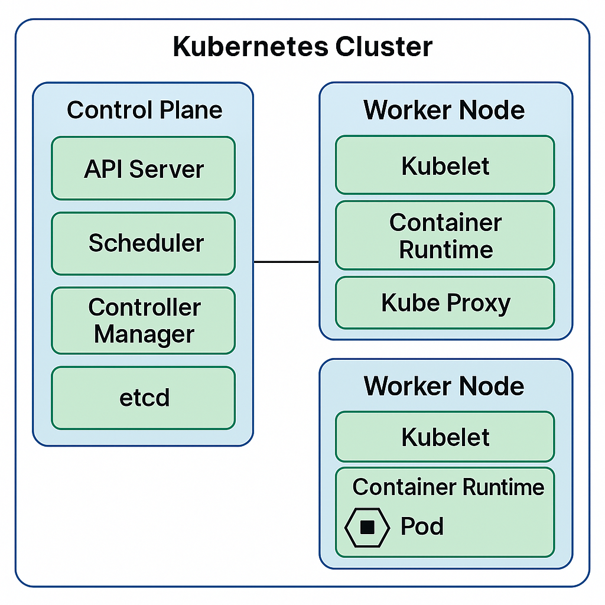

### **🔹 What is Docker?**

Docker is a **containerization platform** that allows developers to package applications **with all dependencies** into **lightweight, portable containers**. These containers can run **consistently** across different environments (development, testing, production).

---

## **1️⃣ Why Use Docker?**

| **Feature**         | **Benefit** |
|---------------------|------------|
| **Portability** | Runs on any system (Windows, Linux, Mac) without changes. |
| **Isolation** | Each container has its own dependencies, avoiding conflicts. |
| **Scalability** | Easily scale applications using Docker Swarm or Kubernetes. |
| **Faster Deployment** | Containers start **within seconds**, unlike VMs. |
| **Efficient Resource Usage** | Containers share the host OS, making them lightweight. |

---

## **2️⃣ Key Concepts in Docker**

| **Term** | **Definition** |
|----------|--------------|
| **Image** | A lightweight, standalone package containing code, runtime, libraries, etc. |
| **Container** | A running instance of a Docker **image**. |
| **Dockerfile** | A script defining how to build a Docker **image**. |
| **Docker Hub** | A public/private repository for storing Docker images. |
| **Volume** | Persistent storage for containers. |
| **Network** | Communication between containers using virtual networks. |

---

## **3️⃣ How Docker Works?**

1️⃣ **You create a Dockerfile (recipe for your image).**  
2️⃣ **You build an image from the Dockerfile.**  
3️⃣ **You run a container from the image.**  
4️⃣ **Containers run your app in an isolated environment.**

---

## **4️⃣ Example: Running a Spring Boot App in Docker**

### **Step 1: Create a `Dockerfile`**
```dockerfile
# Use official Java runtime
FROM openjdk:17

# Set working directory inside container
WORKDIR /app

# Copy the JAR file to container
COPY target/myapp.jar myapp.jar

# Command to run the JAR
CMD ["java", "-jar", "myapp.jar"]
```

---

### **Step 2: Build the Docker Image**
```sh
docker build -t myapp .
```

---

### **Step 3: Run the Container**
```sh
docker run -d -p 8080:8080 myapp
```
✅ **Explanation:**
- `-d`: Runs container in the background.
- `-p 8080:8080`: Maps port 8080 of the container to port 8080 on the host.

---

## **5️⃣ Docker Compose (For Multiple Services)**
If your app depends on **databases, message brokers, etc.**, you can use `docker-compose.yml`:

```yaml
version: "3"
services:
  app:
    build: .
    ports:
      - "8080:8080"
    depends_on:
      - db
  db:
    image: postgres:latest
    environment:
      POSTGRES_USER: user
      POSTGRES_PASSWORD: password
```

Start all services with:
```sh
docker-compose up -d
```

---

## **6️⃣ Docker vs Virtual Machines (VMs)**
| **Feature**  | **Docker (Containers)** | **Virtual Machines (VMs)** |
|-------------|------------------------|---------------------------|
| **Startup Time** | Seconds | Minutes |
| **Performance** | Lightweight, shares OS kernel | Heavy, separate OS for each VM |
| **Portability** | Runs anywhere | OS-dependent |
| **Resource Usage** | Uses host resources efficiently | High CPU & RAM usage |

---

## **7️⃣ When to Use Docker?**
✔ **Microservices** architecture  
✔ **CI/CD pipelines**  
✔ **Cloud deployment** (AWS, Azure, GCP)  
✔ **Testing in isolated environments**

Would you like an example with **Kubernetes + Docker**? 🚀

### **🔹 Docker + Kubernetes: Running a Microservice in Kubernetes**

Kubernetes (K8s) is an **orchestration tool** for managing **Docker containers** at scale. It helps with **scaling, deployment, and monitoring** of containerized applications.

---

## **1️⃣ How Docker and Kubernetes Work Together**

| **Component**    | **Docker** 🚀 | **Kubernetes** 🏗️ |
|----------------|-------------|----------------|
| **Purpose** | Packages applications into containers | Manages and orchestrates containers |
| **Scaling** | Manual (run multiple containers) | Automatic scaling |
| **Load Balancing** | No built-in support | Native support via Services |
| **Self-Healing** | Not supported | Restarts failed containers automatically |
| **Networking** | Uses Docker bridge | Uses Cluster Networking |

---

## **2️⃣ Deploying a Spring Boot App on Kubernetes**

We will deploy a **Spring Boot application** running inside a **Docker container** on Kubernetes.

---

### **Step 1: Create a Dockerfile**
```dockerfile
# Use official Java runtime
FROM openjdk:17

# Set working directory inside container
WORKDIR /app

# Copy the JAR file into the container
COPY target/myapp.jar myapp.jar

# Command to run the JAR
CMD ["java", "-jar", "myapp.jar"]
```

✅ **This creates a Docker image containing our Spring Boot app.**

---

### **Step 2: Build and Push the Docker Image**
```sh
docker build -t myapp .
docker tag myapp my-dockerhub-username/myapp:v1
docker push my-dockerhub-username/myapp:v1
```

✅ **This uploads the image to Docker Hub so Kubernetes can pull it.**

---

### **Step 3: Create a Kubernetes Deployment (YAML)**

📌 **Create `deployment.yaml`**
```yaml
apiVersion: apps/v1
kind: Deployment
metadata:
  name: myapp-deployment
spec:
  replicas: 3
  selector:
    matchLabels:
      app: myapp
  template:
    metadata:
      labels:
        app: myapp
    spec:
      containers:
      - name: myapp
        image: my-dockerhub-username/myapp:v1
        ports:
        - containerPort: 8080
```
✅ **This defines:**
- **3 replicas** (containers) of our app.
- Pulls the **Docker image** from Docker Hub.
- Exposes **port 8080** inside the container.

---

### **Step 4: Create a Kubernetes Service (YAML)**

📌 **Create `service.yaml`**
```yaml
apiVersion: v1
kind: Service
metadata:
  name: myapp-service
spec:
  selector:
    app: myapp
  ports:
    - protocol: TCP
      port: 80
      targetPort: 8080
  type: LoadBalancer
```
✅ **This allows external access to the app using a Load Balancer.**

---

### **Step 5: Deploy the Application on Kubernetes**
```sh
kubectl apply -f deployment.yaml
kubectl apply -f service.yaml
```

---

### **Step 6: Verify Deployment**
```sh
kubectl get pods
kubectl get services
```
✅ **Check if pods are running and service is available.**

---

## **3️⃣ Kubernetes Scaling & Self-Healing**

### **Auto Scaling**
```sh
kubectl scale deployment myapp-deployment --replicas=5
```
✅ **Scales up to 5 containers**.

### **Self-Healing**
If a container **fails**, Kubernetes **automatically restarts it**.

---

## **4️⃣ Summary**
✔ **Docker** → Packages the app.  
✔ **Kubernetes** → Orchestrates and scales containers.  
✔ **Deployment.yaml** → Defines how the app runs.  
✔ **Service.yaml** → Exposes the app externally.  
✔ **Scaling & Self-Healing** → Kubernetes manages failures automatically.

🚀 **Want help integrating Kafka or RabbitMQ with Kubernetes? Let me know!**

### **🔹 Kubernetes Cluster & Nodes Explained**

Kubernetes uses a **cluster-based architecture** to manage containerized applications efficiently. A **cluster** consists of **nodes** that run workloads.

---

## **1️⃣ What is a Cluster?**
A **Kubernetes Cluster** is a group of machines (nodes) that work together to run **containerized applications**.

🔹 **A cluster consists of:**  
✔ **Master Node (Control Plane)** – Manages the cluster  
✔ **Worker Nodes** – Runs applications inside Pods

📌 **Example Cluster Setup:**
```
Kubernetes Cluster
 ├── Master Node (Control Plane)
 │   ├── API Server
 │   ├── Scheduler
 │   ├── Controller Manager
 │   ├── etcd (Key-Value Store)
 │
 ├── Worker Node 1
 │   ├── Kubelet
 │   ├── Container Runtime (Docker/Containerd)
 │   ├── Pods (Running Apps)
 │
 ├── Worker Node 2
 │   ├── Kubelet
 │   ├── Container Runtime
 │   ├── More Pods
```

✅ **Clusters provide:**
- **High availability** (multiple nodes)
- **Scalability** (adds/removes nodes)
- **Load balancing** (evenly distributes traffic)

---

## **2️⃣ What is a Node?**
A **Node** is a machine (physical or virtual) in a Kubernetes cluster where applications run.

📌 **Types of Nodes in Kubernetes**  
| **Type** | **Function** |
|---------|-------------|
| **Master Node** | Manages cluster state, scheduling, and networking |
| **Worker Node** | Runs Pods and workloads |

### **🔹 Master Node (Control Plane)**
Manages the entire cluster and ensures applications run smoothly.

| **Component** | **Role** |
|--------------|---------|
| **API Server** | Entry point for all Kubernetes operations |
| **Scheduler** | Assigns Pods to Worker Nodes |
| **Controller Manager** | Manages replica sets, nodes, and endpoints |
| **etcd** | Stores cluster configuration and state |

---

### **🔹 Worker Node**
Executes the actual workloads by running **Pods**.

| **Component** | **Role** |
|--------------|---------|
| **Kubelet** | Manages Pods and communicates with Master Node |
| **Container Runtime** | Runs containers (Docker, containerd, CRI-O) |
| **Kube Proxy** | Manages network rules and traffic |

📌 **Example: Checking Nodes in a Cluster**
```sh
kubectl get nodes
```
✅ **Lists all nodes in the Kubernetes cluster.**

---

## **3️⃣ Cluster Scaling: Adding More Nodes**
Kubernetes can **automatically scale nodes** in a cluster based on workload demand.

### **Manual Scaling**
```sh
kubectl scale deployment myapp --replicas=5
```
✅ **Increases the number of application instances (Pods).**

### **Auto-Scaling with Cluster Autoscaler**
```sh
kubectl autoscale deployment myapp --cpu-percent=50 --min=2 --max=10
```
✅ **Automatically adjusts the number of Pods between 2 and 10.**

---

## **4️⃣ Summary**
✔ **Cluster** → Group of nodes managing workloads  
✔ **Master Node** → Controls the cluster, schedules workloads  
✔ **Worker Node** → Runs containers inside Pods  
✔ **Auto-Scaling** → Adjusts Pods or Nodes based on demand

🚀 **Need help with Kubernetes cluster setup, networking, or security? Let me know!**

### **🔹 Kubernetes In-Depth Explanation**

Kubernetes (K8s) is a **container orchestration platform** that automates **deployment, scaling, and management** of containerized applications. It enables applications to run **reliably at scale** with features like **load balancing, self-healing, and auto-scaling**.

---

# **1️⃣ Kubernetes Architecture**
Kubernetes follows a **master-worker architecture**, where the **control plane (master node)** manages **worker nodes** that run application workloads.

### **📌 Key Components**
| **Component**  | **Role** |
|--------------|---------|
| **Master Node (Control Plane)** | Manages cluster state, schedules workloads |
| **Worker Nodes** | Runs application containers |
| **Pods** | Smallest unit in Kubernetes, holds one or more containers |
| **Deployments** | Manages replica sets and updates |
| **Services** | Exposes applications to internal/external traffic |
| **ConfigMaps & Secrets** | Stores configuration data and sensitive information |
| **Persistent Volumes (PV & PVC)** | Manages storage for stateful applications |

---

# **2️⃣ Kubernetes Core Concepts**
## **🔹 Pods**
- A **Pod** is the smallest deployable unit in Kubernetes.
- Contains **one or more containers** sharing storage and networking.
- Containers inside a **Pod** can communicate using **localhost**.

**Example: Pod YAML**
```yaml
apiVersion: v1
kind: Pod
metadata:
  name: my-pod
spec:
  containers:
    - name: my-container
      image: nginx
      ports:
        - containerPort: 80
```
✅ **This pod runs an Nginx container on port 80.**

---

## **🔹 Deployments (Managing Pods)**
A **Deployment** ensures that the desired number of **Pod replicas** are running.

**Example: Deployment YAML**
```yaml
apiVersion: apps/v1
kind: Deployment
metadata:
  name: my-deployment
spec:
  replicas: 3
  selector:
    matchLabels:
      app: myapp
  template:
    metadata:
      labels:
        app: myapp
    spec:
      containers:
        - name: my-container
          image: nginx
          ports:
            - containerPort: 80
```
✅ **This ensures 3 replicas of `nginx` are running. If a pod fails, Kubernetes recreates it.**

---

## **🔹 Services (Networking in Kubernetes)**
A **Service** exposes Pods to internal or external traffic.

### **📌 Types of Services**
| **Type**         | **Description** |
|----------------|--------------|
| **ClusterIP** | Exposes service inside the cluster (default) |
| **NodePort** | Exposes service on a static port on each node |
| **LoadBalancer** | Integrates with cloud provider's load balancer |
| **ExternalName** | Maps to an external DNS name |

**Example: Exposing a Deployment via Service**
```yaml
apiVersion: v1
kind: Service
metadata:
  name: my-service
spec:
  selector:
    app: myapp
  ports:
    - protocol: TCP
      port: 80
      targetPort: 80
  type: LoadBalancer
```
✅ **This exposes our application externally using a LoadBalancer.**

---

# **3️⃣ Kubernetes Storage**
By default, Pods are **ephemeral**, meaning they lose data when restarted. **Persistent Volumes (PV) and Persistent Volume Claims (PVC)** provide **persistent storage**.

### **📌 Storage Components**
| **Component** | **Description** |
|--------------|--------------|
| **Persistent Volume (PV)** | Physical storage provisioned by an admin |
| **Persistent Volume Claim (PVC)** | A request for storage by a pod |
| **Storage Class** | Defines dynamic provisioning of storage |

**Example: Persistent Volume Claim**
```yaml
apiVersion: v1
kind: PersistentVolumeClaim
metadata:
  name: my-pvc
spec:
  accessModes:
    - ReadWriteOnce
  resources:
    requests:
      storage: 1Gi
```
✅ **This requests 1Gi of storage from available Persistent Volumes.**

---

# **4️⃣ Scaling in Kubernetes**
Kubernetes supports **manual and auto-scaling**.

## **🔹 Horizontal Pod Autoscaler (HPA)**
Automatically increases or decreases the number of pods based on **CPU or memory usage**.

**Enable HPA**
```sh
kubectl autoscale deployment my-deployment --cpu-percent=50 --min=2 --max=10
```
✅ **This scales pods between 2 to 10 based on 50% CPU usage.**

---

# **5️⃣ Self-Healing & Rolling Updates**
Kubernetes ensures **self-healing** by restarting failed pods.

### **Rolling Update**
Ensures zero downtime when deploying a new version of an app.
```sh
kubectl set image deployment/my-deployment my-container=nginx:latest
```
✅ **Kubernetes gradually updates pods without downtime.**

---

# **6️⃣ Kubernetes Security**
| **Security Feature** | **Description** |
|------------------|--------------|
| **RBAC (Role-Based Access Control)** | Restricts access to resources |
| **Network Policies** | Controls how pods communicate |
| **Secrets** | Stores sensitive data (e.g., passwords, API keys) |

**Example: Creating a Secret**
```yaml
apiVersion: v1
kind: Secret
metadata:
  name: my-secret
type: Opaque
data:
  password: bXlwYXNzd29yZA==  # Base64 encoded
```
✅ **Stores a password securely.**

---

# **7️⃣ Kubernetes Monitoring & Logging**
Monitoring is crucial for managing clusters.

| **Tool** | **Purpose** |
|---------|-----------|
| **Prometheus** | Metrics collection |
| **Grafana** | Data visualization |
| **Fluentd / ELK** | Logging |

```sh
kubectl logs my-pod
kubectl top pod
```
✅ **Checks pod logs and resource usage.**

---

# **8️⃣ Summary**
✔ **Pods** → Smallest unit, holds containers  
✔ **Deployments** → Manages replicas of pods  
✔ **Services** → Exposes applications  
✔ **Persistent Volumes** → Provides persistent storage  
✔ **Auto-Scaling** → Automatically adjusts replicas  
✔ **Self-Healing** → Restarts failed pods  
✔ **RBAC & Secrets** → Ensures security

🚀 **Need help with Kubernetes architecture design or advanced concepts? Let me know!**

Here is a pictorial representation of the Kubernetes architecture, showing the components and their functions. Let me know if you need any modifications or explanations! 🚀


Yes! **Pods run inside Nodes** in Kubernetes.

### **📌 Relationship Between Cluster, Nodes, and Pods**
```
Kubernetes Cluster
 ├── Master Node (Control Plane)
 │
 ├── Worker Node 1
 │   ├── Pod 1 (Container A, Container B)
 │   ├── Pod 2 (Container C)
 │
 ├── Worker Node 2
 │   ├── Pod 3 (Container D, Container E)
```
### **🔹 How They Work Together**
- A **Kubernetes Cluster** has multiple **Nodes** (machines).
- Each **Node** runs **multiple Pods**.
- A **Pod** is the smallest unit in Kubernetes and contains **one or more containers**.
- All **containers inside a Pod share the same network and storage**.

### **📌 Example: Checking Pods Inside a Node**
```sh
kubectl get pods -o wide
```
✅ **This command shows which Node each Pod is running on.**

### **🔹 Container Lifecycle in Kubernetes**

A container in Kubernetes follows a lifecycle from creation to termination. Kubernetes **manages** container lifecycles to ensure **stability and reliability**.

---

## **1️⃣ Container Lifecycle Phases**
A container goes through the following **states**:

| **State** | **Description** |
|-----------|----------------|
| **Pending** | Kubernetes schedules the container but it hasn't started yet |
| **Running** | Container is executing inside a Pod |
| **Succeeded** | Container has finished execution successfully |
| **Failed** | Container exited with an error |
| **Unknown** | Node is unresponsive; container state is unknown |

📌 **Check the container state:**
```sh
kubectl get pods
kubectl describe pod <pod-name>
```
✅ **This command shows the current phase of a container.**

---

## **2️⃣ Container Lifecycle Hooks**
Kubernetes provides **hooks** to execute commands at different lifecycle events.

### **🔹 Types of Hooks**
| **Hook** | **Triggered When?** |
|----------|------------------|
| **PostStart** | Runs after the container starts |
| **PreStop** | Runs before the container stops |

### **📌 Example: Adding Lifecycle Hooks**
```yaml
apiVersion: v1
kind: Pod
metadata:
  name: my-pod
spec:
  containers:
    - name: my-container
      image: nginx
      lifecycle:
        postStart:
          exec:
            command: ["/bin/sh", "-c", "echo Container Started"]
        preStop:
          exec:
            command: ["/bin/sh", "-c", "echo Container Stopping"]
```
✅ **This logs messages when the container starts and stops.**

---

## **3️⃣ Container Restart Policies**
Kubernetes allows different **restart behaviors** for containers.

| **Policy** | **Behavior** |
|------------|-------------|
| **Always** (default) | Restart container if it fails |
| **OnFailure** | Restart only if it exits with an error |
| **Never** | Never restart |

### **📌 Example: Setting Restart Policy**
```yaml
apiVersion: v1
kind: Pod
metadata:
  name: restart-policy-example
spec:
  restartPolicy: OnFailure
  containers:
    - name: my-container
      image: busybox
      command: ["exit", "1"]
```
✅ **This container will restart only if it fails.**

---

## **4️⃣ Container Probes (Health Checks)**
Kubernetes monitors container health using **probes**.

### **🔹 Types of Probes**
| **Probe Type** | **Checks?** |
|--------------|------------|
| **Liveness Probe** | If the container is still running |
| **Readiness Probe** | If the container is ready to accept traffic |
| **Startup Probe** | If the container has started correctly |

### **📌 Example: Liveness & Readiness Probes**
```yaml
apiVersion: v1
kind: Pod
metadata:
  name: health-check-pod
spec:
  containers:
    - name: my-container
      image: nginx
      livenessProbe:
        httpGet:
          path: /health
          port: 80
        initialDelaySeconds: 5
      readinessProbe:
        httpGet:
          path: /ready
          port: 80
        initialDelaySeconds: 10
```
✅ **This ensures the container is restarted if unhealthy and does not receive traffic until it's ready.**

---

## **5️⃣ Container Termination Process**
When a container **stops**, Kubernetes follows this process:
1. **PreStop Hook** (if defined) runs.
2. **SIGTERM Signal** sent to gracefully stop the container.
3. Kubernetes waits for **gracePeriodSeconds** (default **30s**).
4. If the container is still running, **SIGKILL** forcefully terminates it.

### **📌 Example: Setting Termination Grace Period**
```yaml
apiVersion: v1
kind: Pod
metadata:
  name: termination-example
spec:
  terminationGracePeriodSeconds: 10
  containers:
    - name: my-container
      image: nginx
```
✅ **This allows the container 10 seconds to shut down gracefully before forceful termination.**

---

## **6️⃣ Summary**
✔ **Containers move through states: Pending → Running → Succeeded/Failed**  
✔ **Lifecycle Hooks (PostStart, PreStop) allow custom logic**  
✔ **Restart Policies control how containers recover**  
✔ **Health Checks (Probes) ensure stability**  
✔ **Termination process uses SIGTERM & SIGKILL**

### **🔹 Docker Image Lifecycle in Kubernetes & Containerization**

A **Docker image** follows a lifecycle from creation to deployment in Kubernetes. Understanding this lifecycle is crucial for **efficient application development and deployment**.

---

## **1️⃣ Docker Image Lifecycle Phases**
A **Docker image** goes through the following **stages**:

| **Stage** | **Description** |
|-----------|----------------|
| **Build** | Image is created using a **Dockerfile** |
| **Tag** | Versioning is applied using a tag (e.g., `nginx:latest`) |
| **Push** | Image is uploaded to a **container registry** (Docker Hub, AWS ECR, etc.) |
| **Pull** | Kubernetes nodes download the image when required |
| **Run** | Image is instantiated as a **container** in Kubernetes |
| **Update** | Images are updated to newer versions using rolling deployments |
| **Delete** | Unused images are removed from registry and nodes |

---

## **2️⃣ Step-by-Step Image Lifecycle**

### **🔹 1. Build an Image**
A **Dockerfile** is used to define the image configuration.

📌 **Example: Dockerfile**
```dockerfile
# Use base image
FROM nginx:latest  

# Copy local files to image
COPY index.html /usr/share/nginx/html/index.html

# Expose port 80
EXPOSE 80
```
✅ **This creates a custom Nginx image with an HTML file.**

📌 **Build the image:**
```sh
docker build -t my-nginx .
```
✅ **This builds the image with the tag `my-nginx`.**

---

### **🔹 2. Tagging an Image**
Tagging helps in version management.

📌 **Tag the image before pushing:**
```sh
docker tag my-nginx myrepo/my-nginx:v1.0
```
✅ **This tags the image with `v1.0` under `myrepo`.**

---

### **🔹 3. Push the Image to a Registry**
Upload the image to a registry like **Docker Hub, AWS ECR, or Azure ACR**.

📌 **Login & Push**
```sh
docker login
docker push myrepo/my-nginx:v1.0
```
✅ **This makes the image available for Kubernetes.**

---

### **🔹 4. Pull the Image in Kubernetes**
When deploying a Pod, Kubernetes automatically pulls the image.

📌 **Example: Pod using a Docker image**
```yaml
apiVersion: v1
kind: Pod
metadata:
  name: nginx-pod
spec:
  containers:
    - name: my-nginx-container
      image: myrepo/my-nginx:v1.0
      ports:
        - containerPort: 80
```
✅ **Kubernetes pulls the image from the registry and runs a container.**

---

### **🔹 5. Running the Container**
The image is now running as a **container** inside a Pod.

📌 **Check running containers**
```sh
kubectl get pods
kubectl describe pod nginx-pod
```
✅ **Confirms that Kubernetes has started the container.**

---

### **🔹 6. Updating the Image (Rolling Updates)**
Kubernetes **updates** images without downtime using **rolling deployments**.

📌 **Modify Deployment to use a new image version**
```sh
kubectl set image deployment/nginx-deployment my-nginx-container=myrepo/my-nginx:v2.0
```
✅ **This updates all running Pods with `v2.0` gradually.**

---

### **🔹 7. Deleting Unused Images**
Unused images take up space and should be removed.

📌 **Remove images locally:**
```sh
docker rmi myrepo/my-nginx:v1.0
```
📌 **Remove images from Kubernetes nodes:**
```sh
kubectl delete pod nginx-pod
```
✅ **This frees up space and removes old image versions.**

---

## **3️⃣ Summary**
✔ **Build** → Create an image using Dockerfile  
✔ **Tag** → Assign version to the image  
✔ **Push** → Upload image to a registry  
✔ **Pull** → Kubernetes downloads the image  
✔ **Run** → Kubernetes starts the container  
✔ **Update** → Rolling updates replace old images  
✔ **Delete** → Remove unused images

🚀 **Need help with optimizing Docker image size or Kubernetes deployments? Let me know!**

# **🔹 Ports and Volumes in Kubernetes**

Ports and volumes are essential concepts in Kubernetes for **networking** and **persistent storage** in containerized applications.

---

## **1️⃣ Ports in Kubernetes**
A **port** is used to enable **communication** between containers, services, and external users.

### **🔹 Types of Ports**
| **Port Type** | **Description** |
|--------------|----------------|
| **Container Port** | The port on which the application inside a container listens |
| **Pod Port** | The port on a Pod, mapped to a container |
| **Service Port** | Exposes the application to other services or the internet |
| **NodePort** | Exposes the service on a fixed port of each node |
| **LoadBalancer** | Exposes the service via a cloud provider’s load balancer |

📌 **Example: Pod with Port Configuration**
```yaml
apiVersion: v1
kind: Pod
metadata:
  name: my-pod
spec:
  containers:
    - name: my-container
      image: nginx
      ports:
        - containerPort: 80
```
✅ **The container listens on port `80` inside the Pod.**

---

### **🔹 Exposing a Pod Using a Service**
A Pod is not directly accessible from outside. We use a **Service** to expose it.

📌 **Example: Service exposing a Pod**
```yaml
apiVersion: v1
kind: Service
metadata:
  name: my-service
spec:
  selector:
    app: my-app
  ports:
    - protocol: TCP
      port: 80        # Service Port
      targetPort: 8080  # Container Port
  type: NodePort
```
✅ **Maps external requests (port `80`) to container port `8080`.**

---

## **2️⃣ Volumes in Kubernetes**
A **volume** is used to store data persistently so that it is not lost when a container restarts.

### **🔹 Types of Volumes**
| **Volume Type** | **Description** |
|---------------|----------------|
| **emptyDir** | Temporary storage, deleted when Pod stops |
| **hostPath** | Uses a directory from the host machine |
| **PersistentVolume (PV)** | Network storage, independent of Pod lifecycle |
| **ConfigMap/Secret** | Stores configuration or sensitive data |

📌 **Example: Using `emptyDir` Volume**
```yaml
apiVersion: v1
kind: Pod
metadata:
  name: my-pod
spec:
  containers:
    - name: my-container
      image: busybox
      command: ["sleep", "3600"]
      volumeMounts:
        - mountPath: "/data"
          name: my-volume
  volumes:
    - name: my-volume
      emptyDir: {}
```
✅ **The `/data` directory inside the container stores temporary data.**

---

### **🔹 Persistent Storage with PersistentVolumes (PV)**
For long-term storage, use a **Persistent Volume (PV)**.

📌 **Step 1: Define a PersistentVolume**
```yaml
apiVersion: v1
kind: PersistentVolume
metadata:
  name: my-pv
spec:
  capacity:
    storage: 1Gi
  accessModes:
    - ReadWriteOnce
  persistentVolumeReclaimPolicy: Retain
  hostPath:
    path: "/mnt/data"
```

📌 **Step 2: Claim Storage with PersistentVolumeClaim (PVC)**
```yaml
apiVersion: v1
kind: PersistentVolumeClaim
metadata:
  name: my-pvc
spec:
  accessModes:
    - ReadWriteOnce
  resources:
    requests:
      storage: 500Mi
```

📌 **Step 3: Use the PVC in a Pod**
```yaml
apiVersion: v1
kind: Pod
metadata:
  name: storage-pod
spec:
  containers:
    - name: my-container
      image: busybox
      command: ["sleep", "3600"]
      volumeMounts:
        - mountPath: "/data"
          name: storage
  volumes:
    - name: storage
      persistentVolumeClaim:
        claimName: my-pvc
```
✅ **The Pod now has persistent storage at `/data`.**

---

## **3️⃣ Summary**
✔ **Ports enable communication** between containers, services, and external users.  
✔ **Services expose applications** via `ClusterIP`, `NodePort`, or `LoadBalancer`.  
✔ **Volumes provide storage** inside and outside containers.  
✔ **Persistent Volumes (PVs) allow data persistence** beyond container lifetimes.

# **🔹 Kubernetes Pods – In Depth Explanation**

A **Pod** is the smallest deployable unit in Kubernetes. It represents **one or more containers** that share the same **network** and **storage**.

---

## **1️⃣ What is a Pod?**
A **Pod**:  
✔ Runs one or more **containers** (e.g., Docker containers).  
✔ Shares the same **network (IP address)** and **storage volumes** among containers.  
✔ Ensures **tight coupling** between application components that must run together.

📌 **Example: Simple Pod with One Container**
```yaml
apiVersion: v1
kind: Pod
metadata:
  name: my-pod
spec:
  containers:
    - name: my-container
      image: nginx
      ports:
        - containerPort: 80
```
✅ **Creates a Pod named `my-pod` running an Nginx container on port `80`.**

---

## **2️⃣ Pod Lifecycle**
A Pod goes through multiple **phases**:

| **Phase**        | **Description** |
|------------------|----------------|
| **Pending**      | Pod is created but containers are not running yet |
| **Running**      | All containers in the Pod are running |
| **Succeeded**    | Containers inside the Pod exited successfully |
| **Failed**       | One or more containers inside the Pod failed |
| **Unknown**      | Kubernetes cannot determine the Pod’s state |

📌 **Check Pod status:**
```sh
kubectl get pods
kubectl describe pod my-pod
```
✅ **Shows the current phase of a Pod.**

---

## **3️⃣ Types of Pods**
| **Type** | **Description** |
|----------|----------------|
| **Single-container Pod** | Runs only one container (common for simple apps) |
| **Multi-container Pod** | Runs multiple containers that share the same network/storage |
| **Static Pod** | Runs directly on the node without being managed by Kubernetes API |

📌 **Example: Multi-container Pod**
```yaml
apiVersion: v1
kind: Pod
metadata:
  name: multi-container-pod
spec:
  containers:
    - name: app-container
      image: my-app
    - name: logging-container
      image: busybox
      command: ["sh", "-c", "while true; do echo 'Logging'; sleep 5; done"]
```
✅ **Both containers share the same Pod environment and can communicate via `localhost`.**

---

## **4️⃣ Pod Networking**
Each Pod gets:
✔ **A unique IP address** within the cluster.  
✔ **All containers in the Pod share the same IP** and can communicate via `localhost`.  
✔ **Communication between Pods** happens via **Kubernetes Services**.

📌 **Check Pod IP:**
```sh
kubectl get pods -o wide
```
✅ **Displays Pod IP and Node details.**

---

## **5️⃣ Pod Storage (Volumes)**
Pods can use **volumes** for persistent storage.

📌 **Example: Pod with `emptyDir` Volume**
```yaml
apiVersion: v1
kind: Pod
metadata:
  name: storage-pod
spec:
  containers:
    - name: my-container
      image: nginx
      volumeMounts:
        - mountPath: "/data"
          name: my-volume
  volumes:
    - name: my-volume
      emptyDir: {}
```
✅ **The volume `/data` is shared among containers in the Pod.**

---

## **6️⃣ Pod Restart Policies**
Pods restart based on the **restartPolicy**.

| **Policy** | **Behavior** |
|------------|-------------|
| **Always** (default) | Pod restarts if a container fails |
| **OnFailure** | Pod restarts only if the container exits with an error |
| **Never** | Pod does not restart |

📌 **Example: Setting Restart Policy**
```yaml
apiVersion: v1
kind: Pod
metadata:
  name: restart-policy-pod
spec:
  restartPolicy: OnFailure
  containers:
    - name: my-container
      image: busybox
      command: ["exit", "1"]
```
✅ **The Pod restarts only if the container fails.**

---

## **7️⃣ Managing Pods**
### **🔹 Creating a Pod**
```sh
kubectl apply -f my-pod.yaml
```
### **🔹 Listing Pods**
```sh
kubectl get pods
```
### **🔹 Viewing Pod Logs**
```sh
kubectl logs my-pod
```
### **🔹 Deleting a Pod**
```sh
kubectl delete pod my-pod
```
✅ **This removes the Pod from the cluster.**

---

## **8️⃣ Summary**
✔ **Pods are the smallest unit in Kubernetes**  
✔ **Each Pod gets a unique IP address**  
✔ **Multi-container Pods share network and storage**  
✔ **Pods restart based on restart policies**  
✔ **Storage can be added via Kubernetes Volumes**

🚀 **Need help troubleshooting Pods or optimizing deployments? Let me know!**

# **🔹 Kubernetes Deployments – In Depth Explanation**

A **Deployment** in Kubernetes is used to **manage, scale, and update** a set of Pods automatically. It ensures that the required number of Pods is always running and makes rolling updates smooth.

---

## **1️⃣ What is a Deployment?**
A **Deployment**:  
✔ Manages a group of **identical Pods**.  
✔ Allows **scaling** up or down easily.  
✔ Supports **rolling updates and rollbacks**.  
✔ Ensures **high availability** by automatically restarting failed Pods.

📌 **Example: Simple Deployment**
```yaml
apiVersion: apps/v1
kind: Deployment
metadata:
  name: my-deployment
spec:
  replicas: 3  # Creates 3 identical Pods
  selector:
    matchLabels:
      app: my-app
  template:
    metadata:
      labels:
        app: my-app
    spec:
      containers:
        - name: my-container
          image: nginx
          ports:
            - containerPort: 80
```
✅ **Creates and manages 3 Pods running an Nginx container.**

---

## **2️⃣ Key Features of Deployments**
| **Feature**       | **Description** |
|-------------------|----------------|
| **Replica Management** | Ensures a specified number of Pods are running. |
| **Rolling Updates** | Updates Pods gradually without downtime. |
| **Rollback** | Reverts to a previous version if the new version fails. |
| **Self-Healing** | Automatically replaces failed Pods. |
| **Scaling** | Increases or decreases the number of running Pods. |

📌 **Check running Deployments**
```sh
kubectl get deployments
```
✅ **Displays the status of all Deployments.**

---

## **3️⃣ Scaling a Deployment**
### **🔹 Increase or Decrease the Number of Pods**
📌 **Manually scale a Deployment**
```sh
kubectl scale deployment my-deployment --replicas=5
```
✅ **Increases the number of Pods from `3` to `5`.**

📌 **Check the updated Pods**
```sh
kubectl get pods
```

---

## **4️⃣ Rolling Updates (Zero Downtime Updates)**
A rolling update replaces old Pods with new ones **gradually**.

📌 **Modify Deployment to use a new image version**
```sh
kubectl set image deployment/my-deployment my-container=nginx:latest
```
✅ **Kubernetes gradually updates Pods to the latest Nginx version.**

📌 **Check rollout status**
```sh
kubectl rollout status deployment my-deployment
```

---

## **5️⃣ Rollback a Deployment**
If a new Deployment version fails, you can **rollback** to the previous version.

📌 **Undo the last Deployment**
```sh
kubectl rollout undo deployment my-deployment
```
✅ **Restores the previous working version.**

📌 **Check Deployment history**
```sh
kubectl rollout history deployment my-deployment
```
✅ **Lists all previous versions of the Deployment.**

---

## **6️⃣ Deleting a Deployment**
📌 **Remove a Deployment**
```sh
kubectl delete deployment my-deployment
```
✅ **This stops and deletes all associated Pods.**

---

## **7️⃣ Summary**
✔ **Deployments manage multiple Pods** for scaling and updates.  
✔ **Rolling updates ensure zero downtime** when deploying new versions.  
✔ **Rollbacks restore a stable version** if an update fails.  
✔ **Self-healing ensures high availability** by replacing failed Pods.  
✔ **Scaling allows increasing or decreasing the number of Pods** easily.

🚀 **Need help with Deployment strategies or troubleshooting? Let me know!**


```---
# Source: microservice-rollout/templates/deployment.yaml
apiVersion: apps/v1
kind: Deployment
metadata:
  name: dmc-initial-load-processor-deployment
  namespace: dmc-central-initial-load
  labels:
    app: dmc-initial-load-processor
    app.kubernetes.io/name: dmc-initial-load-processor
    app.kubernetes.io/part-of: dmc-central-initial-load
    app.kubernetes.io/component: microservice
    component: microservice
    app.kubernetes.io/version: 6.0.0-20241114051339-3004e3ee768aca1fbf863a564f8aa77ea05c274
    version/major: "6"
    version/minor: "0"
    version/patch: "0"
    version/ts: "20241114051339-3004e3ee768aca1fbf863a564f8aa77ea05c274"
    version/commit: ""
    version/raw: 6.0.0-20241114051339_3004e3ee768aca1fbf863a564f8aa77ea05c274
    team/name: blr3
    dt.owner: BLR3
    git/repository: dmc-central-initial-load
    deployment/timestamp: 25-03-2025__07.55.24_UTC
    org: dm
spec:
  selector:
    matchLabels:
      app: dmc-initial-load-processor
      app.kubernetes.io/name: dmc-initial-load-processor
  replicas: 1
  progressDeadlineSeconds: 600
  strategy:
    type: RollingUpdate
    rollingUpdate:
      maxSurge: 100%
      maxUnavailable: 75%
  template:
    metadata:
      annotations:
        proxy.istio.io/config: |
          terminationDrainDuration: 70s
          proxyMetadata:
              EXIT_ON_ZERO_ACTIVE_CONNECTIONS: 'true'
        metrics.dynatrace.com/scrape: "true"
        metrics.dynatrace.com/port: "15020"
      labels:
        app: dmc-initial-load-processor
        app.kubernetes.io/name: dmc-initial-load-processor
        app.kubernetes.io/part-of: dmc-central-initial-load
        app.kubernetes.io/component: microservice
        component: microservice
        app.kubernetes.io/version: 6.0.0-20241114051339-3004e3ee768aca1fbf863a564f8aa77ea05c274
        version/major: "6"
        version/minor: "0"
        version/patch: "0"
        version/ts: "20241114051339-3004e3ee768aca1fbf863a564f8aa77ea05c274"
        version/commit: ""
        version/raw: 6.0.0-20241114051339_3004e3ee768aca1fbf863a564f8aa77ea05c274
        team/name: blr3
        dt.owner: BLR3
        git/repository: dmc-central-initial-load
        deployment/timestamp: 25-03-2025__07.55.24_UTC
        org: dm
        cf/org: dm-internal-azure
        cf/space: az-dev
    spec:
      initContainers:
        - name: permission-init
          image: busybox
          command: [ "sh", "-c", "chown -R 65534 /mnt/heap-dumps" ]
          volumeMounts:
            - name: heap-dump
              mountPath: /mnt/heap-dumps
        
      automountServiceAccountToken: false
      imagePullSecrets:
        - name: artifactory-secret
      nodeSelector:
        worker.gardener.cloud/pool: wg-general
      topologySpreadConstraints:
        - maxSkew: 1
          topologyKey: "topology.kubernetes.io/zone"
          whenUnsatisfiable: DoNotSchedule
          labelSelector:
            matchLabels:
              app: dmc-initial-load-processor
              app.kubernetes.io/name: dmc-initial-load-processor
      containers:
      - name: dmc-initial-load-processor-container
        image: "dm-docker-dev.common.repositories.cloud.sap/dmc-central-initial-load/dmc-initial-load-processor:6.0.0-20241114051339_3004e3ee768aca1fbf863a564f8aa77ea05c274"
        imagePullPolicy: Always
        resources:
          limits:
            cpu: "2"
            memory: 4Gi
          requests:
            cpu: "1"
            memory: 4Gi
        ports:
          - name: http
            containerPort: 8080
            protocol: TCP
        
        env:
          - name: CF_ORG
            value: dm-internal-azure
          - name: CF_SPACE
            value: az-dev
          - name: DOMAIN
            value: dm.eu20-dev.dm-internl.shoot.canary.k8s-hana.ondemand.com
          - name: HEAP_DUMP_PATH
            value: /mnt/heap-dumps
          - name: PORT
            value: "8080"
          - name: DT_CLUSTER_ID
            value: dmc-initial-load-processor
          - name: CLUSTER_NAME
            value: "eu20-dev"
          - name: DT_TAGS
            value: "AZDEV"
          - name: INITIAL_LOAD_SIZE
            value: "10"
          - name: INITIAL_LOAD_WAIT_TIME
            value: "2000"
          - name: JAVA_TOOL_OPTIONS
            value: "-Xmx2730M"
          - name: JBP_CONFIG_COMPONENTS
            value: "jres: ['com.sap.xs.java.buildpack.jdk.SAPMachineJDK']"
          - name: JBP_CONFIG_JAVA_OPTS
            value: "[java_opts: '-Xshare:off']"
          - name: JBP_CONFIG_SAP_MACHINE_JDK
            value: "[ version: 17.+]"
          - name: KAFKA_ORG
            value: "az-dev"
          - name: LKH_MANAGER_URL
            value: "http://dmc-lakehouse-manager-svc.dmc-lakehouse-ms.svc.cluster.local:8080"
          - name: SAAS_REGISTRAR_URL
            value: "https://dm-internal-azure-az-dev-saas-registrar.cfapps.eu20.hana.ondemand.com"
          - name: SPRING_PROFILES_ACTIVE
            value: "cloud,azure,cc-kafka"
          
          - name: VCAP_SERVICES
            valueFrom:
              secretKeyRef:
                key: VCAP_SERVICES
                name: vcap-dmc-initial-load-processor
                optional: false
        livenessProbe:
          httpGet:
            path: /health
            port: http
          periodSeconds: 60
          failureThreshold: 5
          timeoutSeconds: 5
        readinessProbe:
          httpGet:
            path: /health
            port: http
          periodSeconds: 30
          failureThreshold: 10
          timeoutSeconds: 5 # Only use the httpGet property from the readiness probe
        startupProbe:
          httpGet:
            path: /health
            port: http
          periodSeconds: 30
          failureThreshold: 3
          timeoutSeconds: 1
        lifecycle:
          preStop:
            exec:
              command:
              - sh
              - -c
              - sleep 10
        securityContext:
          capabilities:
            drop:
              - ALL
            add:
              - SYS_PTRACE
          runAsUser:  65534
          runAsGroup: 65534
          runAsNonRoot: true
          allowPrivilegeEscalation: false
        volumeMounts:
          - name: heap-dump
            mountPath: /mnt/heap-dumps
          
      volumes:
        - name: heap-dump
          hostPath:
            # directory location on host
            path: /mnt/resource/heap-dumps/
            # if folder doesn't exist then create
            type: DirectoryOrCreate
        
      terminationGracePeriodSeconds: 70
```


# **🔹 Kubernetes Services – In-Depth Explanation**

A **Service** in Kubernetes is used to expose and enable communication between a set of **Pods** inside or outside the cluster. Since **Pods have dynamic IPs**, a Service provides a **stable IP and DNS name** for reliable access.

---

## **1️⃣ Why Do We Need Kubernetes Services?**
✔ **Pods are ephemeral** (i.e., they can be created/destroyed at any time).  
✔ **Pods have dynamic IPs**, making direct communication unreliable.  
✔ **Services provide a stable way** to connect to Pods.  
✔ **Supports load balancing** across multiple Pods.

📌 **Example Scenario**:
- You have multiple Pods running a web application (`nginx`).
- A client wants to access the app using a stable endpoint.
- A **Service** exposes the Pods on a fixed **IP address and DNS name**.

---

## **2️⃣ Types of Kubernetes Services**
| **Service Type** | **Description** | **Use Case** |
|------------------|----------------|--------------|
| **ClusterIP** (default) | Exposes the service only within the cluster | Internal microservices communication |
| **NodePort** | Exposes the service on a fixed port of each node | Accessing a service externally via `<NodeIP>:<NodePort>` |
| **LoadBalancer** | Uses a cloud provider’s external Load Balancer | Exposes service externally with a public IP |
| **ExternalName** | Maps a service to an external DNS name | Redirecting traffic to an external service |

---

## **3️⃣ ClusterIP (Default)**
- **Accessible only inside the cluster** (not from external users).
- Used for **communication between microservices**.
- Automatically assigned an internal IP.

📌 **Example: Defining a ClusterIP Service**
```yaml
apiVersion: v1
kind: Service
metadata:
  name: my-clusterip-service
spec:
  selector:
    app: my-app  # Targets Pods with this label
  ports:
    - protocol: TCP
      port: 80      # Service Port
      targetPort: 8080  # Pod Port
  type: ClusterIP  # Default type
```
✅ **Access the service inside the cluster using**:
```sh
curl http://my-clusterip-service:80
```

---

## **4️⃣ NodePort**
- Exposes the service **on a static port** (`30000-32767`) on each node.
- You can access it externally using `<NodeIP>:<NodePort>`.

📌 **Example: NodePort Service**
```yaml
apiVersion: v1
kind: Service
metadata:
  name: my-nodeport-service
spec:
  selector:
    app: my-app
  ports:
    - protocol: TCP
      port: 80
      targetPort: 8080
      nodePort: 30007  # Manually specifying a NodePort (optional)
  type: NodePort
```
✅ **Access the service externally using**:
```sh
curl http://<NodeIP>:30007
```

---

## **5️⃣ LoadBalancer**
- Uses **cloud provider’s Load Balancer** (AWS, GCP, Azure).
- Exposes the service **externally with a public IP**.
- Best for **exposing web applications**.

📌 **Example: LoadBalancer Service**
```yaml
apiVersion: v1
kind: Service
metadata:
  name: my-loadbalancer-service
spec:
  selector:
    app: my-app
  ports:
    - protocol: TCP
      port: 80
      targetPort: 8080
  type: LoadBalancer
```
✅ **Gets an external IP for public access.**
```sh
kubectl get service my-loadbalancer-service
```

---

## **6️⃣ ExternalName**
- Maps a service to an **external domain name** (e.g., `database.example.com`).
- No need for manual DNS configuration.

📌 **Example: ExternalName Service**
```yaml
apiVersion: v1
kind: Service
metadata:
  name: external-service
spec:
  type: ExternalName
  externalName: database.example.com
```
✅ **Redirects traffic to `database.example.com`.**

---

## **7️⃣ Checking and Managing Services**
### **🔹 List all services**
```sh
kubectl get services
```
### **🔹 Get detailed information**
```sh
kubectl describe service my-service
```
### **🔹 Delete a service**
```sh
kubectl delete service my-service
```

---

## **8️⃣ Summary**
✔ **Services provide stable access** to Pods.  
✔ **Types of Services:** `ClusterIP`, `NodePort`, `LoadBalancer`, `ExternalName`.  
✔ **ClusterIP is used for internal communication** between Pods.  
✔ **NodePort allows external access** via `<NodeIP>:<NodePort>`.  
✔ **LoadBalancer integrates with cloud providers** to expose a public IP.  
✔ **ExternalName redirects traffic** to an external service.

🚀 **Need help with service networking or troubleshooting? Let me know!**

# **🔹 ConfigMaps & Secrets in Kubernetes – In-Depth Explanation**

Kubernetes **ConfigMaps** and **Secrets** are used to **decouple configuration** from application code. They help in managing external configurations, such as **database URLs, API keys, passwords**, etc.

---

## **1️⃣ What is a ConfigMap?**
A **ConfigMap** stores **non-sensitive** configuration data, such as:
✔ Environment variables  
✔ Configuration files  
✔ Command-line arguments

📌 **Example Use Case:**
- Storing **database connection URLs**.
- Defining **application properties**.
- Managing **logging levels** (`DEBUG`, `INFO`, etc.).

---

## **2️⃣ Creating a ConfigMap**
### **🔹 1. Using a YAML file**
```yaml
apiVersion: v1
kind: ConfigMap
metadata:
  name: my-config
data:
  DATABASE_URL: "jdbc:mysql://db:3306/mydb"
  LOG_LEVEL: "DEBUG"
```
✅ **Apply it using:**
```sh
kubectl apply -f my-config.yaml
```

---

## **3️⃣ Using ConfigMaps in Pods**
📌 **Example: Inject ConfigMap as Environment Variables**
```yaml
apiVersion: v1
kind: Pod
metadata:
  name: my-pod
spec:
  containers:
    - name: my-container
      image: nginx
      env:
        - name: DATABASE_URL
          valueFrom:
            configMapKeyRef:
              name: my-config
              key: DATABASE_URL
```
✅ **Inside the container, `DATABASE_URL` will be available as an environment variable.**

📌 **Check ConfigMap values:**
```sh
kubectl get configmap my-config -o yaml
```

---

## **4️⃣ What is a Secret?**
A **Secret** is used to store **sensitive information**, such as:
✔ Passwords  
✔ API keys  
✔ TLS certificates

🚨 **Why not use ConfigMaps for secrets?**  
🔒 Secrets are stored in an **encoded format** (Base64).  
🔒 Access to Secrets is **restricted** by Kubernetes RBAC.

---

## **5️⃣ Creating a Secret**
### **🔹 1. Using a YAML file**
```yaml
apiVersion: v1
kind: Secret
metadata:
  name: my-secret
type: Opaque
data:
  DB_PASSWORD: cGFzc3dvcmQ=  # Base64 encoded "password"
```
✅ **Apply it using:**
```sh
kubectl apply -f my-secret.yaml
```

### **🔹 2. Create a Secret from CLI**
```sh
kubectl create secret generic my-secret --from-literal=DB_PASSWORD=password
```
✅ **Kubernetes will automatically encode the secret.**

---

## **6️⃣ Using Secrets in Pods**
📌 **Example: Inject Secret as an Environment Variable**
```yaml
apiVersion: v1
kind: Pod
metadata:
  name: my-pod
spec:
  containers:
    - name: my-container
      image: nginx
      env:
        - name: DB_PASSWORD
          valueFrom:
            secretKeyRef:
              name: my-secret
              key: DB_PASSWORD
```
✅ **Inside the container, `DB_PASSWORD` will be available as an environment variable.**

📌 **Check Secret values:**
```sh
kubectl get secret my-secret -o yaml
```
🚨 **Base64 encoded values will be shown. To decode them:**
```sh
echo "cGFzc3dvcmQ=" | base64 --decode
```

---

## **7️⃣ Mounting ConfigMaps & Secrets as Volumes**
Instead of injecting as environment variables, you can **mount them as files** inside a Pod.

📌 **Example: Mounting ConfigMap as a Volume**
```yaml
apiVersion: v1
kind: Pod
metadata:
  name: my-pod
spec:
  volumes:
    - name: config-volume
      configMap:
        name: my-config
  containers:
    - name: my-container
      image: nginx
      volumeMounts:
        - mountPath: "/config"
          name: config-volume
```
✅ **Files inside `/config` will contain values from `my-config` ConfigMap.**

📌 **Example: Mounting Secret as a Volume**
```yaml
apiVersion: v1
kind: Pod
metadata:
  name: my-pod
spec:
  volumes:
    - name: secret-volume
      secret:
        secretName: my-secret
  containers:
    - name: my-container
      image: nginx
      volumeMounts:
        - mountPath: "/secrets"
          name: secret-volume
```
✅ **Files inside `/secrets` will contain values from `my-secret`.**

---

## **8️⃣ Key Differences Between ConfigMaps & Secrets**
| Feature | ConfigMap | Secret |
|---------|----------|--------|
| **Purpose** | Stores non-sensitive data | Stores sensitive data (passwords, API keys) |
| **Data Encoding** | Plaintext | Base64 encoded |
| **Security** | Readable by any Pod | Requires Kubernetes RBAC |
| **Use Cases** | Logging levels, DB URLs | Passwords, TLS certificates |

---

## **9️⃣ Managing ConfigMaps & Secrets**
### **🔹 List ConfigMaps**
```sh
kubectl get configmaps
```
### **🔹 List Secrets**
```sh
kubectl get secrets
```
### **🔹 Describe a Secret**
```sh
kubectl describe secret my-secret
```
### **🔹 Delete a ConfigMap/Secret**
```sh
kubectl delete configmap my-config
kubectl delete secret my-secret
```

---

## **🔟 Summary**
✔ **ConfigMaps** store **non-sensitive** configurations.  
✔ **Secrets** store **sensitive** information securely.  
✔ **Both can be injected** into Pods as **environment variables or volumes**.  
✔ **Secrets are encoded and require special permissions** to access.

🚀 **Need help managing application configurations? Let me know!**

# **🔹 Kubernetes Ingress – In-Depth Explanation**

## **1️⃣ What is Ingress?**
Ingress is a **Kubernetes API object** that manages **external access** to services within a cluster.  
It provides **HTTP(S) routing**, allowing access to multiple services **via a single load balancer**.

---

## **2️⃣ Why Use Ingress?**
✔ **Consolidates multiple services under one domain**  
✔ **Eliminates the need for multiple LoadBalancers** (cost-efficient)  
✔ **Supports host-based & path-based routing**  
✔ **Enables TLS (HTTPS) termination**  
✔ **Provides authentication & rate limiting**

📌 **Without Ingress:** Each service needs a `NodePort` or `LoadBalancer` for external access.  
📌 **With Ingress:** A single entry point can route requests to multiple services.

---

## **3️⃣ Ingress vs. LoadBalancer vs. NodePort**
| Feature | NodePort | LoadBalancer | Ingress |
|---------|---------|--------------|---------|
| **Exposes Services** | Yes | Yes | Yes |
| **Direct External Access** | Yes (`<NodeIP>:<Port>`) | Yes (Cloud LB) | No (Uses Ingress Controller) |
| **Path-Based Routing** | ❌ No | ❌ No | ✅ Yes |
| **TLS Termination** | ❌ No | ✅ Yes | ✅ Yes |
| **Load Balancing** | ❌ No | ✅ Yes | ✅ Yes |
| **Cost** | Free | Costly (1 LB per service) | Cost-efficient (1 LB for multiple services) |

---

## **4️⃣ How Ingress Works**
1. **Ingress Resource**: Defines routing rules (`YAML` file).
2. **Ingress Controller**: Implements the rules (e.g., Nginx, Traefik).
3. **External Traffic** flows through the **Ingress Controller** to the correct **Service**.

---

## **5️⃣ Installing an Ingress Controller**
Kubernetes does **not** provide an Ingress controller by default.  
You need to install one like:  
✔ **NGINX Ingress Controller** (Most Common)  
✔ **Traefik**  
✔ **HAProxy**  
✔ **Istio Gateway**

📌 **Example: Installing Nginx Ingress Controller**
```sh
kubectl apply -f https://raw.githubusercontent.com/kubernetes/ingress-nginx/main/deploy/static/provider/cloud/deploy.yaml
```
✅ **This deploys the Nginx Ingress Controller into your cluster.**

---

## **6️⃣ Basic Ingress Configuration**
📌 **Example: Simple Ingress for a Web App**
```yaml
apiVersion: networking.k8s.io/v1
kind: Ingress
metadata:
  name: my-ingress
  annotations:
    nginx.ingress.kubernetes.io/rewrite-target: /
spec:
  rules:
    - host: myapp.example.com  # External domain name
      http:
        paths:
          - path: /
            pathType: Prefix
            backend:
              service:
                name: my-service  # Maps to the service
                port:
                  number: 80
```
✅ **Requests to `myapp.example.com` go to `my-service`.**

📌 **Check the Ingress**
```sh
kubectl get ingress
```

---

## **7️⃣ Path-Based Routing**
📌 **Example: Different services based on URL paths**
```yaml
apiVersion: networking.k8s.io/v1
kind: Ingress
metadata:
  name: my-ingress
spec:
  rules:
    - host: myapp.example.com
      http:
        paths:
          - path: /api
            pathType: Prefix
            backend:
              service:
                name: api-service
                port:
                  number: 80
          - path: /web
            pathType: Prefix
            backend:
              service:
                name: web-service
                port:
                  number: 80
```
✅ **Requests to `/api` go to `api-service`, and `/web` goes to `web-service`.**

---

## **8️⃣ TLS (HTTPS) in Ingress**
📌 **Enable HTTPS using TLS certificates**
```yaml
apiVersion: networking.k8s.io/v1
kind: Ingress
metadata:
  name: secure-ingress
spec:
  tls:
    - hosts:
        - myapp.example.com
      secretName: my-tls-secret  # Kubernetes Secret containing the TLS certificate
  rules:
    - host: myapp.example.com
      http:
        paths:
          - path: /
            pathType: Prefix
            backend:
              service:
                name: my-service
                port:
                  number: 80
```
✅ **Ensure you have a TLS Secret (`my-tls-secret`).**
```sh
kubectl create secret tls my-tls-secret --cert=cert.pem --key=key.pem
```

---

## **9️⃣ Managing Ingress**
### **List Ingress resources**
```sh
kubectl get ingress
```
### **Describe an Ingress**
```sh
kubectl describe ingress my-ingress
```
### **Delete an Ingress**
```sh
kubectl delete ingress my-ingress
```

---

## **🔟 Summary**
✔ **Ingress provides a single entry point** for multiple services.  
✔ **Eliminates the need for multiple LoadBalancers.**  
✔ **Supports host-based & path-based routing.**  
✔ **Enables HTTPS using TLS termination.**  
✔ **Requires an Ingress Controller** (like Nginx).

🚀 **Need help setting up Ingress in your cluster? Let me know!**

# **🔹 StatefulSets in Kubernetes – In-Depth Explanation**

## **1️⃣ What is a StatefulSet?**
A **StatefulSet** is a Kubernetes **workload resource** used for managing stateful applications that require **stable network identities, persistent storage, and ordered deployment/scaling**.

📌 **StatefulSets vs Deployments:**
| Feature | Deployment | StatefulSet |
|----------|------------|-------------|
| Pod Identity | Random, changes on restart | Fixed, stable name |
| Storage | Ephemeral (unless PVC used) | Persistent (PVC automatically assigned) |
| Scaling | Any order | Ordered (sequential) |
| Use Case | Stateless apps (e.g., web servers) | Stateful apps (e.g., databases, Kafka, Zookeeper) |

---

## **2️⃣ When to Use StatefulSets?**
✔ Databases (**MySQL, PostgreSQL, MongoDB**)  
✔ Message brokers (**Kafka, RabbitMQ**)  
✔ Distributed systems (**Elasticsearch, Zookeeper, Cassandra**)  
✔ Applications requiring **stable network identities**

---

## **3️⃣ How StatefulSets Work?**
StatefulSets ensure:  
✔ **Ordered Deployment**: Pods start **sequentially (0 → N-1)**.  
✔ **Ordered Scaling**: Pods **scale up/down** in order.  
✔ **Stable Network Identity**: Each Pod gets a **fixed hostname** (`pod-x.service-name.namespace.svc.cluster.local`).  
✔ **Persistent Storage**: Even if a Pod is deleted, **its storage remains**.

📌 **Example StatefulSet Pod Names**
```
db-0
db-1
db-2
```
Each Pod maintains its **own identity and data** even if restarted.

---

## **4️⃣ Example: Creating a StatefulSet**
Let's deploy a **3-node MongoDB cluster** with persistent storage.

### **🔹 Define a Headless Service**
```yaml
apiVersion: v1
kind: Service
metadata:
  name: mongo-service
spec:
  clusterIP: None  # Headless service for stable DNS
  selector:
    app: mongo
  ports:
    - port: 27017
```
✅ **Ensures Pods get stable DNS names (`mongo-0.mongo-service`, `mongo-1.mongo-service`).**

---

### **🔹 Define a StatefulSet**
```yaml
apiVersion: apps/v1
kind: StatefulSet
metadata:
  name: mongo
spec:
  serviceName: "mongo-service"
  replicas: 3
  selector:
    matchLabels:
      app: mongo
  template:
    metadata:
      labels:
        app: mongo
    spec:
      containers:
        - name: mongo
          image: mongo:latest
          ports:
            - containerPort: 27017
          volumeMounts:
            - name: mongo-storage
              mountPath: /data/db
  volumeClaimTemplates:
    - metadata:
        name: mongo-storage
      spec:
        accessModes: [ "ReadWriteOnce" ]
        resources:
          requests:
            storage: 10Gi
```
✅ **Ensures:**  
1️⃣ Each Pod (`mongo-0`, `mongo-1`, `mongo-2`) gets a **stable identity**.  
2️⃣ Each Pod has its **own Persistent Volume (`mongo-storage-mongo-0`, `mongo-storage-mongo-1`, etc.).**  
3️⃣ Scaling is **sequential**, ensuring stability.

---

## **5️⃣ Key Features of StatefulSets**
### **🔹 1. Stable Network Identity**
Each Pod gets a **predictable hostname** via a headless service.  
📌 Example: `mongo-0.mongo-service`, `mongo-1.mongo-service`

### **🔹 2. Persistent Storage**
Each Pod gets **dedicated storage** that **remains intact** even if the Pod is deleted.

### **🔹 3. Ordered Pod Management**
✔ **Deployment:** Pods start **in sequence** (`0 → 1 → 2`).  
✔ **Scaling Up:** New Pods are added **one by one**.  
✔ **Scaling Down:** The highest-numbered Pod is **removed first**.

---

## **6️⃣ Scaling & Deleting StatefulSets**
### **🔹 Scaling Up**
```sh
kubectl scale statefulset mongo --replicas=5
```
✅ Adds `mongo-3`, `mongo-4` in order.

### **🔹 Scaling Down**
```sh
kubectl scale statefulset mongo --replicas=2
```
✅ Removes `mongo-4`, `mongo-3` first.

### **🔹 Deleting a StatefulSet**
```sh
kubectl delete statefulset mongo
```
✅ **Pods are deleted, but Persistent Volumes remain!**

### **🔹 Deleting with Storage Cleanup**
```sh
kubectl delete statefulset mongo --cascade=orphan
kubectl delete pvc -l app=mongo
```
✅ **Deletes Pods & associated storage.**

---

## **7️⃣ Summary**
| Feature | StatefulSet Benefits |
|------------|------------------|
| **Stable Pod Names** | `pod-0`, `pod-1`, `pod-2` remain fixed |
| **Persistent Storage** | Data remains even after Pod restarts |
| **Ordered Deployment & Scaling** | Ensures stability in distributed systems |
| **Use Cases** | Databases, Kafka, Zookeeper, Elasticsearch |

🚀 **StatefulSets are essential for managing stateful applications like databases in Kubernetes!** Let me know if you need a specific example for your use case! 🚀

# **🔹 Storage API in Kubernetes – In-Depth Guide**

## **1️⃣ What is Kubernetes Storage API?**
The **Kubernetes Storage API** provides **persistent and ephemeral storage** solutions for Pods. It ensures:  
✔ **Data persistence** across Pod restarts.  
✔ **Dynamic provisioning** of storage.  
✔ **Scalability** in cloud-native environments.

---

## **2️⃣ Storage Types in Kubernetes**
### **🔹 1. Ephemeral Storage (Temporary)**
🔹 Storage exists **only while the Pod is running**.  
📌 Used for **caching, logs, temporary files**.  
Examples:
- `emptyDir` – Shared between containers in the same Pod.
- `configMap`, `secret` – Stores configuration data.

📌 **Example: `emptyDir` (Data is lost when Pod stops)**
```yaml
apiVersion: v1
kind: Pod
metadata:
  name: temp-storage-pod
spec:
  containers:
    - name: app
      image: busybox
      volumeMounts:
        - name: cache-volume
          mountPath: /cache
  volumes:
    - name: cache-volume
      emptyDir: {}
```

✅ **Use Case:** Temporary storage shared by all containers in the Pod.

---

### **🔹 2. Persistent Storage (Survives Pod Restarts)**
🔹 Storage that remains **even if the Pod is deleted**.  
📌 Used for **databases, distributed systems, stateful applications**.  
Examples:
- **Persistent Volumes (PV)**
- **Persistent Volume Claims (PVC)**
- **Storage Classes**
- **CSI (Container Storage Interface)**

---

## **3️⃣ Kubernetes Persistent Storage API Components**
### **🔹 1. Persistent Volume (PV)**
✔ **Cluster-wide storage** resource (created by admins).  
✔ Represents **NFS, AWS EBS, Azure Disk, GCE PD, CephFS, etc.**

📌 **Example: Create a Persistent Volume (PV)**
```yaml
apiVersion: v1
kind: PersistentVolume
metadata:
  name: my-pv
spec:
  capacity:
    storage: 10Gi
  accessModes:
    - ReadWriteOnce  # Mounted by only one Pod at a time
  persistentVolumeReclaimPolicy: Retain
  storageClassName: standard
  hostPath:
    path: "/mnt/data"  # Local storage on node
```
✅ **Creates a 10GiB storage volume available to Pods.**

---

### **🔹 2. Persistent Volume Claim (PVC)**
✔ **Pod requests storage** via a **Persistent Volume Claim (PVC)**.  
✔ Kubernetes **binds the PVC to an available PV** automatically.

📌 **Example: Request a PVC**
```yaml
apiVersion: v1
kind: PersistentVolumeClaim
metadata:
  name: my-pvc
spec:
  accessModes:
    - ReadWriteOnce
  resources:
    requests:
      storage: 5Gi
  storageClassName: standard
```
✅ **Pod will request 5GiB of storage from an available PV.**

---

### **🔹 3. Storage Classes (Dynamic Storage Provisioning)**
✔ **Dynamically creates Persistent Volumes (PVs) when needed.**  
✔ Cloud providers (AWS, GCP, Azure) **automatically allocate storage**.

📌 **Example: Define a Storage Class**
```yaml
apiVersion: storage.k8s.io/v1
kind: StorageClass
metadata:
  name: fast-storage
provisioner: kubernetes.io/aws-ebs
parameters:
  type: gp2
reclaimPolicy: Retain
```
✅ **New PVs will be provisioned dynamically with AWS EBS `gp2` disks.**

📌 **Example: PVC using this Storage Class**
```yaml
apiVersion: v1
kind: PersistentVolumeClaim
metadata:
  name: dynamic-pvc
spec:
  accessModes:
    - ReadWriteOnce
  resources:
    requests:
      storage: 10Gi
  storageClassName: fast-storage
```
✅ **Dynamically provisions storage when needed.**

---

### **🔹 4. CSI (Container Storage Interface)**
✔ Allows external storage providers to integrate with Kubernetes.  
✔ Supports **Ceph, GlusterFS, Portworx, NetApp, AWS EFS, Azure Disk, GCP PD, etc.**

📌 **Example: CSI Volume for AWS EFS**
```yaml
apiVersion: v1
kind: PersistentVolume
metadata:
  name: efs-pv
spec:
  capacity:
    storage: 20Gi
  accessModes:
    - ReadWriteMany
  storageClassName: efs-storage
  csi:
    driver: efs.csi.aws.com
    volumeHandle: fs-12345678
```
✅ **Creates a CSI-backed AWS EFS storage volume.**

---

## **4️⃣ How to Use Persistent Storage in a Pod?**
📌 **Example: Mounting a PVC inside a Pod**
```yaml
apiVersion: v1
kind: Pod
metadata:
  name: my-storage-pod
spec:
  containers:
    - name: app
      image: busybox
      volumeMounts:
        - mountPath: "/data"
          name: my-storage
  volumes:
    - name: my-storage
      persistentVolumeClaim:
        claimName: my-pvc
```
✅ **Pod now has a `/data` directory that persists across restarts.**

---

## **5️⃣ Summary – Storage API Features**
| Storage Type | Description | Use Case |
|-------------|------------|----------|
| `emptyDir` | Temporary storage for a Pod | Caching, temporary files |
| `PersistentVolume (PV)` | Cluster-wide storage resource | Pre-provisioned storage |
| `PersistentVolumeClaim (PVC)` | Pod requests storage dynamically | User-defined storage requests |
| `StorageClass` | Automatically provisions PVs | Cloud storage (AWS, GCP, Azure) |
| `CSI (Container Storage Interface)` | Supports external storage providers | AWS EFS, CephFS, NetApp |

🚀 **Conclusion:**  
✔ **For temporary storage:** Use `emptyDir`.  
✔ **For persistent storage:** Use `PersistentVolume + PVC`.  
✔ **For dynamic storage:** Use `StorageClass + PVC`.  
✔ **For cloud-native storage:** Use `CSI`.

🔹 **Since your application runs on Kubernetes, use Persistent Volumes with dynamic provisioning for optimal storage management!** 🚀 Let me know if you need specific configurations!


### **Istio Load Balancer: `LEAST_REQUEST` Strategy**

In **Istio**, the `loadBalancer` field under a **DestinationRule** specifies how traffic is distributed across available instances of a service.

```yaml
apiVersion: networking.istio.io/v1alpha3
kind: DestinationRule
metadata:
  name: myapp-destination
spec:
  host: myapp-service
  trafficPolicy:
    loadBalancer:
      simple: LEAST_REQUEST
```

---

### **🔹 What Does `LEAST_REQUEST` Mean?**
The `LEAST_REQUEST` strategy ensures that **incoming requests are sent to the instance (pod) with the fewest active requests**.

### **🔹 How It Works**
1. When Istio receives a request, it checks the number of active requests being handled by each service instance (pod).
2. It forwards the request to the instance (pod) with the **least number of active requests**.
3. This helps in **distributing load efficiently**, reducing response time, and preventing **overloaded** instances.

---

### **🔹 When to Use `LEAST_REQUEST`?**
✔ Best suited for **services with variable request processing times**, such as:
- APIs with **different execution times per request**
- Services experiencing **uneven traffic loads**
- **Compute-intensive** microservices

🔻 **Not Ideal If:**
- All requests take roughly the **same time** to process (in such cases, `ROUND_ROBIN` or `RANDOM` might be better).

---

### **🔹 Other Load Balancing Strategies in Istio**
| **Strategy**        | **Description** |
|---------------------|----------------|
| `ROUND_ROBIN`      | Distributes requests evenly across all available instances. |
| `RANDOM`           | Sends requests randomly to one of the available instances. |
| `LEAST_REQUEST`    | Sends requests to the instance with the least active requests. |
| `PASSTHROUGH`      | Directly forwards requests without any load balancing (used when relying on external load balancers). |

---

### **🔹 Example Scenario**
Imagine a service with 3 replicas:
- **Pod A**: 3 active requests
- **Pod B**: 1 active request
- **Pod C**: 2 active requests

📌 **With `LEAST_REQUEST`, a new request will be sent to Pod B** since it has the fewest active requests.

---

### **✅ Summary**
- `LEAST_REQUEST` directs traffic to the **least busy** instance.
- Helps **balance uneven loads** and improves performance.
- Useful for services with **variable response times**.
- An alternative to **ROUND_ROBIN**, which distributes requests evenly regardless of load.

Let me know if you need more details! 🚀


