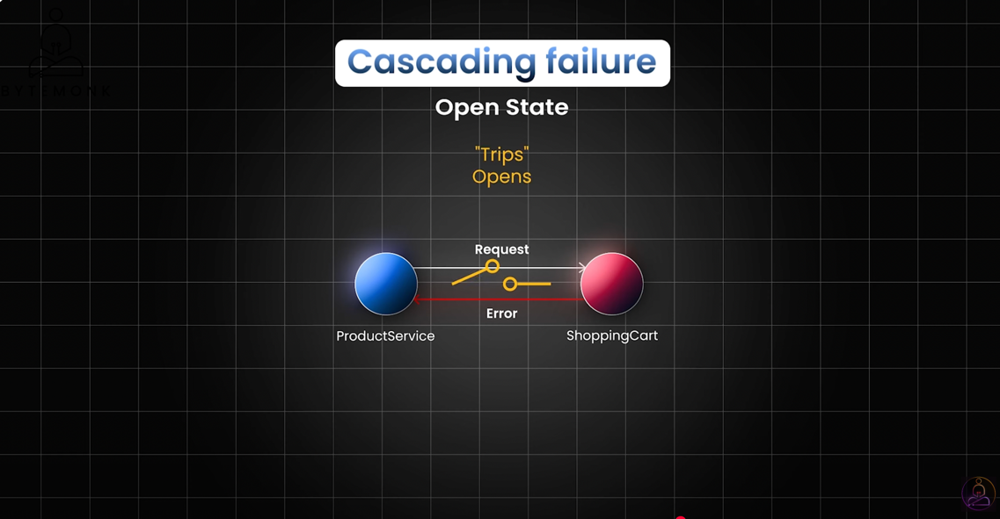
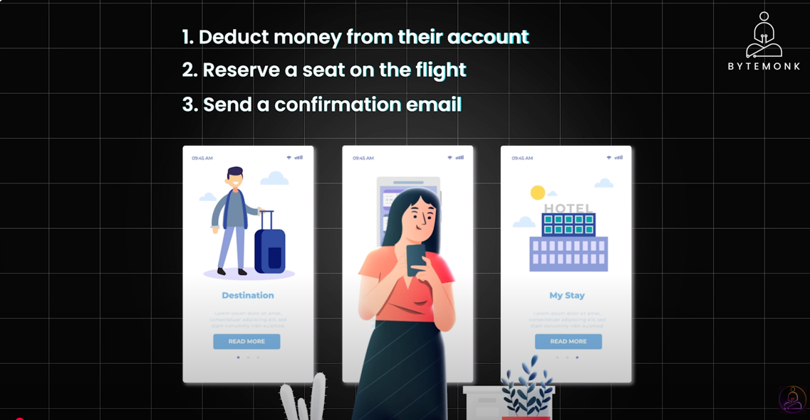
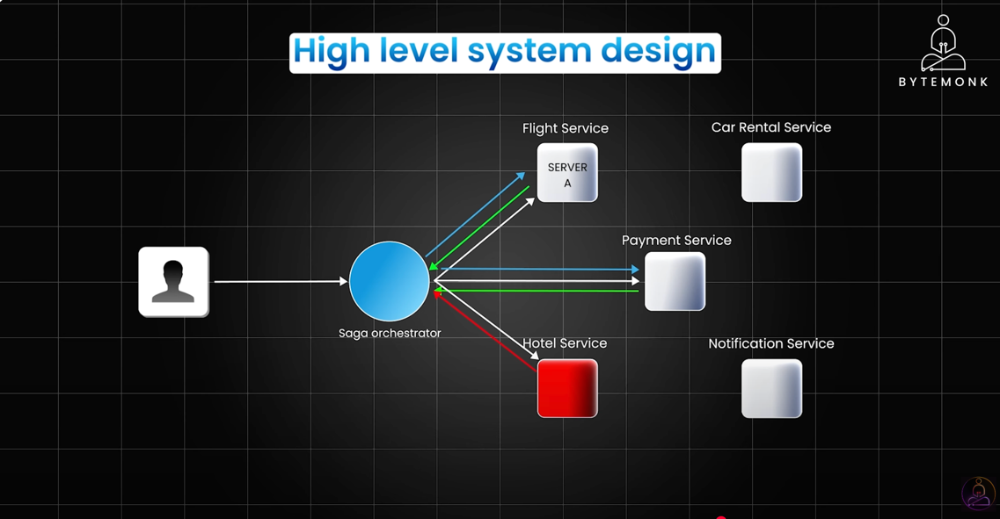

The **principles of microservices** guide how microservices are designed, developed, deployed, and maintained. These principles help build scalable, resilient, and maintainable distributed systems. Here's a structured breakdown:

---

## ✅ **Core Principles of Microservices**

**SHORT CUT :** 

CC I LORD SSS

C - Communication via apis/messaging

C - continuous delivery/devops alignment

I - independently deployable

L - Language independency for each micro service

O - Observibility - logging, tracing, metrics

R - Resilience

D - decentralized data management

S - Scalability

S - Security

S - single responsibility

### 1. **Single Responsibility / Bounded Context**
- Each microservice should focus on **one business capability**.
- It aligns with **Domain-Driven Design (DDD)**.
- Avoids mixing logic from multiple domains.

🧠 *Example*: One service for "User Management", another for "Order Processing".

---

### 2. **Independently Deployable**
- Each service can be **deployed, updated, or scaled independently**.
- Reduces deployment risk and increases agility.

🚀 *Benefit*: No need to redeploy the entire system when one service changes.

---

### 3. **Decentralized Data Management**
- Each microservice owns its **own database**.
- Prevents tight coupling and enforces separation.

⚠️ *Note*: No shared DB between services. Use APIs or messaging to communicate.

---

### 4. **Communication via APIs or Messaging**
- Services communicate over **lightweight protocols**:
    - **RESTful APIs** over HTTP
    - **Asynchronous messaging** (e.g., RabbitMQ, Kafka)

💬 *Rule*: Prefer asynchronous communication for scalability.

---

### 5. **Resilience and Fault Tolerance**
- Each service must be **designed to fail gracefully**.
- Use patterns like:
    - **Circuit Breaker**
    - **Retries**
    - **Fallbacks**

🔁 *Tools*: Netflix Hystrix, Resilience4j

---

### 6. **Scalability**
- Each microservice can be **scaled independently** based on load.
- Helps optimize infrastructure usage and costs.

📈 *Example*: Scale “Order” service during sales without scaling the entire system.

---

### 7. **Continuous Delivery and DevOps Alignment**
- Encourages **CI/CD pipelines** for fast, reliable deployments.
- Supports **automation**, testing, monitoring, and rollback strategies.

🧪 *Tools*: Jenkins, GitLab CI, ArgoCD

---

### 8. **Technology Agnostic / Polyglot Persistence**
- Services can be written in **different languages** or use **different data stores**.
- Promotes use of the best tools for each service's needs.

🛠️ *Example*: Java for one service, Node.js for another.

---

### 9. **Observability (Logging, Metrics, Tracing)**
- Each service must have:
    - **Centralized logging** (e.g., ELK, Fluentd)
    - **Metrics collection** (e.g., Prometheus + Grafana)
    - **Distributed tracing** (e.g., Jaeger, Zipkin)

🔍 Helps with **debugging and performance monitoring**.

---

### 10. **Security**
- Secure **communication between services** (e.g., mTLS in Istio).
- Use **authentication/authorization mechanisms** like OAuth2, JWT.

🛡️ *Practice*: Secure APIs with gateways and apply **zero trust** principles.

---

Great! Here's a **visual diagram** and **real-world example** to help you understand how these microservices principles come together in practice.

---

## 📊 **Microservices Architecture Diagram (with Principles Applied)**

```
                       +-------------------+
                       |  API Gateway      |  ← Entry point, routing, auth
                       +-------------------+
                                |
          +--------------------+--------------------+
          |                    |                    |
+----------------+   +----------------+   +----------------+
|  User Service  |   | Order Service  |   | Inventory Svc  |
+----------------+   +----------------+   +----------------+
| AuthN/AuthZ    |   | Create Order   |   | Stock Levels   |
| User Profile   |   | Track Order    |   | Reordering     |
+--------+-------+   +--------+-------+   +--------+--------+
         |                    |                    |
         |     +------------- |--------------------+
         |     |              |  
         v     v              v
+----------------+   +----------------+   +----------------+
|  MongoDB       |   |  MySQL         |   |  Cassandra     |
|  (User Data)   |   |  (Orders)      |   |  (Inventory)   |
+----------------+   +----------------+   +----------------+

                +----------------------------------+
                |    Message Broker (e.g., Kafka)  |
                +----------------------------------+

                 +---------------------------------+
                 | Monitoring / Tracing / Logging |
                 | (Prometheus, Grafana, Jaeger)  |
                 +---------------------------------+
```

---

## ✅ **How Principles Are Applied in the Above Example**

| Principle                         | Implementation in the Diagram                                                 |
|----------------------------------|--------------------------------------------------------------------------------|
| **Single Responsibility**        | Each service handles one domain: User, Order, Inventory                       |
| **Independently Deployable**     | Services run independently and can be deployed without affecting others       |
| **Decentralized Data Management**| Each service has its own DB (MongoDB, MySQL, Cassandra)                       |
| **Communication via APIs/Messaging** | Services use REST + Kafka for async events                                   |
| **Resilience/Fault Tolerance**   | Message broker decouples systems, retries built in, circuit breaker at gateway|
| **Scalability**                  | Inventory service can scale independently during high sales                   |
| **CI/CD Friendly**               | Each service has its own repo, build pipeline                                 |
| **Polyglot Tech**                | Different databases and possibly different languages per service              |
| **Observability**                | Centralized logging and metrics with Grafana + Jaeger                         |
| **Security**                     | API Gateway handles authentication/authorization using JWT or OAuth2         |

---


## **Design Patterns in Micro Service :**

## **Event Driven Architecture Pattern :** 

EDA pattern


traditional synchronous communication via rest/http

tightly coupled interactions

EDA : offers a streamlined alternative by decoupling services using events. more scalable and efficient system design


best way is to use event driven architecture + syschronous communication where ever needed

eg : EDA + SERVICE MESH


scalability is one of the primary reasons, companies adapt to event driven architecture


Challenges in EDA :


KAFKA, RABBITMQ , AMAZON SQS


## **Circuit Breaker Pattern :** 


even when some of the services are experiencing problem , it will allow the system to function without fail. 

Retry pattern - tries again - best for transient failures (temporary failures)


if the threshold reaches, then it will moved to open state



after a timeout of period, it goes into half open state, 


Netflix Hytrix - old
Resilience4j - very good and light weight


## **Saga Pattern  : Distributed Transactions** 




2 phases -
in preparation phase - cooardinator sends a request to prepare for commit of transaction to all the involved services
if the reply is yes then goes to next phase. if not stops here

in commit phase : cooardinator sends a commit requiest to all services, to permanently store. if something fails, then all the
other services also rollback

eg of this algorithm is : Apache ZooKeeper


Disadvantages :


everything is dependant on co-oardinator. if it dies then enter into deadlock


Mitigation :


ensuring consistency is a critical challenge

thats why distributed transactions. a group of  transactions are considered as a single unit of work.
either all units succeed, or none will


thats why sagas offer a more effective way.


if any service fails, then compensating actions can be executed.

breaks down into local transactions and each is responsible for a single task. and they communicate with each other through events.


Orchestrated saga :

saga orchestrator waits for each saga to send a response, before moving to the next saga.


in coreoghraphed saga, there is no central orchestrator, each participants communicate through events, listening to each other





## **Strangler Pattern :**

moving from monolithic to micro services .

strangle the old system over time to move to micro services


in-line with Aggregation architecture.

key point is that.. both monolyth and micro services live together for a period of time


service discovery tools - eureka
service mesh - istio


## Data Per Service Pattern : 


different types :


multiple schemas can exist in same db, but are isolated from one another.


higher latency and poor experience


Challenges :

Data Consistency


to address these challenges, pair it with event driven architecture.


## **Aggregator Pattern :** 


acts as a co-ordinator for collecting responses and combining them into single result


offen works hand in hand with another pattern : CQRS 


NEWS app... fetching multiple responses and delivering to user. one output is independent of other's


output of one service becomes request of the other. dependency.


branch pattern similar to scatter-gather but based on the responses received, allows different processing paths. 
eg : if flight booking failed, hotel booking also fail, if success, then hotel also success.


Challenges :


## **Side Car Pattern :** 


use : services focus on purely business logic. while side car takes care of the rest (load balancing, logging, communication, security, monitoring)


istio-envoy


Challenges :


